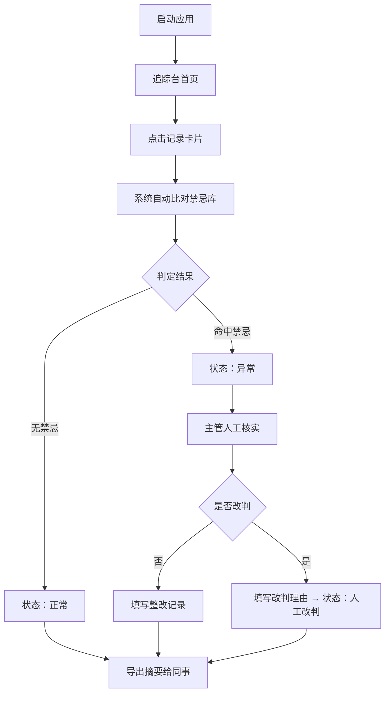

## 1. 产品概述

婴幼儿辅食禁忌追踪台（月子护理版）是为月子中心护理主管设计的膳食合规审核工具。护理主管每日对照三日食材表与餐盘照片，快速判定是否存在婴幼儿辅食禁忌风险，确保厨房未按旧表备料。

- 目标用户：月子中心护理主管、膳食督导
- 核心价值：避免旧备料引发过敏/禁忌事件，异常可追溯、整改有记录、导出可协作

## 2. 核心功能

### 2.1 用户角色

| 角色 | 注册方式 | 核心权限 |
|------|----------|----------|
| 护理主管 | 本地启动即用 | 查看追踪台、判定状态、补录记录、导出摘要 |

### 2.2 功能模块

1. **追踪台首页**：三日膳食列表、状态标签、筛选控件、统计概览卡片
2. **记录详情页**：餐盘照片、食材明细、禁忌比对、判定状态流转、错误原因解读、整改记录时间线
3. **导出功能**：生成同事可直接阅读的摘要（非内部字段名），含隐私脱敏与格式校验原因
4. **手工补录**：离线场景下补录一条记录，展示补录前后差异

### 2.3 页面详情

| 页面名称 | 模块名称 | 功能描述 |
|----------|----------|----------|
| 追踪台首页 | 统计概览 | 显示正常/异常/人工改判/待审核四项计数及当日合规率 |
| 追踪台首页 | 状态筛选条 | 全部/正常/异常/人工改判/待审核 五个快捷过滤按钮 |
| 追踪台首页 | 记录卡片列表 | 每条卡片展示房间号、宝宝姓名（脱敏）、餐次、状态标签、时间、缩略图 |
| 记录详情页 | 餐盘照片区 | 大图展示、照片说明文字、上传时间 |
| 记录详情页 | 食材明细表 | 三日食材表对比，高亮禁忌匹配项 |
| 记录详情页 | 状态流转区 | 显示当前状态、可执行操作（通过/驳回/人工改判） |
| 记录详情页 | 校验原因区 | 手机号格式混乱原因、隐私字段泄露风险说明，均以自然语言呈现 |
| 记录详情页 | 整改记录时间线 | 历史操作、备注、责任人时间线 |
| 导出弹层 | 摘要预览 | 预览同事可读摘要文本，一键复制/下载 |
| 补录弹层 | 补录表单 | 房间号、宝宝姓名、食材、照片说明、备注 |

## 3. 核心流程

护理主管启动应用 → 浏览追踪台列表，默认显示全部记录 → 点击一条记录进入详情 → 系统自动比对禁忌库 → 分三条路径：

- **正常路径**：无禁忌匹配 → 状态标记"正常" → 可导出合规摘要
- **异常路径**：命中禁忌项 → 状态标记"异常" → 详情页展示具体禁忌与风险 → 填写整改记录 → 导出异常摘要
- **人工改判路径**：系统判定异常但主管核实无误 → 执行"人工改判" → 填写改判理由 → 状态变为"人工改判" → 改判理由永久留痕

## 4. 用户界面设计

### 4.1 设计风格

- **主色**：鼠尾草绿 #87A878（健康、自然、月子氛围）
- **辅色**：珊瑚粉 #E8998D（温柔警示、母婴感）
- **强调色**：深琥珀 #C17817（人工改判、待关注）
- **中性色**：暖米白 #FAF7F2、暖灰 #6B6560、深墨 #2C2A28
- **按钮**：圆角 10px，柔和投影，hover 时轻微上浮 + 阴影加深
- **字体**：标题用「Noto Serif SC」（人文感），正文用「Noto Sans SC」（清晰可读）
- **布局**：卡片式布局，充裕留白，12 栅格，桌面端两栏（列表 + 详情抽屉/路由）
- **图标**：Lucide 线性图标，1.5px 线宽，与文字同色或主色

### 4.2 页面设计概览

| 页面名称 | 模块名称 | UI 元素 |
|----------|----------|---------|
| 追踪台首页 | 统计概览 | 四张横向排列的圆角卡片，数字大号衬线字体 + 小字说明，底部微渐变背景 |
| 追踪台首页 | 状态筛选条 | 胶囊形按钮组，选中状态填充主色 + 白字，未选中描边灰 |
| 追踪台首页 | 记录卡片列表 | 纵向列表，每张卡片左侧圆角缩略图，中间文字区（房间号、宝宝、餐次），右侧状态标签 + 箭头 |
| 记录详情页 | 餐盘照片区 | 顶部全幅圆角大图，下方照片说明浅灰卡片 |
| 记录详情页 | 食材明细表 | 表格样式，禁忌行整行珊瑚粉浅底 + 左侧红竖条标记 |
| 记录详情页 | 状态流转区 | 状态大号徽章 + 横向按钮组（通过/驳回/人工改判） |
| 记录详情页 | 校验原因区 | 折叠面板，展开后逐条自然语言说明，附"查看原始数据"小字入口 |
| 记录详情页 | 整改记录时间线 | 左侧竖线 + 圆点节点，右侧操作内容 + 时间 + 责任人 |
| 导出弹层 | 摘要预览 | 白色卡片，内部分段自然语言文本，一键复制按钮悬浮底部 |

### 4.3 响应式

桌面端优先（≥1280px），详情页与列表并排展示；平板端（768-1279px）列表与详情上下堆叠；移动端（<768px）列表优先，详情全屏弹层。触控目标 ≥44px。
