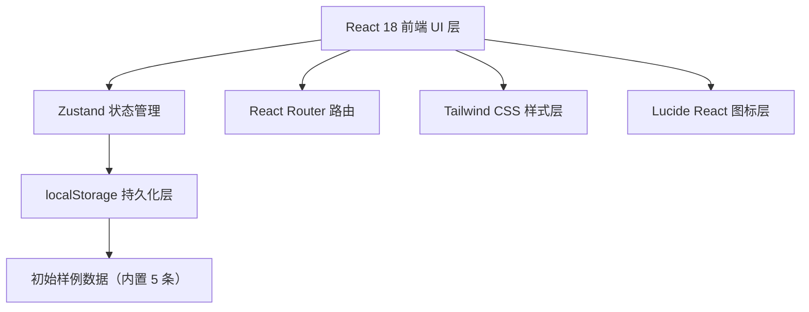
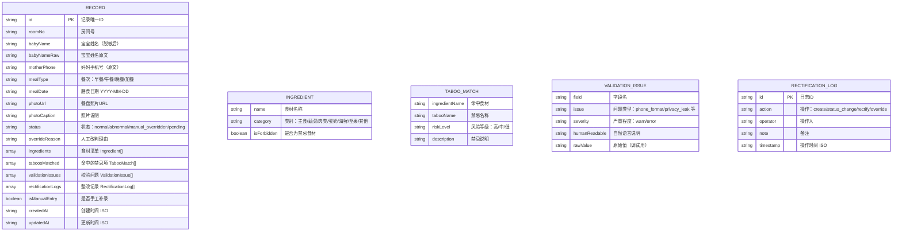

## 1. 架构设计

纯前端单页应用，无后端服务。所有数据通过 Zustand 管理并同步到 localStorage 实现服务重启后数据不丢失。

## 2. 技术说明

- **前端**：React@18 + TypeScript@5 + TailwindCSS@3 + Vite@5
- **初始化工具**：vite-init（react-ts 模板）
- **路由**：react-router-dom@6
- **状态管理**：zustand@4（含 persist 中间件 → localStorage）
- **图标**：lucide-react@latest
- **后端**：无
- **数据库**：localStorage（由 zustand persist 自动序列化）

## 3. 路由定义

| 路由 | 用途 |
|------|------|
| / | 追踪台首页（列表 + 统计 + 筛选） |
| /record/:id | 记录详情页 |

## 4. 数据模型

### 4.1 数据模型定义

### 4.2 初始样例数据（5 条）

1. **正常记录**：302 房 小米粥+南瓜泥+蛋黄，无禁忌，手机号格式正确
2. **异常记录**：501 房 虾仁蒸蛋（海鲜禁忌），手机号格式混乱（"138-1234-5678转01"），存在隐私字段
3. **人工改判记录**：208 房 系统判定花生碎为禁忌，主管核实为专用低敏花生粉，人工改判通过
4. **待审核记录**：405 房 数据待处理，供走审核流程
5. **手工补录记录**：101 房 补录记录，`isManualEntry=true`，展示补录前后字段差异

## 5. 核心逻辑模块

| 模块 | 位置 | 职责 |
|------|------|------|
| useRecordStore | src/store/useRecordStore.ts | Zustand store：CRUD、状态流转、持久化 |
| tabooEngine | src/utils/tabooEngine.ts | 禁忌比对引擎：输入食材列表，输出命中禁忌 |
| validationEngine | src/utils/validationEngine.ts | 校验引擎：手机号格式、隐私字段检测，输出自然语言说明 |
| exportSummary | src/utils/exportSummary.ts | 导出同事可读的摘要文本（脱敏） |
| sampleData | src/data/sampleData.ts | 内置 5 条样例数据 |
