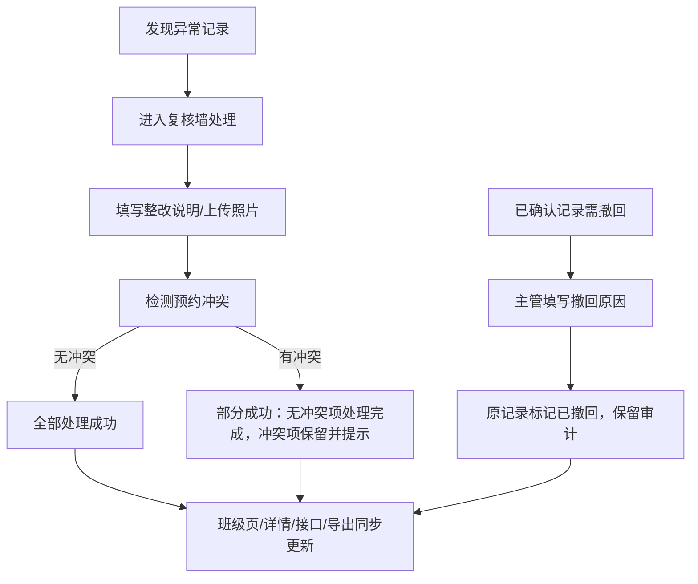

## 1. 产品概述

婴幼儿用品消毒复核墙（月子护理版）是面向月子中心护理团队的质量管理工具，用于跟踪、复核和审计婴幼儿用品消毒发放全流程。解决消毒记录遗漏、异常处理不同步、撤回无审计等核心痛点。

## 2. 核心功能

### 2.1 用户角色

| 角色 | 核心权限 |
|------|----------|
| 护理员 | 录入消毒记录、查看班级/宝宝详情、处理异常、手工补录 |
| 护理主管 | 查看完整数据（含隐私字段）、复查审计日志、导出清单、撤回已确认记录 |
| 系统管理员 | 角色配置、系统设置 |

### 2.2 功能模块

1. **班级列表页**：展示各班级消毒概况、异常数量、快速导航
2. **宝宝详情页**：单宝宝消毒记录时间线、照片说明、状态流转、整改记录
3. **消毒复核墙主界面**：异常列表、批量处理、预约冲突处理
4. **导出中心**：按角色过滤隐私字段、导出 Excel/CSV
5. **审计日志**：记录所有状态变更、撤回操作、手工补录痕迹

### 2.3 页面详情

| 页面名称 | 模块名称 | 功能描述 |
|-----------|-------------|---------------------|
| 班级列表页 | 班级卡片 | 展示班级名称、在住宝宝数、今日异常数、最近更新时间 |
| 班级列表页 | 快速筛选 | 按异常状态、日期范围、班级名称筛选 |
| 宝宝详情页 | 记录时间线 | 时间倒序展示消毒发放记录，含异常标记与处理状态 |
| 宝宝详情页 | 记录详情卡 | 照片、用品类型、消毒方式、发放时间、操作人、异常说明、整改记录 |
| 宝宝详情页 | 手工补录 | 主管可补录历史记录，自动标记补录来源与补录人 |
| 复核墙主界面 | 异常看板 | 按严重程度分组展示未处理异常 |
| 复核墙主界面 | 异常处理表单 | 选择处理方案、填写整改说明、上传整改照片、处理预约冲突 |
| 复核墙主界面 | 撤回操作 | 已确认记录撤回需填写原因，原记录保留审计不可删除 |
| 导出中心 | 导出配置 | 选择日期范围、班级、字段，按角色自动过滤隐私字段 |

## 3. 核心流程

**异常处理主流程**：护理员在复核墙发现异常 → 填写整改说明与照片 → 系统检测预约冲突（如同一时段重复发放）→ 允许部分成功处理无冲突项 → 班级页计数同步更新、宝宝详情新增处理记录、后台接口返回最新状态、导出清单自动包含最新数据

**记录撤回流程**：护理主管发现已确认记录有误 → 点击撤回 → 填写撤回原因 → 原记录标记"已撤回"但保留全部字段 → 审计日志记录撤回人、撤回时间、撤回原因 → 宝宝详情同时展示原记录与撤回标记

**手工补录流程**：主管进入宝宝详情 → 点击"手工补录" → 填写历史消毒信息 → 系统自动打标"手工补录"、记录补录人、补录时间 → 样例数据内置一条补录记录用于对比

## 4. 用户界面设计

### 4.1 设计风格

- **主色调**：医用级水青色 `#0EA5A5`（信任、清洁），辅助色珊瑚橙 `#F97316`（异常警示），中性色石板灰
- **按钮风格**：圆角 10px，主按钮实心带微妙阴影，次按钮描边 ghost 样式
- **字体**：标题使用"思源宋体 SemiBold"，正文使用"Inter"，数据数字使用等宽字体"JetBrains Mono"
- **布局风格**：卡片式网格布局，左侧导航 + 顶部状态栏，主内容区采用 2-3 栏弹性布局
- **图标风格**：lucide-react 线性图标，异常状态用实心红点闪烁动画

### 4.2 页面设计概览

| 页面名称 | 模块名称 | UI 元素 |
|-----------|-------------|----------|
| 班级列表页 | 顶部状态栏 | 角色切换器、今日日期、导出按钮、搜索框 |
| 班级列表页 | 班级卡片网格 | 卡片悬停微抬升、异常数角标红点闪烁、点击进入详情 |
| 宝宝详情页 | 头部信息栏 | 宝宝姓名（按角色脱敏/全名）、床位号、过敏标识、照片头像 |
| 宝宝详情页 | 时间线记录流 | 垂直线 + 节点圆 + 左右交替卡片，异常节点珊瑚橙色边框 |
| 宝宝详情页 | 记录详情模态 | 大图预览、字段表格、整改记录折叠面板、审计日志 |
| 复核墙主界面 | 异常看板 | 三栏（高/中/低优先级）可拖拽卡片，顶部统计条 |
| 复核墙主界面 | 处理侧滑抽屉 | 右侧滑出表单，底部固定操作栏（处理/取消） |

### 4.3 响应式

桌面端优先（1440px），适配 1280px 以上；平板端折叠侧栏；移动端采用单列瀑布流。
