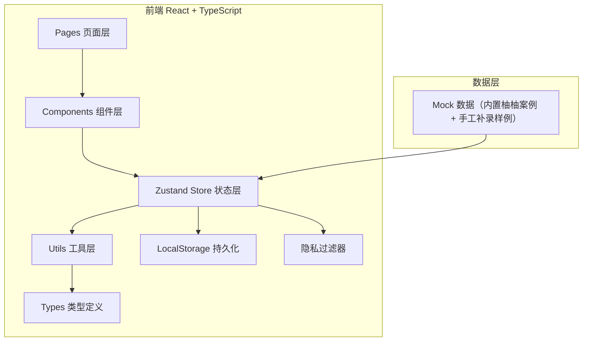

## 1. 架构设计



## 2. 技术选型

- **前端框架**：React@18 + TypeScript
- **构建工具**：Vite
- **样式方案**：TailwindCSS@3
- **状态管理**：Zustand（含 persist 中间件做 localStorage 持久化）
- **路由**：react-router-dom@6
- **图标**：lucide-react
- **后端**：无，全前端 Mock + localStorage 持久化，模拟接口延迟

## 3. 路由定义

| Route | 用途 |
|-------|------|
| `/` | 班级列表页（首页） |
| `/class/:classId` | 班级详情（宝宝列表） |
| `/baby/:babyId` | 宝宝详情页（含时间线、手工补录） |
| `/review-wall` | 消毒复核墙主界面（异常处理） |
| `/export` | 导出中心 |
| `/audit` | 审计日志（主管） |

## 4. API 接口（模拟层）

```typescript
// 获取班级列表
GET /api/classes → { classes: Class[], stats: ClassStats }

// 获取宝宝详情
GET /api/babies/:id → { baby: Baby, records: DisinfectionRecord[] }

// 获取异常列表
GET /api/anomalies?status=pending → { anomalies: Anomaly[] }

// 处理异常（支持部分成功）
POST /api/anomalies/:id/resolve → { success: boolean, partialSuccess?: string[], conflicts?: string[] }

// 撤回已确认记录
POST /api/records/:id/withdraw → { success: boolean, auditId: string }

// 手工补录记录
POST /api/records/manual → { record: DisinfectionRecord, isManual: true }

// 导出清单（按角色过滤）
GET /api/export?role=nurse&from=...&to=... → Blob (CSV)
```

## 5. 数据模型

### 5.1 ER 图

```mermaid
erDiagram
    CLASS ||--o{ BABY : contains
    BABY ||--o{ DISINFECTION_RECORD : has
    DISINFECTION_RECORD ||--o| ANOMALY : may_have
    DISINFECTION_RECORD ||--o{ AUDIT_LOG : produces
    DISINFECTION_RECORD ||--o{ CORRECTION : may_have
    USER ||--o{ AUDIT_LOG : creates
```

### 5.2 TypeScript 类型定义

```typescript
type Role = 'nurse' | 'supervisor' | 'admin';

interface User {
  id: string;
  name: string;          // 隐私字段：主管以上可见全名
  role: Role;
  employeeNo: string;    // 隐私字段
}

interface Class {
  id: string;
  name: string;          // e.g. "阳光 A 班"
  babyCount: number;
  todayAnomalyCount: number;
}

interface Baby {
  id: string;
  classId: string;
  name: string;          // 隐私字段：护理员可见脱敏（"柚*"），主管可见全名
  bedNo: string;
  motherName?: string;   // 隐私字段：仅主管可见
  allergies: string[];
  avatar: string;
}

type RecordStatus = 'confirmed' | 'withdrawn' | 'pending_review' | 'anomaly_resolved';

interface DisinfectionRecord {
  id: string;
  babyId: string;
  itemType: 'feeding_bottle' | 'pacifier' | 'toy' | 'clothing' | 'bedding';
  disinfectionMethod: 'high_temp' | 'uv' | 'chemical' | 'steam';
  operatorId: string;
  operatedAt: string;        // ISO
  photoUrl?: string;
  photoRemark?: string;
  status: RecordStatus;
  isManual: boolean;         // 手工补录标记
  manualCreatedBy?: string;
  manualCreatedAt?: string;
  originalRecordId?: string; // 撤回后新记录关联
  correction?: Correction;
  anomalyId?: string;
}

interface Anomaly {
  id: string;
  recordId: string;
  type: 'reissue_unclean' | 'missing_photo' | 'appointment_conflict' | 'wrong_item';
  severity: 'high' | 'medium' | 'low';
  description: string;
  status: 'pending' | 'resolved' | 'partial_resolved';
  resolvedAt?: string;
  resolverId?: string;
  resolutionNote?: string;
  conflictedRecordIds?: string[];
}

interface Correction {
  id: string;
  recordId: string;
  description: string;
  photos: string[];
  correctedBy: string;
  correctedAt: string;
}

interface AuditLog {
  id: string;
  recordId: string;
  action: 'create' | 'confirm' | 'withdraw' | 'correct' | 'manual_create' | 'anomaly_resolve';
  operatorId: string;
  operatorRole: Role;
  timestamp: string;
  reason?: string;
  beforeSnapshot?: Partial<DisinfectionRecord>;
  afterSnapshot?: Partial<DisinfectionRecord>;
}
```

## 6. 核心模块说明

### 6.1 状态同步机制
Zustand store 作为单一数据源，异常处理、撤回、补录操作通过 action 更新 store → persist 中间件自动写入 localStorage → 订阅 store 的班级页、宝宝详情、导出模块自动重渲染。

### 6.2 隐私字段过滤
`src/utils/privacyFilter.ts` 统一处理：页面渲染前、JSON API 响应序列化前、日志打印前、导出文件生成前，均调用 `applyPrivacyFilter(data, currentUserRole)` 按角色规则脱敏。

### 6.3 审计保留策略
撤回记录采用"软删除 + 快照"模式：原记录 status 改为 `withdrawn`，保留全部字段；审计日志保存操作前后快照 + 原因；宝宝详情同时展示撤回记录与后续补录记录。

### 6.4 预约冲突处理
异常处理时调用 `checkAppointmentConflicts(records)` 返回冲突 ID 列表，UI 对无冲突项执行 resolve，冲突项保留并提示"存在预约冲突，以下项未处理：xxx"。
