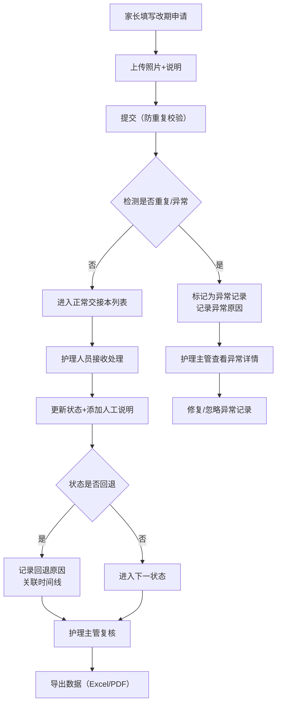

## 1. 产品概述

本系统是月子护理中心内部运营管理工具，聚焦婴幼儿课程改期交接与辅食厨房冷冻柜名额管理两大核心场景，解决当前依赖Excel表格、口头交接导致的数据丢失、状态冲突、责任不清等问题，覆盖家长端录入、护理端审批、主管端复核、数据导出的完整业务闭环。

- 目标用户：家长（录入申请）、护理人员（处理交接）、护理主管（复核审批）、厨房管理员（冷冻柜名额）
- 核心价值：数据可追溯、状态防冲突、坏数据隔离、服务重启不丢数据

## 2. 核心功能

### 2.1 用户角色

| 角色 | 注册方式 | 核心权限 |
|------|----------|----------|
| 家长 | 工号绑定 | 录入改期申请、上传照片说明、查看处理进度、导出记录 |
| 护理人员 | 员工账号 | 接收处理交接、更新状态、添加人工说明、补录记录 |
| 护理主管 | 管理员账号 | 复核审批、查看整改记录、冻结/解冻记录、导出全量数据 |
| 厨房管理员 | 员工账号 | 冷冻柜名额分配、转班占用确认、名额释放 |

### 2.2 功能模块

1. **家长录入页**：改期申请表单、照片上传、说明填写、实时预览
2. **交接本列表页**：全量记录、状态筛选、来源文件标注、处理人显示、快速搜索
3. **记录详情页**：完整时间线、来源文件、状态流转、人工说明、照片、整改记录、坏数据原因标注
4. **冷冻柜管理页**：名额看板、转班占用标记、实时释放、口头占用预警
5. **数据导出页**：按条件筛选、多格式导出（Excel/PDF）、导出日志

### 2.3 页面详情

| 页面名称 | 模块名称 | 功能描述 |
|----------|----------|----------|
| 家长录入页 | 表单区域 | 宝宝姓名、课程名称、原上课时间、改期原因、期望改期时间下拉选择 |
| 家长录入页 | 照片上传 | 最多3张、压缩预览、说明文字绑定每张照片 |
| 家长录入页 | 提交校验 | 防重复提交（前端防抖+后端去重）、提交成功回执单号 |
| 交接本列表页 | 记录卡片 | 每条显示：来源文件名、处理人头像姓名、当前状态徽章、最近一次人工说明摘要、提交时间 |
| 交接本列表页 | 筛选栏 | 按状态/处理人/日期范围/来源类型筛选，支持关键词搜索 |
| 交接本列表页 | 坏数据隔离 | 异常记录灰色标记、独立Tab页"异常记录"，不污染正常列表 |
| 记录详情页 | 基本信息区 | 完整表单数据、来源文件链接、提交时间、提交人 |
| 记录详情页 | 状态时间线 | 每次状态变更：变更人、变更时间、变更前后状态、变更原因说明 |
| 记录详情页 | 照片说明区 | 照片缩略图+对应说明文字、支持放大查看 |
| 记录详情页 | 整改记录区 | 问题描述、整改措施、整改人、整改时间、复核人 |
| 记录详情页 | 异常信息区 | 重复提交检测标记、状态回退原因、坏数据修复日志 |
| 记录详情页 | 操作区 | 护理人员更新状态、添加说明、主管审批按钮 |
| 冷冻柜管理页 | 名额看板 | 按日期×时段矩阵展示，绿色=可用、黄色=口头占用、红色=已确认占用 |
| 冷冻柜管理页 | 转班操作 | 选中名额→填写转班人→确认占用/释放，操作留痕 |
| 冷冻柜管理页 | 口头占用预警 | 超过24小时未确认的口头占用自动高亮提醒 |
| 数据导出页 | 筛选配置 | 状态、日期范围、处理人、是否含异常记录 |
| 数据导出页 | 导出执行 | 生成下载链接、导出日志（谁、何时、导出了什么范围） |

## 3. 核心流程

家长在录入页填写婴幼儿课程改期信息并上传照片说明，提交后系统生成唯一记录进入交接本。护理人员看到新记录后处理，更新状态并添加人工说明。护理主管可复核、查看整改记录。整个过程中重复提交和状态回退被检测并标记为异常，在详情页可查看原因，不影响正常记录。所有数据持久化存储，服务重启后详情页的照片说明、状态和整改记录保持完整。冷冻柜名额实时看板防止口头占用未确认导致的冲突。数据可按条件筛选后导出，完成业务闭环。

## 4. 用户界面设计

### 4.1 设计风格

- 主色调：暖粉色 `#F8B4C4`（母婴温馨感）+ 深墨绿 `#2D5A4D`（专业信任感）
- 辅助色：米白 `#FFF8F3` 背景、浅灰 `#E8E4E0` 分割、柠檬黄 `#FFD93D` 预警、浅粉 `#FFE4EC` 状态高亮
- 按钮风格：圆角12px、2px边框阴影悬停、点击微下沉动画
- 字体：标题用「霞鹜文楷」（温暖手写感）、正文用「思源黑体」（清晰可读）
- 布局风格：左侧导航栏 + 右侧内容区、卡片式分组、柔和阴影 `0 2px 12px rgba(45,90,77,0.08)`
- 图标：统一使用圆角线性图标，状态徽章采用实心圆角胶囊

### 4.2 页面设计概述

| 页面名称 | 模块名称 | UI元素 |
|----------|----------|--------|
| 家长录入页 | 表单区域 | 卡片式分组、浮动标签输入框、渐变色提交按钮、悬浮成功提示 |
| 交接本列表页 | 记录卡片 | 头像+姓名行、状态徽章、来源文件小图标、说明文字截断、悬停上浮阴影 |
| 记录详情页 | 时间线 | 竖线节点、左右交替布局、节点状态色、进入时逐条淡入动画 |
| 冷冻柜管理页 | 名额矩阵 | 单元格色块、悬停tooltip、点击弹出操作面板、口头占用闪烁效果 |
| 数据导出页 | 导出面板 | 分段筛选器、进度条动画、完成后弹跳下载按钮 |

### 4.3 响应式

桌面端优先设计，最小支持宽度1280px。在iPad竖屏（768px）以上保持双栏布局，小屏幕自动折叠左侧导航为汉堡菜单。所有表格支持横向滚动，表单控件自适应宽度。

### 4.4 数据持久化

- 使用 localStorage + IndexedDB 双层存储，照片等大文件存 IndexedDB，元数据存 localStorage
- 页面加载时自动从本地存储恢复，服务重启不影响已存数据
- 定时自动保存草稿（每30秒），防止意外刷新丢失
- 坏数据带 `isCorrupted` 标记和 `corruptionReason` 字段，查询时默认过滤，异常页单独展示
