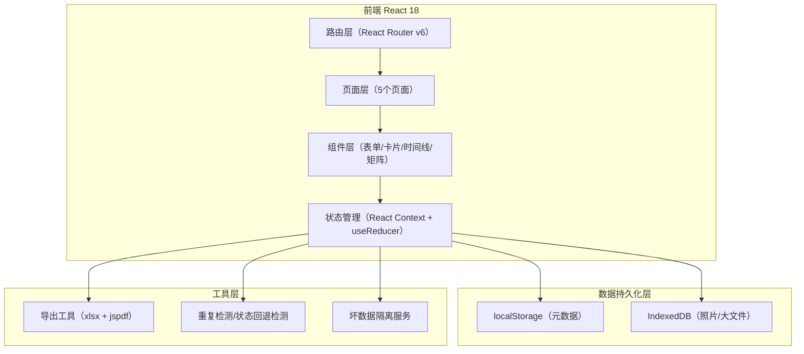
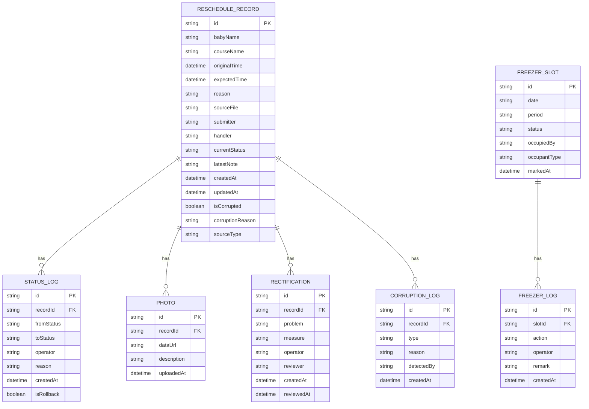

## 1. 架构设计



## 2. 技术描述

- 前端：React@18 + TypeScript + Vite@5
- 样式：Tailwind CSS@3 + CSS 变量主题系统
- 路由：React Router DOM@6
- 状态：React Context + useReducer（无额外依赖，轻量）
- 本地存储：localDataStorage 封装 localStorage + idb 封装 IndexedDB
- 导出：xlsx（Excel导出）、jspdf（PDF导出）
- Mock数据：内置样例数据，含1条手工补录记录用于对比展示

## 3. 路由定义

| 路由 | 页面 | 说明 |
|------|------|------|
| / | 重定向到 /submit | 默认跳转家长录入页 |
| /submit | 家长录入页 | 改期申请表单 + 照片上传 |
| /handover | 交接本列表页 | 记录列表 + 筛选 + 异常Tab |
| /handover/:id | 记录详情页 | 完整时间线 + 状态操作 |
| /freezer | 冷冻柜管理页 | 名额矩阵看板 + 转班操作 |
| /export | 数据导出页 | 筛选条件 + 导出执行 |

## 4. 数据模型

### 4.1 数据模型ER图



### 4.2 核心类型定义

```typescript
type RecordStatus = 'pending' | 'processing' | 'completed' | 'cancelled' | 'rejected';
type SourceType = 'parent_submit' | 'manual_entry' | 'file_import';
type SlotStatus = 'available' | 'verbal_hold' | 'confirmed';

interface RescheduleRecord {
  id: string;
  babyName: string;
  courseName: string;
  originalTime: string;
  expectedTime: string;
  reason: string;
  sourceFile?: string;
  submitter: string;
  handler?: string;
  currentStatus: RecordStatus;
  latestNote?: string;
  createdAt: string;
  updatedAt: string;
  isCorrupted: boolean;
  corruptionReason?: string;
  sourceType: SourceType;
  statusLogs: StatusLog[];
  photos: PhotoItem[];
  rectifications: Rectification[];
  corruptionLogs: CorruptionLog[];
}

interface StatusLog {
  id: string;
  recordId: string;
  fromStatus: RecordStatus;
  toStatus: RecordStatus;
  operator: string;
  reason: string;
  createdAt: string;
  isRollback: boolean;
}

interface PhotoItem {
  id: string;
  recordId: string;
  dataUrl: string;
  description: string;
  uploadedAt: string;
}

interface Rectification {
  id: string;
  recordId: string;
  problem: string;
  measure: string;
  operator: string;
  reviewer?: string;
  createdAt: string;
  reviewedAt?: string;
}

interface CorruptionLog {
  id: string;
  recordId: string;
  type: 'duplicate_submit' | 'status_rollback' | 'data_integrity';
  reason: string;
  detectedBy: 'system' | 'manual';
  createdAt: string;
}

interface FreezerSlot {
  id: string;
  date: string;
  period: 'morning' | 'afternoon' | 'evening';
  status: SlotStatus;
  occupiedBy?: string;
  occupantType?: 'normal' | 'shift_transfer';
  markedAt?: string;
  logs: FreezerLogEntry[];
}

interface FreezerLogEntry {
  id: string;
  slotId: string;
  action: 'hold' | 'confirm' | 'release';
  operator: string;
  remark?: string;
  createdAt: string;
}
```

## 5. 核心服务模块

### 5.1 重复提交检测服务（DuplicateDetector）
- 检测维度：babyName + courseName + originalTime 30秒内重复提交
- 检测到后标记 `isCorrupted: true`，`corruptionReason: '检测到重复提交'`，并写入 `corruptionLogs`

### 5.2 状态回退检测服务（RollbackDetector）
- 每次状态变更对比历史状态流，若 toStatus 在时间线早于当前 latest 状态则判定为回退
- 记录 `statusLog.isRollback: true`，写入 `corruptionLogs` 说明原因

### 5.3 坏数据隔离服务（CorruptionIsolator）
- 默认查询过滤 `isCorrupted: true` 的记录
- 提供 `getCorruptedRecords()` 专门接口供异常Tab页使用
- 修复操作将 `isCorrupted` 置为 false 并保留完整修复日志

### 5.4 持久化服务（PersistenceService）
- `saveRecord()` 同时写入 localStorage（元数据）和 IndexedDB（photos 数组）
- `loadRecord(id)` 双源合并恢复
- `autoSaveDraft()` 每30秒保存表单草稿
- 服务重启/页面刷新后 `initStore()` 自动从本地恢复全部数据

## 6. 初始化样例数据

内置 Mock 数据包含：
- 5条正常家长录入记录（不同状态各1-2条）
- 1条手工补录记录（sourceType: 'manual_entry'），用于对比补录前后差异
- 1条重复提交异常记录（用于展示坏数据隔离效果）
- 1条状态回退异常记录（用于展示回退原因）
- 14天×3时段的冷冻柜名额初始数据
