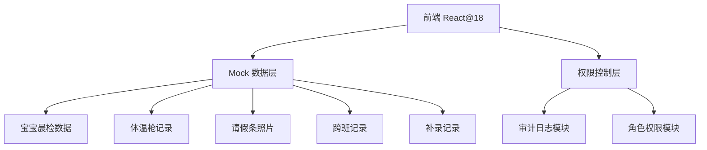
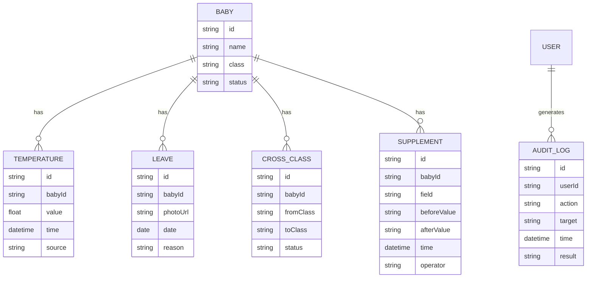

## 1. 架构设计

## 2. 技术描述
- 前端：React@18 + tailwindcss@3 + vite
- 初始化工具：vite-init
- 后端：无后端，全部使用 Mock 数据
- 数据：本地 Mock JSON 数据

## 3. 路由定义
| 路由 | 用途 |
|------|------|
| /login | 登录页，角色选择 |
| /dashboard | 排程板主页 |
| /baby/:id | 宝宝详情页 |
| /audit | 审计日志页 |
| /data-status | 数据状态页 |

## 4. 数据模型
### 4.1 数据模型定义

