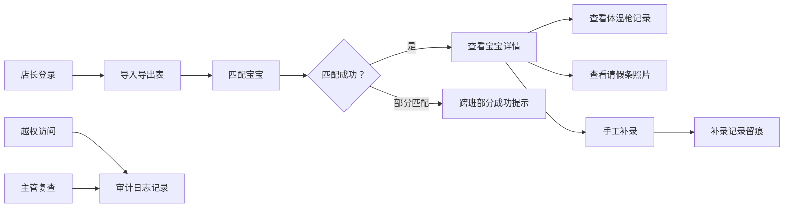

## 1. 产品概述
婴幼儿晨检复核排程板家庭协作版，解决月底复盘时保健复核找不到来源、前后口径变化的问题。
- 主要目标：店长可从导出表反查到宝宝详情，查看原始体温枪记录和请假条照片；家庭角色权限分级查看；越权审计追踪。
- 核心价值：建立数据溯源链条，保障数据治理有迹可循，家庭协作信息边界清晰。

## 2. 核心功能

### 2.1 用户角色
| 角色 | 登录方式 | 核心权限 |
|------|----------|----------|
| 老人（家庭） | 账号登录 | 仅查看晨检摘要（体温状态、是否出勤） |
| 父母（家庭） | 账号登录 | 查看宝宝完整晨检详情、体温记录、请假条 |
| 店长 | 账号登录 | 导出表反查、跨班处理、手工补录、查看审计日志 |
| 主管 | 账号登录 | 所有权限、审计复查、数据状态管理 |

### 2.2 功能模块
1. **登录页**：角色选择登录、权限校验
2. **排程板主页**：晨检列表、日期选择、班级筛选、导出表导入
3. **宝宝详情页**：体温记录、请假条照片、跨班记录、补录记录
4. **审计日志页**：越权访问记录、操作日志
5. **数据状态页**：空数据/脏数据/正常数据三种状态展示

### 2.3 页面详情
| 页面名称 | 模块名称 | 功能描述 |
|----------|----------|----------|
| 登录页 | 角色选择 | 四种角色选择登录，权限校验 |
| 排程板主页 | 晨检列表 | 按日期/班级筛选，宝宝卡片展示晨检状态 |
| 排程板主页 | 导出表反查 | 导入导出表匹配宝宝详情 |
| 宝宝详情页 | 体温枪记录 | 原始体温记录时间轴展示 |
| 宝宝详情页 | 请假条照片 | 请假条照片原图查看 |
| 宝宝详情页 | 跨班记录 | 同一宝宝跨班部分成功提示 |
| 宝宝详情页 | 手工补录 | 补录前后对比展示 |
| 审计日志页 | 越权记录 | 越权访问用户、时间、内容 |
| 数据状态页 | 状态分类 | 空数据/脏数据/正常数据三种状态分类展示 |

## 3. 核心流程
店长登录 → 导入导出表 → 匹配反查宝宝 → 查看体温记录/请假条 → 跨班部分成功处理 → 手工补录 → 越权操作审计记录

## 4. 用户界面设计
### 4.1 设计风格
- 主色调：温暖柔和的医疗护理蓝 (#4A90A4)，辅助色：柔和的婴儿粉 (#F8B4B4)
- 按钮风格：圆角胶囊按钮，柔和阴影
- 字体：标题使用 Noto Serif SC，正文使用 Noto Sans SC
- 布局风格：卡片式布局，顶部导航栏
- 图标风格：圆润可爱的医疗/婴儿相关图标

### 4.2 页面设计概览
| 页面名称 | 模块名称 | UI元素 |
|----------|----------|----------|
| 登录页 | 角色卡片 | 四色角色卡片，柔和渐变，悬停微动效 |
| 排程板主页 | 宝宝卡片 | 晨检状态颜色标识（绿/黄/红 |
| 宝宝详情页 | 体温记录时间轴 | 时间轴展示体温点，颜色标识异常值 |
| 数据状态页 | 状态分类卡片 | 三种状态不同配色区分 |

### 4.3 响应式
桌面端优先，移动端自适应，触控优化
