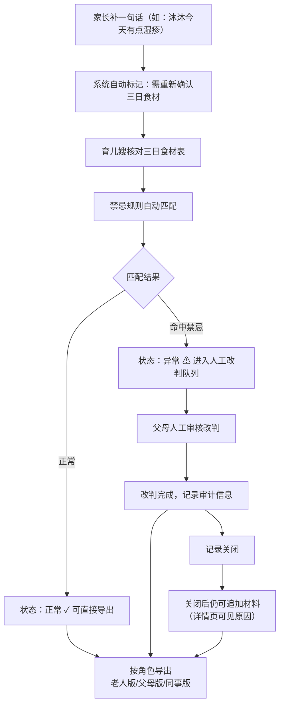

## 1. 产品概述
面向多成员家庭的婴幼儿辅食安全对账工具，解决家庭育儿嫂与家长之间三日食材计划的确认、禁忌核对、异常追溯与协作沟通问题。
- 核心目标：让老人快速看懂摘要、让父母掌握完整细节、让育儿嫂操作便捷，所有状态变更可追溯
- 目标用户：0-3岁婴幼儿家庭（父母、祖父母/外祖父母、住家/日间育儿嫂）

## 2. 核心功能

### 2.1 用户角色
| 角色 | 说明 | 核心权限 |
|------|------|----------|
| 老人（祖辈） | 沐沐爷爷奶奶/外公外婆 | 仅查看摘要视图（食材、状态、结论），看不到内部审计字段和技术错误 |
| 父母 | 沐沐爸爸/妈妈 | 完整详情视图，可改判、追加材料、导出、切换角色预览 |
| 育儿嫂 | 家庭服务人员 | 录入三日食材、标记状态、提交确认，不可改判历史结论 |

### 2.2 功能模块
1. **对账台首页**：三日食材表总览、状态筛选、快速搜索、角色切换
2. **记录详情页**：食材明细、禁忌匹配结果、完整审计时间线、补录前后差异对比、异常原因说明
3. **导出面板**：按角色生成可分享摘要，输出人类可读文本而非内部字段

### 2.3 页面详情
| 页面名称 | 模块名称 | 功能描述 |
|----------|----------|----------|
| 对账台首页 | 三日食材表 | 按日期展示早中晚+加餐，每行显示食材、禁忌状态、处理人 |
| 对账台首页 | 状态标签栏 | 全部/正常/异常/待人工改判/已补录 五个筛选Tab |
| 对账台首页 | 角色切换器 | 老人/父母/育儿嫂三种视图即时切换，用于演示权限边界 |
| 对账台首页 | 顶部操作栏 | 导出按钮、补录入口、沐沐家长补充说明横幅 |
| 记录详情页 | 食材与禁忌匹配 | 展示触发的禁忌规则、严重程度、建议处理方式 |
| 记录详情页 | 审计时间线 | 所有操作人、操作时间、操作类型的完整流水，缺失处理人时显示原因 |
| 记录详情页 | 补录差异对比 | 手工补录记录并排展示原始数据与补录数据的差异高亮 |
| 记录详情页 | 关闭后追加材料 | 已关闭记录仍可追加材料，并在详情页显著标注原因"记录已关闭后补充，不影响原始结论" |
| 导出面板 | 按角色导出 | 老人版摘要（极简）、父母版详情（完整）、同事协作版（脱敏专业摘要） |

## 3. 核心流程

家长补充说明→系统标记需重新确认→育儿嫂核对三日食材→系统自动匹配禁忌→正常/异常分流→异常进入人工改判→改判完成/关闭后仍可追加材料→按角色导出摘要

## 4. 用户界面设计

### 4.1 设计风格
- **主色调**：柔和暖米色 #FBF7F2 背景，搭配婴儿粉 #F8B4B4 警示、鼠尾草绿 #9CC4A1 正常、夕阳橙 #F4A261 待改判
- **按钮风格**：圆角 14px，微阴影，hover 时有轻微上浮 + 阴影加深
- **字体**：标题用 "Noto Serif SC" 衬线体营造家庭温度，正文用 "Noto Sans SC" 保证可读性
- **布局风格**：卡片式布局，每张记录一张卡片，时间线用左侧竖线连接
- **图标风格**：Lucide 线性图标，搭配食物类 emoji 增强识别（🍎🥚🥛）

### 4.2 页面设计概览
| 页面名称 | 模块名称 | UI 元素 |
|----------|----------|----------|
| 对账台首页 | 家长补充横幅 | 淡粉底色，左侧 💬 图标，"沐沐妈妈 09:12 补充：今天有点湿疹，饮食请注意"，右侧"重新确认"按钮 |
| 对账台首页 | 三日食材表 | 日期分组标题 + 时段标签（早/中/晚/加餐）+ 食材 chips + 状态徽章 |
| 对账台首页 | 记录卡片 | hover 上浮 2px + 阴影加深，点击涟漪效果 |
| 记录详情页 | 审计时间线 | 左侧彩色圆点 + 竖线，每节点显示操作人、时间、说明，缺失处理人时灰色虚线 + "系统自动操作/处理人信息不可用" |
| 记录详情页 | 补录差异 | 左右双栏对比，删除项红色删除线，新增项绿色高亮背景 |
| 导出面板 | 预览卡片 | 三种角色版本并排展示，点击卡片即复制对应文本 |

### 4.3 响应式
桌面端优先（≥1024px），双栏布局：左侧食材列表，右侧详情预览。移动端（<768px）单栏堆叠，详情页全屏覆盖。所有触控目标 ≥44×44px。
