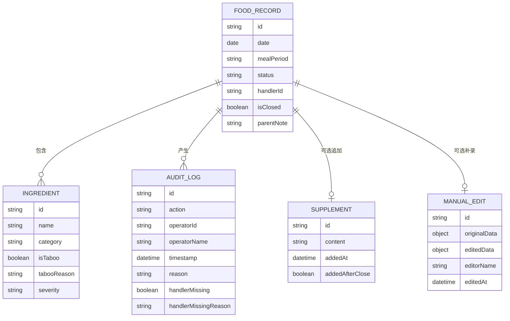

## 1. 架构设计

纯前端单页应用，所有数据内置为 Mock 数据，不依赖后端服务，方便启动即演示。

## 2. 技术描述
- **前端**：React@18 + TypeScript + Tailwind CSS@3 + Vite
- **状态管理**：Zustand
- **图标**：lucide-react
- **路由**：react-router-dom
- **初始化工具**：vite-init（react-ts 模板）

## 3. 路由定义
| 路由 | 用途 |
|------|------|
| / | 对账台首页（三日食材表 + 记录列表 + 筛选） |
| /record/:id | 记录详情页（食材明细 + 禁忌 + 审计 + 补录差异） |
| /export | 导出面板（按角色预览与导出） |

## 4. 数据模型

### 4.1 数据模型定义

### 4.2 样例数据设计（内置 5 条覆盖三条路径）

| 编号 | 路径 | 场景描述 |
|------|------|----------|
| 1 | 正常路径 | 6月5日早餐，食材合规，无禁忌命中，状态正常 |
| 2 | 异常路径 | 6月5日午餐，含"鲜虾仁"命中海鲜禁忌，状态异常待处理 |
| 3 | 人工改判路径 | 6月5日晚餐，原判定"鸡蛋"过敏，父母人工改判为"可少量食用" |
| 4 | 关闭后追加材料 | 6月6日加餐，记录已关闭后家长追加观察说明 |
| 5 | 手工补录（含差异） | 6月6日早餐，育儿嫂补录漏记的"牛油果"，展示补录前后对比 |

其中编号 4 同时包含"审计里处理人缺失"场景——某条日志 operatorId 为空，handlerMissing=true，handlerMissingReason="该操作由系统自动触发，无对应处理人"。

## 5. 核心业务规则（前端实现）
1. **坏数据隔离**：状态为 `invalid` 的记录只在"全部"筛选中以灰色半透明卡片显示，不进入正常/异常/改判的任何统计
2. **关闭后追加材料**：记录 isClosed=true 时仍可追加 Supplement，但追加时标记 addedAfterClose=true，详情页顶部显示黄色警示条说明此材料不影响原始结论
3. **处理人缺失展示**：AuditLog 中 handlerMissing=true 时，时间线节点显示灰色虚线图标，文字为"处理人信息不可用：{handlerMissingReason}"
4. **角色视图边界**：
   - 老人角色：仅渲染 `<SummaryView />` 组件，隐藏审计时间线、补录差异、内部状态码
   - 父母角色：渲染完整 `<DetailView />` + `<AuditTimeline />` + `<DiffViewer />`
   - 育儿嫂角色：渲染食材编辑能力，但隐藏改判按钮与导出同事版入口
5. **导出摘要**：exportSummary() 函数接收 role 参数，输出纯文本，老人版 ≤150 字，同事版使用脱敏后的人类可读描述而非 `status_code=2` 这类内部字段
