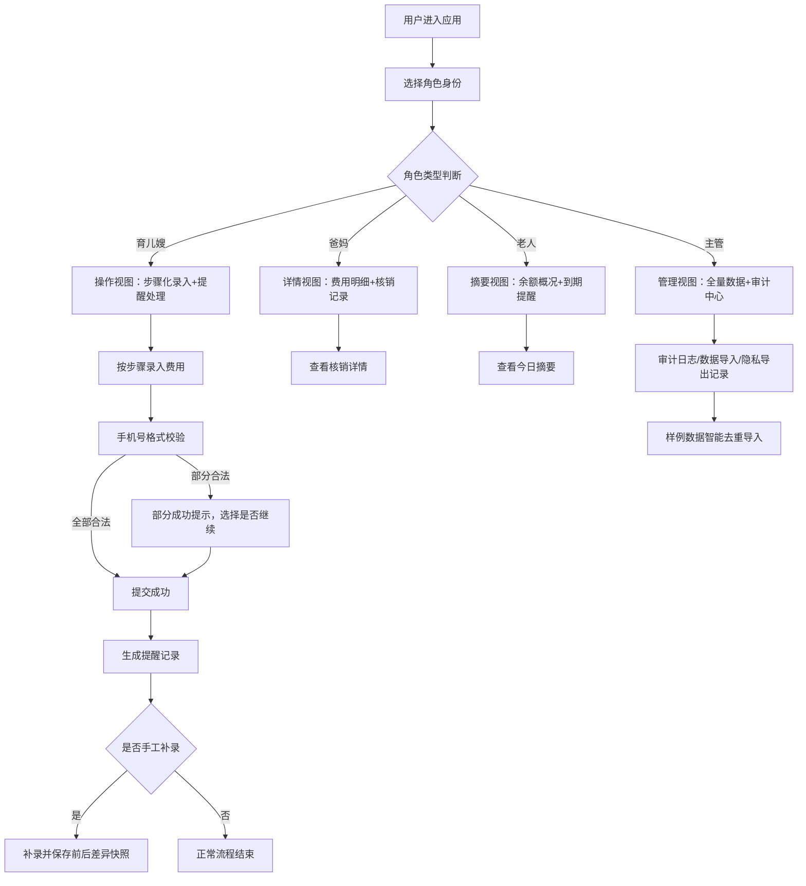

## 1. 产品概述
婴幼儿费用核销提醒墙家庭协作版是一款面向家庭的婴幼儿日常费用管理协作工具，解决育儿嫂新手操作难、月底余额突然变负、家庭成员信息不对称等问题。通过步骤化流程、角色分层视图、审计追溯机制，让家庭育儿费用透明、可控、可追溯。

## 2. 核心功能

### 2.1 用户角色
| 角色 | 登录方式 | 核心权限 |
|------|----------|----------|
| 老人(长辈) | 角色切换 | 仅查看费用摘要、余额概况、到期提醒，不看明细和隐私 |
| 爸妈(家长) | 角色切换 | 查看完整费用明细、核销记录、处理步骤，管理基础数据 |
| 育儿嫂(普通员工) | 角色切换 | 按步骤录入费用、处理核销提醒，只看必要操作内容 |
| 主管(管理员) | 角色切换 | 查看审计日志、隐私导出记录、数据去重历史，全量数据管理 |

### 2.2 功能模块
1. **角色切换登录页**: 头像式角色选择，一键切换身份视图
2. **费用核销提醒墙主页**: 卡片式提醒列表，按角色展示不同粒度信息
3. **步骤化处理流程**: 新手引导式操作，每步有说明和校验，避免月底余额变负
4. **手工补录功能**: 允许手工补录遗漏记录，保留补录前后差异痕迹
5. **审计日志中心**: 记录隐私字段导出、数据变更、导入操作，仅主管可见
6. **样例数据导入**: 智能去重，重复导入不产生多份有效记录，历史清晰
7. **手机号格式校验**: 支持部分成功模式，格式混乱时允许有效数据通过

### 2.3 页面详情
| 页面名称 | 模块名称 | 功能描述 |
|----------|----------|----------|
| 角色选择页 | 角色卡片 | 4个角色头像卡片，点击进入对应视图，带角色说明 |
| 提醒墙主页 | 顶部概览卡 | 根据角色展示余额/摘要/全量数据 |
| 提醒墙主页 | 提醒卡片列表 | 待核销费用卡片，支持按角色过滤信息字段 |
| 步骤处理页 | 步骤指示器 | 5步处理流程，每步有验证和回退功能 |
| 步骤处理页 | 手机号录入 | 智能格式校验，部分成功提示 |
| 手工补录页 | 补录表单 | 带备注的补录表单，自动关联历史快照 |
| 审计中心 | 日志列表 | 导出记录、变更记录、导入记录，可筛选复查 |
| 数据导入页 | 样例导入 | 一键导入样例，智能去重提示，历史版本保留 |

## 3. 核心流程
用户选择角色进入对应视图，育儿嫂按步骤录入费用信息，系统校验手机号等字段，支持部分成功。爸妈查看明细，老人看摘要。主管可审计所有操作。导出隐私字段时自动记录审计日志。重复导入样例数据时自动去重，保留历史版本。手工补录记录保留前后差异快照。

## 4. 用户界面设计
### 4.1 设计风格
- **主色**: 温暖的婴儿奶粉色 `#FFF4E6`，主强调色为柔和橙 `#FF8A4C`，辅助色为薄荷绿 `#7ED7C1`
- **次色**: 审计警示用深红 `#E85D5D`，成功状态用森林绿 `#4CAF7A`
- **按钮风格**: 柔和圆角(12px)，微投影，悬浮时有轻微上浮动画
- **字体**: 标题使用圆润的「ZCOOL KuaiLe」/「站酷快乐体」，正文使用「PingFang SC」苹方
- **布局风格**: 卡片式布局，大量圆角和柔和阴影，营造家庭温暖感
- **图标风格**: 使用 Lucide 图标，统一圆角风格，搭配小 emoji 装饰
- **背景纹理**: 极浅的奶油色渐变 + 细微点状纹理，不刺眼

### 4.2 页面设计概述
| 页面名称 | 模块名称 | UI 元素 |
|----------|----------|---------|
| 角色选择页 | 角色卡片 | 大头像圆形卡片，角色名称+权限说明，悬浮放大动效 |
| 提醒墙主页 | 顶部概览卡 | 大号余额数字，状态徽章，渐变背景色条 |
| 提醒墙主页 | 提醒卡片列表 | 左右分栏卡片，左侧状态颜色条，右侧金额+到期日 |
| 步骤处理页 | 步骤指示器 | 顶部时间线式步骤条，已完成打勾，当前高亮 |
| 步骤处理页 | 表单区域 | 大输入框，实时校验提示，下/上一步按钮 |
| 审计中心 | 日志列表 | 时间线布局，操作人+时间+内容，红色标记隐私导出 |
| 数据导入页 | 去重对比 | 左右对比卡片，左侧旧数据，右侧新数据，差异高亮 |

### 4.3 响应式
桌面端优先设计，最大宽度 1280px 居中布局；平板适配双栏；移动端单栏堆叠，触控区域≥44px。

### 4.4 动效设计
- 页面加载：卡片依次淡入上浮(100ms 间隔)
- 步骤切换：横向滑动过渡
- 按钮点击：缩放 0.96 -> 1.0 的微动效
- 余额数字：变化时有滚动递增动画
