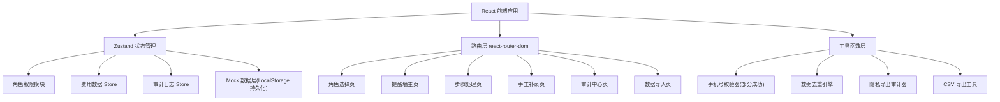
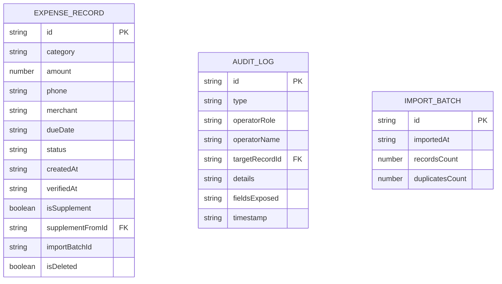

## 1. 架构设计



## 2. 技术描述
- **前端**: React@18 + TypeScript + Tailwind CSS@3 + Vite
- **状态管理**: Zustand（轻量，适合多模块 Store）
- **路由**: react-router-dom
- **图标**: lucide-react
- **持久化**: LocalStorage（模拟后端数据持久化）
- **数据**: Mock 内置样例数据，支持导入导出 CSV
- **后端**: 无（纯前端实现，LocalStorage 作为数据存储层）

## 3. 路由定义
| 路由 | 用途 |
|------|------|
| `/` | 角色选择登录页 |
| `/dashboard` | 费用核销提醒墙主页（按角色渲染不同视图） |
| `/process/:recordId` | 步骤化处理流程页 |
| `/supplement` | 手工补录页 |
| `/audit` | 审计中心页（仅主管可见） |
| `/import` | 样例数据导入页（仅主管可见） |

## 4. API 定义（前端 Mock Service 层）
```typescript
// 角色类型
type UserRole = 'elder' | 'parent' | 'nanny' | 'admin';

// 费用记录类型
interface ExpenseRecord {
  id: string;
  category: '奶粉' | '尿不湿' | '医疗' | '辅食' | '其他';
  amount: number;
  phone?: string;
  merchant: string;
  dueDate: string;
  status: 'pending' | 'verified' | 'rejected' | 'supplemented';
  createdAt: string;
  verifiedAt?: string;
  isSupplement?: boolean;
  supplementFromId?: string;
  beforeSnapshot?: Partial<ExpenseRecord>;
  importBatchId?: string;
  isDeleted?: boolean;
}

// 审计日志类型
interface AuditLog {
  id: string;
  type: 'export_privacy' | 'import' | 'update' | 'supplement' | 'delete';
  operatorRole: UserRole;
  operatorName: string;
  targetRecordId?: string;
  details: string;
  fieldsExposed?: string[];
  timestamp: string;
}

// Store 方法接口
interface AppStore {
  currentRole: UserRole | null;
  setRole: (role: UserRole) => void;
  records: ExpenseRecord[];
  addRecord: (record: Omit<ExpenseRecord, 'id' | 'createdAt'>) => void;
  updateRecord: (id: string, patch: Partial<ExpenseRecord>) => void;
  supplementRecord: (originalId: string, supplement: Partial<ExpenseRecord>, remark: string) => void;
  validatePhone: (phones: string[]) => { valid: string[]; invalid: string[]; partialSuccess: boolean };
  auditLogs: AuditLog[];
  addAuditLog: (log: Omit<AuditLog, 'id' | 'timestamp'>) => void;
  importSampleData: () => { added: number; skipped: number; duplicates: number };
  exportRecords: (includePrivacy: boolean) => string;
  getRecordsByRole: () => ExpenseRecord[];
}
```

## 5. 数据模型（LocalStorage Schema）



## 6. 核心业务逻辑说明

### 6.1 角色视图过滤规则
| 角色 | 可见字段 | 可见操作 |
|------|----------|----------|
| elder(老人) | 仅：category, amount(取整), status, dueDate | 无操作，只读 |
| parent(爸妈) | 全部字段除：phone 后4位脱敏 | 查看详情, 导出(不含隐私) |
| nanny(育儿嫂) | amount, category, merchant, dueDate, status | 录入, 核销处理 |
| admin(主管) | 全部字段，完整手机号 | 所有操作 + 审计 + 导入 |

### 6.2 手机号部分成功校验
- 输入批量手机号（逗号/空格/换行分隔）
- 正则校验中国大陆手机号 `/^1[3-9]\d{9}$/`
- 返回 `{ valid, invalid, partialSuccess }`
- `partialSuccess = true` 时提示用户「X 个有效，Y 个无效，是否仅提交有效部分？」

### 6.3 隐私导出审计
- 当 `includePrivacy=true` 导出时，自动写入 AuditLog，`type='export_privacy'`
- 记录 `fieldsExposed: ['phone']` 等隐私字段
- 审计中心中此类记录红色高亮

### 6.4 样例数据去重
- 每条样例数据有内置 `sampleKey = category+amount+merchant+dueDate`
- 导入时遍历比对，已存在则跳过，`skipped++`
- 每次导入生成 `importBatchId`，记录批次
- 不删除旧记录，只标记新导入的有效记录

### 6.5 手工补录差异快照
- 补录时保存 `beforeSnapshot`（原始记录的关键字段）
- 新记录 `isSupplement=true`, `supplementFromId=原记录ID`
- 原记录状态改为 `'supplemented'`，不删除
- 审计日志记录补录前后差异
