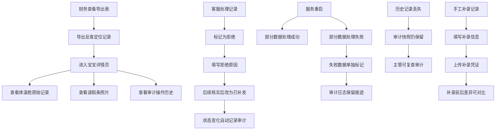

## 1. 产品概述
婴幼儿晨检复核回访册工坊客服版是专为辅食工坊客服团队设计的晨检数据管理系统，解决早高峰体温记录零散、财务追溯困难、审计缺失等问题。通过结构化数据管理、完整审计链路、多状态页面反馈，实现从导出表到宝宝详情再到原始记录的全链路追溯。

- **核心问题解决**：早高峰体温记录零散、财务追溯困难、历史记录丢失无审计、状态变化无痕迹
- **目标用户**：辅食工坊客服、财务同事、主管
- **产品价值**：提升数据可追溯性、保障审计完整性、优化客服处理效率

## 2. 核心功能

### 2.1 用户角色
| 角色 | 登录方式 | 核心权限 |
|------|----------|----------|
| 客服 | 账号登录 | 处理记录、状态流转、手工补录、导出数据 |
| 财务 | 账号登录 | 反查宝宝详情、查看原始记录、导出报表 |
| 主管 | 账号登录 | 审计复查、查看操作日志、数据统计 |

### 2.2 功能模块
1. **记录列表页**：晨检记录列表、筛选搜索、数据状态标识、批量操作
2. **宝宝详情页**：宝宝基本信息、体温枪原始记录、请假条照片、操作历史
3. **记录处理页**：拒绝/补发状态流转、备注填写、手工补录表单
4. **导出管理页**：导出任务列表、导出反查入口、变化痕迹展示
5. **审计日志页**：操作审计、历史记录恢复、服务重启记录
6. **数据状态页**：空数据占位、脏数据提示、正常数据展示的三种状态反馈

### 2.3 页面详情
| 页面名称 | 模块名称 | 功能描述 |
|----------|----------|----------|
| 记录列表页 | 数据状态区 | 空数据友好提示、脏数据红色标识、正常数据绿色标识 |
| 记录列表页 | 操作区 | 拒绝按钮、补发按钮、详情查看、手工补录入口 |
| 宝宝详情页 | 原始记录区 | 体温枪原始数据展示、请假条照片预览、时间戳显示 |
| 宝宝详情页 | 审计区 | 操作历史时间线、状态变化痕迹、操作人记录 |
| 导出管理页 | 反查区 | 从导出行定位到宝宝详情、展示字段级变化对比 |
| 导出管理页 | 变化痕迹区 | 显示"拒绝→已补发"等状态变更历史 |
| 审计日志页 | 重启记录区 | 服务重启部分成功标记、失败数据单独列出 |
| 审计日志页 | 数据恢复区 | 历史丢失记录的审计快照、恢复操作入口 |
| 手工补录页 | 补录表单 | 体温记录补录、请假条上传、补录原因填写 |

## 3. 核心流程
财务同事从导出Excel中找到有疑问的记录，通过系统的导出反查功能定位到具体宝宝，查看该宝宝的体温枪原始记录和请假条照片，同时可追溯该记录的所有状态变化（如"拒绝→已补发"）和操作人。客服处理时，先标记一条记录为"拒绝"，后续核实后改为"已补发"，整个过程在审计日志中永久保留。系统重启时采用部分成功机制，失败数据单独标记，历史记录即使丢失也保留审计快照供主管复查。

## 4. 用户界面设计

### 4.1 设计风格
- **主色调**：温暖橙红 `#E63946`（代表关怀与警示），搭配医疗蓝 `#457B9D`（专业与信任）
- **辅助色**：状态绿 `#2A9D8F`（正常），警告黄 `#E9C46A`（脏数据），危险红 `#E63946`（拒绝）
- **按钮风格**：圆角8px，主按钮渐变填充，次要按钮描边，hover有微妙阴影提升
- **字体**：标题使用"Noto Serif SC"衬线字体显稳重，正文使用"Noto Sans SC"无衬线字体保清晰
- **布局风格**：卡片式布局，左侧导航+右侧内容区，顶部面包屑导航
- **图标风格**：线性图标搭配微小圆角，体温枪用🌡️，请假条用📝，审计用🔍

### 4.2 页面设计概述
| 页面名称 | 模块名称 | UI元素 |
|----------|----------|--------|
| 记录列表页 | 状态卡片 | 三种数据状态卡片轮播展示，空数据有插画占位 |
| 记录列表页 | 数据表格 | 斑马纹表格，状态标签彩色胶囊，行hover高亮 |
| 宝宝详情页 | 信息概览 | 宝宝头像卡片，关键信息大字展示 |
| 宝宝详情页 | 时间线 | 垂直时间线展示状态变化，节点有动画效果 |
| 宝宝详情页 | 照片画廊 | 请假条照片网格布局，点击放大预览 |
| 导出管理页 | 对比视图 | 左右分栏展示补录前后数据差异，变化处高亮 |
| 审计日志页 | 时间轴 | 横向时间轴展示服务重启记录，成功/失败分区显示 |
| 手工补录页 | 表单 | 分步表单，上传区域拖拽上传，实时预览 |

### 4.3 响应式
采用桌面优先设计，主内容区最小宽度1200px。平板端折叠侧边栏，手机端转为底部Tab导航，表格横向滚动。所有交互元素确保触控区域≥44x44px。

### 4.4 动效设计
- 页面加载：内容区渐入+轻微上移，卡片依次延迟入场
- 状态变化：状态标签切换时缩放+颜色渐变动画
- 数据刷新：骨架屏loading→内容渐现过渡
- 按钮交互：点击时缩小到95%再回弹，营造物理反馈
- 时间线：滚动时节点依次点亮动画
