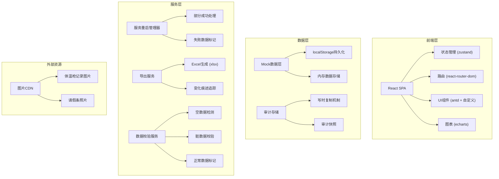
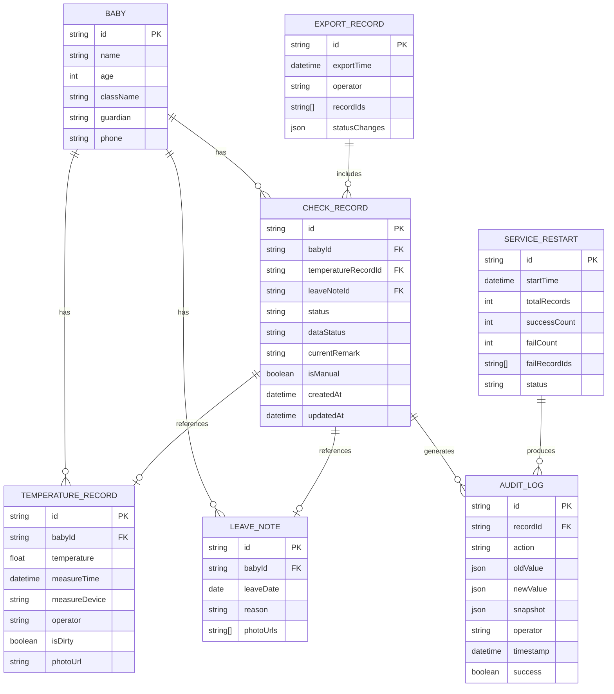

## 1. 架构设计



## 2. 技术描述
- **前端框架**：React@18 + TypeScript@5
- **构建工具**：Vite@5
- **样式方案**：TailwindCSS@3 + 自定义CSS变量
- **状态管理**：zustand@4（轻量级，适合审计场景）
- **路由**：react-router-dom@6
- **UI组件库**：Ant Design@5 + 自定义业务组件
- **Excel导出**：xlsx@0.18
- **图表**：echarts@5
- **数据持久化**：localStorage + 内存状态
- **Mock数据**：内置完整样例数据，无需后端

## 3. 路由定义
| 路由 | 用途 |
|------|------|
| / | 记录列表首页（含三种数据状态展示） |
| /baby/:id | 宝宝详情页（原始记录+请假条+审计） |
| /export | 导出管理页（反查+变化痕迹） |
| /audit | 审计日志页（服务重启+历史恢复） |
| /manual-add | 手工补录页 |

## 4. 数据状态定义

```typescript
// 数据状态枚举
enum DataStatus {
  EMPTY = 'empty',      // 空数据
  DIRTY = 'dirty',      // 脏数据
  NORMAL = 'normal'     // 正常数据
}

// 记录状态枚举
enum RecordStatus {
  PENDING = 'pending',      // 待处理
  REJECTED = 'rejected',    // 已拒绝
  REISSUED = 'reissued',    // 已补发
  MANUAL = 'manual'         // 手工补录
}

// 操作类型枚举
enum AuditAction {
  CREATE = 'create',
  UPDATE = 'update',
  REJECT = 'reject',
  REISSUE = 'reissue',
  MANUAL_ADD = 'manual_add',
  EXPORT = 'export',
  SERVICE_RESTART = 'service_restart',
  DATA_RESTORE = 'data_restore'
}

// 宝宝信息
interface Baby {
  id: string;
  name: string;
  age: number;
  className: string;
  guardian: string;
  phone: string;
  avatar: string;
  createdAt: string;
}

// 体温枪原始记录
interface TemperatureRecord {
  id: string;
  babyId: string;
  temperature: number;
  measureTime: string;
  measureDevice: string;
  operator: string;
  remark: string;
  photoUrl: string;
  isDirty: boolean;
  dirtyReason?: string;
}

// 请假条
interface LeaveNote {
  id: string;
  babyId: string;
  leaveDate: string;
  reason: string;
  photoUrls: string[];
  operator: string;
  createdAt: string;
}

// 晨检复核记录
interface CheckRecord {
  id: string;
  babyId: string;
  temperatureRecordId?: string;
  leaveNoteId?: string;
  status: RecordStatus;
  dataStatus: DataStatus;
  currentRemark: string;
  isManual: boolean;
  createdAt: string;
  updatedAt: string;
  operator: string;
}

// 审计日志
interface AuditLog {
  id: string;
  recordId?: string;
  babyId?: string;
  action: AuditAction;
  oldValue?: any;
  newValue?: any;
  snapshot?: any;
  operator: string;
  timestamp: string;
  serviceRestartId?: string;
  success: boolean;
  errorMessage?: string;
}

// 服务重启记录
interface ServiceRestart {
  id: string;
  startTime: string;
  endTime?: string;
  totalRecords: number;
  successCount: number;
  failCount: number;
  failRecordIds: string[];
  operator: string;
  status: 'processing' | 'partial_success' | 'completed' | 'failed';
}

// 导出记录
interface ExportRecord {
  id: string;
  exportTime: string;
  operator: string;
  recordIds: string[];
  statusChanges: Array<{
    recordId: string;
    oldStatus: string;
    newStatus: string;
    changeTime: string;
    operator: string;
  }>;
  downloadUrl: string;
}
```

## 5. 核心机制设计

### 5.1 服务重启部分成功机制
```typescript
interface RestartResult {
  success: string[];      // 成功处理的记录ID
  failed: Array<{         // 失败的记录
    recordId: string;
    reason: string;
    data: any;
  }>;
  auditSnapshot: AuditLog[];  // 审计快照，即使数据丢失也保留
}

// 幂等处理：每条记录单独事务，失败不影响其他
async function processWithPartialSuccess(records: CheckRecord[]): Promise<RestartResult> {
  const success: string[] = [];
  const failed: Array<{recordId: string, reason: string, data: any}> = [];
  const auditSnapshot: AuditLog[] = [];
  
  for (const record of records) {
    try {
      // 先写入审计快照（写时复制）
      const snapshot = createAuditSnapshot(record, AuditAction.SERVICE_RESTART);
      auditSnapshot.push(snapshot);
      
      // 处理业务逻辑
      await processSingleRecord(record);
      
      success.push(record.id);
    } catch (error) {
      failed.push({
        recordId: record.id,
        reason: error.message,
        data: { ...record }
      });
    }
  }
  
  // 即使部分失败，审计快照必须全部保留
  await persistAuditLogs(auditSnapshot);
  
  return { success, failed, auditSnapshot };
}
```

### 5.2 审计保留机制（历史记录丢失时）
```typescript
// 写时复制策略：每次操作前先保存快照
async function saveWithAudit<T>(
  record: T, 
  action: AuditAction, 
  operator: string,
  updateFn: (r: T) => Promise<T>
): Promise<T> {
  // 1. 先保存旧值快照到审计
  const auditLog: AuditLog = {
    id: generateId(),
    recordId: (record as any).id,
    action,
    oldValue: JSON.parse(JSON.stringify(record)),
    operator,
    timestamp: new Date().toISOString(),
    success: true
  };
  await persistAuditLog(auditLog);
  
  // 2. 执行更新
  const updated = await updateFn(record);
  
  // 3. 更新审计记录的新值
  auditLog.newValue = JSON.parse(JSON.stringify(updated));
  await updateAuditLog(auditLog);
  
  return updated;
}

// 即使主数据丢失，审计快照可用于恢复
async function restoreFromAudit(recordId: string): Promise<CheckRecord | null> {
  const latestAudit = await getLatestAuditByRecordId(recordId);
  if (latestAudit?.newValue) {
    return latestAudit.newValue as CheckRecord;
  }
  return null;
}
```

### 5.3 状态流转痕迹追踪
```typescript
interface StatusChange {
  from: RecordStatus;
  to: RecordStatus;
  reason: string;
  operator: string;
  timestamp: string;
}

// 拒绝 → 已补发 的完整流转记录
async function rejectThenReissue(
  recordId: string,
  rejectReason: string,
  reissueReason: string,
  operator: string
): Promise<CheckRecord> {
  // 第一步：拒绝
  let record = await getRecord(recordId);
  record = await saveWithAudit(
    record,
    AuditAction.REJECT,
    operator,
    async (r) => ({
      ...r,
      status: RecordStatus.REJECTED,
      currentRemark: rejectReason,
      updatedAt: new Date().toISOString()
    })
  );
  
  // 第二步：已补发（模拟后续操作）
  record = await saveWithAudit(
    record,
    AuditAction.REISSUE,
    operator,
    async (r) => ({
      ...r,
      status: RecordStatus.REISSUED,
      currentRemark: reissueReason,
      updatedAt: new Date().toISOString()
    })
  );
  
  return record;
}
```

## 6. 数据模型ER图



## 7. 初始样例数据

```typescript
// 样例数据包含：
// 1. 3条正常数据
// 2. 1条脏数据（体温异常高、备注不完整）
// 3. 1条空数据（只有宝宝ID，无体温记录）
// 4. 1条"拒绝→已补发"完整流转记录
// 5. 1条手工补录记录（包含补录前后差异）
// 6. 1条服务重启部分成功记录
// 7. 2张请假条照片
// 8. 3条体温枪原始记录
```
