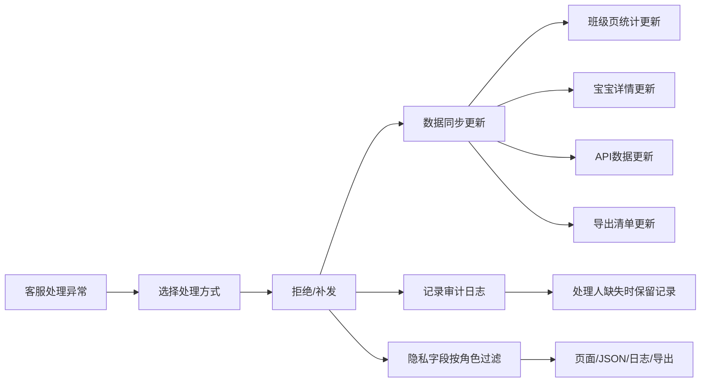

## 1. 产品概述

婴幼儿用品消毒提醒墙工坊客服版是一款面向幼儿园/托育机构的用品消毒管理系统，帮助客服人员处理用品发放异常、追踪消毒记录、管理宝宝用品发放情况。系统解决了未清洁用品再次发放的问题，确保异常处理后所有数据同步更新，并提供完整的审计追踪。

## 2. 核心功能

### 2.1 用户角色

| 角色 | 注册方式 | 核心权限 |
|------|---------|---------|
| 客服人员 | 系统分配 | 处理异常记录、补发用品、手工补录、导出清单 |
| 主管 | 系统分配 | 查看审计记录、复查异常处理、查看隐私字段 |
| 普通员工 | 系统分配 | 查看班级和宝宝信息，无隐私字段访问权 |

### 2.2 功能模块

1. **班级列表页**：查看所有班级及异常统计，实时同步处理结果
2. **宝宝详情页**：查看单个宝宝的用品发放记录和异常历史
3. **客服处理页**：处理异常记录（拒绝/补发）、手工补录记录
4. **审计日志页**：查看所有操作记录，处理人缺失时保留记录
5. **导出功能**：导出Excel清单，包含状态变更历史

### 2.3 页面详情

| 页面名称 | 模块名称 | 功能描述 |
|---------|---------|---------|
| 班级列表页 | 班级卡片 | 显示班级名称、宝宝数量、待处理异常数 |
| 班级列表页 | 异常筛选 | 按状态筛选异常记录 |
| 宝宝详情页 | 基本信息 | 显示宝宝姓名、年龄、过敏史（隐私字段按角色处理） |
| 宝宝详情页 | 用品记录 | 用品发放历史、消毒状态、异常标记 |
| 宝宝详情页 | 异常历史 | 显示所有异常处理记录和状态变更 |
| 客服处理页 | 异常处理 | 拒绝或补发用品，支持部分成功 |
| 客服处理页 | 手工补录 | 手动添加补发记录，标记补录来源 |
| 审计日志页 | 操作记录 | 所有操作的完整审计，处理人缺失时保留 |
| 导出功能 | 清单导出 | 导出Excel，包含状态变更历史和变更原因 |

## 3. 核心流程

用户在客服处理页选择一条异常记录，选择处理方式（拒绝/补发），提交后系统自动同步更新班级页的异常统计、宝宝详情页的记录状态、后台API返回最新数据，并更新导出清单的数据。若记录已关闭后追加材料，允许部分项目成功。所有操作都会记录审计日志，即使处理人信息缺失也会保留记录。隐私字段在各个层面按用户角色进行过滤。

## 4. 用户界面设计

### 4.1 设计风格
- 主色调：医疗蓝 (#165DFF) 搭配温暖橙 (#FF7D00)
- 按钮风格：圆角8px，带轻微阴影，hover时有上浮效果
- 字体：标题使用 Noto Sans SC Bold，正文使用 Noto Sans SC Regular
- 布局风格：卡片式布局，顶部导航，侧边栏菜单
- 图标风格：使用 lucide-react 线性图标

### 4.2 页面设计概述

| 页面名称 | 模块名称 | UI元素 |
|---------|---------|---------|
| 班级列表页 | 班级卡片 | 渐变色卡片、统计数字动画、状态标签 |
| 宝宝详情页 | 时间线 | 用品发放时间线、状态变更标记 |
| 客服处理页 | 处理表单 | 分步表单、确认弹窗、成功提示 |
| 审计日志页 | 记录列表 | 斑马纹表格、状态徽章、操作人信息 |

### 4.3 响应式
- 桌面端（1200px+）：三栏布局，侧边栏+主内容+详情面板
- 平板端（768px-1200px）：两栏布局，可折叠侧边栏
- 移动端（<768px）：单栏布局，底部导航

### 4.4 关键交互
- 异常处理后，相关数据自动刷新，显示更新动画
- 状态变更时，记录变更历史并在导出中体现
- 手工补录记录使用特殊标记区分系统自动记录
