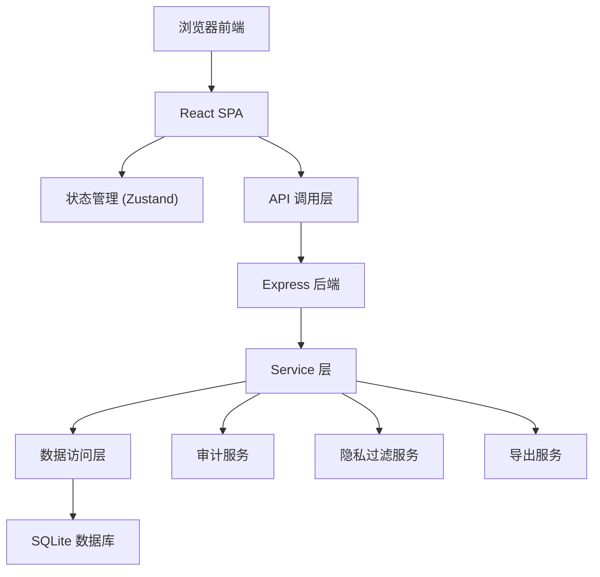

## 1. 架构设计



## 2. 技术描述

- 前端：React@18 + TypeScript + TailwindCSS@3 + Vite
- 后端：Express@4 + TypeScript + ESM
- 数据库：SQLite（文件存储，无需额外服务）
- 状态管理：Zustand
- 路由：React Router DOM
- 图标：lucide-react
- 导出：SheetJS (xlsx)
- 初始化工具：vite-init
- 项目模板：react-express-ts

## 3. 核心功能实现要点

### 3.1 数据同步机制
- 异常处理后，通过 Zustand 状态管理自动更新所有相关页面
- 使用发布订阅模式，数据变更后通知所有订阅组件刷新
- API 返回数据包含更新版本号，前端比对后决定是否刷新

### 3.2 部分成功逻辑
- 已关闭记录追加材料时，逐条处理，返回成功/失败明细
- 事务控制：单条失败不影响其他条目的处理
- 响应体包含 `partialSuccess` 标识和 `successItems`/`failedItems` 数组

### 3.3 审计日志
- 所有操作（创建/更新/删除）强制记录审计日志
- 处理人缺失时，记录 `operatorId: null` 但保留完整操作记录
- 日志包含：操作类型、操作时间、IP地址、请求参数、响应结果、处理人（可为空）

### 3.4 隐私字段处理
- 后端中间件统一处理隐私字段过滤
- 根据用户角色决定返回字段：
  - 主管：完整字段（含过敏史、家庭住址、联系方式）
  - 客服：脱敏字段（姓+*，手机号中间四位*）
  - 普通员工：隐私字段全部替换为 `***`
- 日志和导出同样应用此规则

### 3.5 状态变更历史
- 每条记录维护 `statusHistory` 数组，记录所有状态变更
- 包含：变更时间、变更前状态、变更后状态、变更原因、处理人
- 导出Excel时单独列示状态变更历史

## 4. 路由定义

| 路由 | 页面 | 说明 |
|------|------|------|
| / | 重定向到 /classes | 首页 |
| /classes | 班级列表页 | 查看所有班级和异常统计 |
| /classes/:classId | 班级详情页 | 查看班级下所有宝宝 |
| /baby/:babyId | 宝宝详情页 | 查看宝宝用品记录和异常历史 |
| /customer-service | 客服处理页 | 处理异常、手工补录 |
| /audit | 审计日志页 | 查看操作记录 |
| /export | 导出页面 | 导出数据清单 |

## 5. API 定义

```typescript
// 基础类型
type RecordStatus = 'pending' | 'approved' | 'rejected' | 'reissued' | 'closed' | 'manual';
type UserRole = 'admin' | 'supervisor' | 'customer_service' | 'staff';

interface Baby {
  id: string;
  name: string;
  age: number;
  classId: string;
  allergyHistory?: string; // 隐私字段
  parentPhone?: string;    // 隐私字段
  address?: string;        // 隐私字段
}

interface SupplyRecord {
  id: string;
  babyId: string;
  classId: string;
  itemName: string;
  itemType: 'bottle' | 'towel' | 'clothes' | 'other';
  sterilized: boolean;
  status: RecordStatus;
  statusHistory: StatusChange[];
  isManual: boolean;
  createdAt: string;
  updatedAt: string;
  remark?: string;
}

interface StatusChange {
  timestamp: string;
  fromStatus: RecordStatus;
  toStatus: RecordStatus;
  reason: string;
  operatorId: string | null;
}

interface AuditLog {
  id: string;
  operationType: 'create' | 'update' | 'delete' | 'export';
  entityType: string;
  entityId: string;
  operatorId: string | null;
  operatorRole: UserRole | null;
  ipAddress: string;
  requestParams: any;
  responseData: any;
  timestamp: string;
  success: boolean;
  errorMessage?: string;
}

// 请求/响应类型
interface HandleExceptionRequest {
  recordId: string;
  action: 'approve' | 'reject' | 'reissue' | 'close';
  reason: string;
  items?: { itemId: string; action: string }[]; // 用于部分成功
}

interface PartialSuccessResponse {
  success: boolean;
  partialSuccess: boolean;
  successItems: string[];
  failedItems: { itemId: string; error: string }[];
  message: string;
}

// 隐私过滤中间件
// 所有API响应经过此中间件处理
function filterPrivacyFields<T>(data: T, userRole: UserRole): T;
```

## 6. 数据模型

### 6.1 ER 图

```mermaid
erDiagram
    CLASS ||--o{ BABY : has
    BABY ||--o{ SUPPLY_RECORD : has
    CLASS ||--o{ SUPPLY_RECORD : has
    SUPPLY_RECORD ||--o{ STATUS_CHANGE : has
    USER ||--o{ AUDIT_LOG : creates
    SUPPLY_RECORD ||--o{ AUDIT_LOG : relates
    BABY ||--o{ AUDIT_LOG : relates
```

### 6.2 DDL 语句

```sql
-- 班级表
CREATE TABLE classes (
  id TEXT PRIMARY KEY,
  name TEXT NOT NULL,
  teacher_name TEXT,
  created_at TEXT NOT NULL DEFAULT CURRENT_TIMESTAMP,
  updated_at TEXT NOT NULL DEFAULT CURRENT_TIMESTAMP
);

-- 宝宝表
CREATE TABLE babies (
  id TEXT PRIMARY KEY,
  name TEXT NOT NULL,
  age INTEGER NOT NULL,
  class_id TEXT NOT NULL REFERENCES classes(id),
  allergy_history TEXT, -- 隐私字段
  parent_phone TEXT,    -- 隐私字段
  address TEXT,         -- 隐私字段
  created_at TEXT NOT NULL DEFAULT CURRENT_TIMESTAMP,
  updated_at TEXT NOT NULL DEFAULT CURRENT_TIMESTAMP
);

-- 用品记录表
CREATE TABLE supply_records (
  id TEXT PRIMARY KEY,
  baby_id TEXT NOT NULL REFERENCES babies(id),
  class_id TEXT NOT NULL REFERENCES classes(id),
  item_name TEXT NOT NULL,
  item_type TEXT NOT NULL CHECK (item_type IN ('bottle', 'towel', 'clothes', 'other')),
  sterilized INTEGER NOT NULL DEFAULT 0,
  status TEXT NOT NULL DEFAULT 'pending',
  is_manual INTEGER NOT NULL DEFAULT 0,
  remark TEXT,
  created_at TEXT NOT NULL DEFAULT CURRENT_TIMESTAMP,
  updated_at TEXT NOT NULL DEFAULT CURRENT_TIMESTAMP
);

-- 状态变更历史表
CREATE TABLE status_changes (
  id TEXT PRIMARY KEY,
  record_id TEXT NOT NULL REFERENCES supply_records(id),
  from_status TEXT NOT NULL,
  to_status TEXT NOT NULL,
  reason TEXT NOT NULL,
  operator_id TEXT, -- 允许为空，处理人缺失时保留记录
  created_at TEXT NOT NULL DEFAULT CURRENT_TIMESTAMP
);

-- 用户表
CREATE TABLE users (
  id TEXT PRIMARY KEY,
  username TEXT NOT NULL UNIQUE,
  password_hash TEXT NOT NULL,
  role TEXT NOT NULL CHECK (role IN ('admin', 'supervisor', 'customer_service', 'staff')),
  name TEXT NOT NULL,
  created_at TEXT NOT NULL DEFAULT CURRENT_TIMESTAMP
);

-- 审计日志表
CREATE TABLE audit_logs (
  id TEXT PRIMARY KEY,
  operation_type TEXT NOT NULL,
  entity_type TEXT NOT NULL,
  entity_id TEXT NOT NULL,
  operator_id TEXT, -- 允许为空
  operator_role TEXT, -- 允许为空
  ip_address TEXT,
  request_params TEXT,
  response_data TEXT,
  success INTEGER NOT NULL DEFAULT 1,
  error_message TEXT,
  timestamp TEXT NOT NULL DEFAULT CURRENT_TIMESTAMP
);

-- 索引
CREATE INDEX idx_supply_records_class_id ON supply_records(class_id);
CREATE INDEX idx_supply_records_baby_id ON supply_records(baby_id);
CREATE INDEX idx_supply_records_status ON supply_records(status);
CREATE INDEX idx_status_changes_record_id ON status_changes(record_id);
CREATE INDEX idx_audit_logs_entity ON audit_logs(entity_type, entity_id);
CREATE INDEX idx_audit_logs_timestamp ON audit_logs(timestamp);
```

### 6.3 初始数据

```sql
-- 插入班级
INSERT INTO classes (id, name, teacher_name) VALUES 
('class1', '小班（樱桃班）', '李老师'),
('class2', '中班（草莓班）', '王老师'),
('class3', '大班（芒果班）', '张老师');

-- 插入宝宝（包含隐私字段）
INSERT INTO babies (id, name, age, class_id, allergy_history, parent_phone, address) VALUES 
('baby1', '陈小明', 3, 'class1', '牛奶、花生过敏', '13812345678', '北京市朝阳区建国路88号'),
('baby2', '李小红', 3, 'class1', '青霉素过敏', '13987654321', '北京市海淀区中关村大街1号'),
('baby3', '王小满', 4, 'class2', '海鲜过敏', '13611112222', '北京市西城区金融街100号'),
('baby4', '张小刚', 4, 'class2', NULL, '13733334444', '北京市东城区王府井大街50号'),
('baby5', '刘小美', 5, 'class3', '鸡蛋过敏', '13555556666', '北京市丰台区南三环西路');

-- 插入用户
INSERT INTO users (id, username, password_hash, role, name) VALUES 
('user1', 'admin', 'hash1', 'admin', '系统管理员'),
('user2', 'supervisor', 'hash2', 'supervisor', '赵主管'),
('user3', 'cs001', 'hash3', 'customer_service', '客服小王'),
('user4', 'cs002', 'hash4', 'customer_service', '客服小李'),
('user5', 'staff001', 'hash5', 'staff', '员工小张');

-- 插入用品记录（包含小满那条未清洁记录和各种状态的记录）
INSERT INTO supply_records (id, baby_id, class_id, item_name, item_type, sterilized, status, is_manual, remark) VALUES 
('record1', 'baby3', 'class2', '奶瓶', 'bottle', 0, 'rejected', 0, '未清洁用品再次发放 - 小满那条'),
('record2', 'baby1', 'class1', '毛巾', 'towel', 1, 'pending', 0, NULL),
('record3', 'baby2', 'class1', '换洗衣物', 'clothes', 1, 'approved', 0, NULL),
('record4', 'baby4', 'class2', '奶瓶', 'bottle', 0, 'pending', 0, '未清洁'),
('record5', 'baby5', 'class3', '水杯', 'other', 1, 'closed', 0, NULL),
('record6', 'baby3', 'class2', '毛巾', 'towel', 0, 'rejected', 0, '未清洁');

-- 插入状态变更历史（小满那条记录的拒绝->补发过程）
INSERT INTO status_changes (id, record_id, from_status, to_status, reason, operator_id) VALUES 
('change1', 'record1', 'pending', 'rejected', '未清洁，拒绝发放', 'user3'),
('change2', 'record1', 'rejected', 'reissued', '已清洁，同意补发', 'user4');

-- 插入手工补录记录
INSERT INTO supply_records (id, baby_id, class_id, item_name, item_type, sterilized, status, is_manual, remark) VALUES 
('record7', 'baby3', 'class2', '备用奶瓶', 'bottle', 1, 'manual', 1, '手工补录 - 家长自行带来的备用奶瓶');

-- 插入状态变更历史（手工补录）
INSERT INTO status_changes (id, record_id, from_status, to_status, reason, operator_id) VALUES 
('change3', 'record7', 'pending', 'manual', '手工补录记录', 'user3');

-- 插入审计日志（包含处理人缺失的情况）
INSERT INTO audit_logs (id, operation_type, entity_type, entity_id, operator_id, operator_role, ip_address, request_params, response_data, success) VALUES 
('audit1', 'update', 'supply_record', 'record1', 'user3', 'customer_service', '192.168.1.100', '{"action":"reject"}', '{"success":true}', 1),
('audit2', 'update', 'supply_record', 'record1', NULL, NULL, '192.168.1.101', '{"action":"reissue"}', '{"success":true}', 1),
('audit3', 'create', 'supply_record', 'record7', 'user3', 'customer_service', '192.168.1.100', '{"isManual":true}', '{"success":true}', 1);
```
