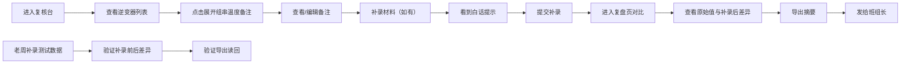

## 1. 产品概述

能源光伏逆变器复核台是面向光伏电站运维团队的内部工具，解决月底班组长核对逆变器数据时，调度员需要在旧版Excel台账和页面筛选之间反复切换解释的痛点。通过结构化展示、可展开详情、白话提示和一键导出等功能，提升数据复核效率。

- 核心目标：减少运维调度员月底解释成本，让班组长快速获取结论
- 目标用户：光伏运维调度员、值班员、班组长
- 市场价值：内部效率工具，降低沟通成本，减少数据核对错误

## 2. 核心功能

### 2.1 用户角色

| 角色 | 核心场景 | 核心需求 |
|------|----------|----------|
| 班组长 | 月底查看复核结论 | 快速看数量、原因、处理人、未拍板记录，不需要技术细节 |
| 运维调度员 | 日常复核、解释数据 | 组串温度备注折叠展示，避免满屏内部字段 |
| 值班员 | 补录材料 | 看到白话文提示，理解补录晚到的影响 |

### 2.2 功能模块

1. **逆变器复核台主页**：逆变器列表、可展开的组串温度备注区域、复核状态标签
2. **补录材料模块**：材料补录表单、白话提示信息、补录状态跟踪
3. **复盘对比页**：原始值保留展示、补录前后差异对比、刷新后状态不丢失
4. **摘要导出模块**：一键导出班组长可读摘要、包含关键指标统计

### 2.3 页面详情

| 页面名称 | 模块名称 | 功能描述 |
|-----------|-------------|---------------------|
| 逆变器复核台 | 逆变器列表卡片 | 展示逆变器基本信息、运行状态、复核结论、处理人 |
| 逆变器复核台 | 可展开组串温度备注 | 点击展开查看组串温度、备注信息、补录记录，默认折叠避免信息过载 |
| 逆变器复核台 | 老周补录测试数据 | 预置一条老周手工补录的组串温度备注，用于验证补录前后差异和导出读回 |
| 补录材料页 | 白话提示区 | 用通俗语言解释"补录材料晚到"对复核的影响，避免专业术语 |
| 复盘对比页 | 原始值保留区 | 页面刷新后仍保留历史原始值，展示补录前后的温度、备注差异 |
| 摘要导出页 | 导出预览 | 展示导出摘要内容预览：异常数量、原因分类、处理人清单、未拍板记录 |
| 摘要导出页 | 导出功能 | 支持复制文本、下载文件，内容可直接转发给班组长 |

## 3. 核心流程

用户主要流程：
1. 运维调度员登录复核台，默认看到逆变器列表，组串温度备注折叠不显示
2. 需要查看详情时点击展开，看到组串温度、历史备注、补录记录
3. 值班员补录材料时，页面显示白话文提示说明补录晚到的影响
4. 复盘时进入对比页，即使刷新页面，历史原始值仍然保留
5. 月底一键导出摘要，包含数量、原因、处理人、未拍板记录，可直接转发班组长
6. 系统预置老周补录的测试数据，用于验证整个补录→对比→导出流程

## 4. 用户界面设计

### 4.1 设计风格

**工业运维专业风格**：
- 主色调：深科技蓝 (#0F3B5F)，代表能源、专业、可靠
- 辅助色：警示橙 (#F59E0B) 用于异常提醒，成功绿 (#10B981) 用于正常状态，待处理灰 (#6B7280) 用于未拍板
- 按钮风格：方角直角按钮，2px边框，hover时边框高亮，工业感强
- 字体：标题用 "JetBrains Mono" 等宽字体体现专业感，正文用 "Noto Sans SC" 保证中文可读性
- 布局风格：卡片式栅格布局，左侧导航+右侧内容区，数据表格带斑马纹
- 图标：线性工业图标，避免花哨，强调功能性

### 4.2 页面设计概述

| 页面名称 | 模块名称 | UI Elements |
|-----------|-------------|-------------|
| 逆变器复核台 | 列表卡片 | 深蓝卡片背景、白色文字、状态标签角标、展开箭头动画、hover微上浮 |
| 逆变器复核台 | 可展开区域 | 滑入动画、内缩进24px、浅灰背景、时间轴样式展示补录记录 |
| 补录材料页 | 白话提示 | 浅橙背景、橙边边框、大号emoji警示、口语化文案 |
| 复盘对比页 | 差异对比 | 左右两列布局、删除线样式展示旧值、绿色高亮展示新值、差异标记 |
| 摘要导出页 | 统计面板 | 大字号数字、分类卡片、未拍板记录用红色边框突出 |

### 4.3 响应式

- Desktop-first 设计，主内容区最小宽度1200px
- 移动端适配：卡片垂直堆叠，可展开区域改为全屏抽屉
- 表格在移动端横向滚动，保证数据完整性

### 4.4 动效设计

- 页面加载：卡片从上到下错落出现，staggered动画延迟50ms
- 展开/收起：高度平滑过渡300ms，箭头旋转180度
- 状态变化：背景色渐变过渡200ms
- 数据导出：按钮点击后出现对勾动画，复制成功提示滑入
