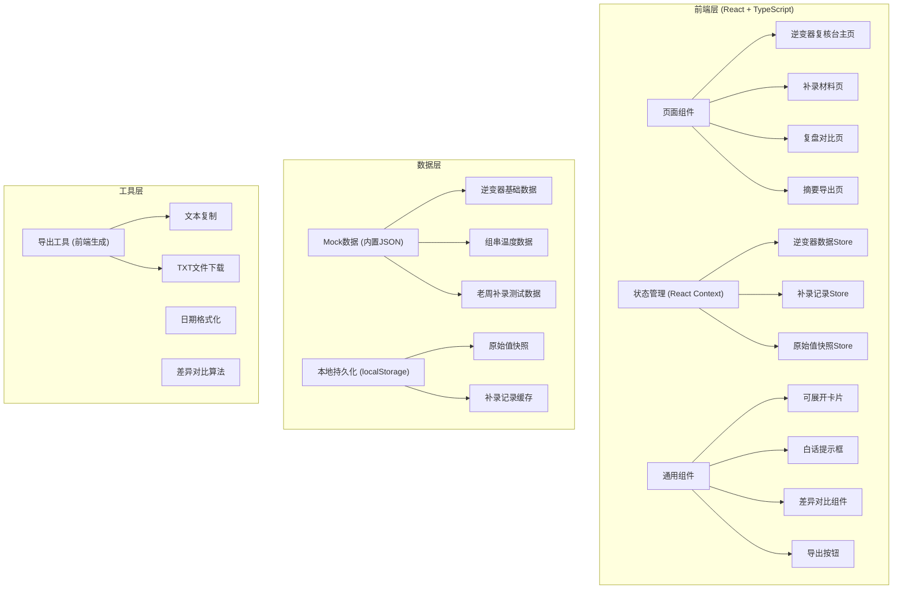
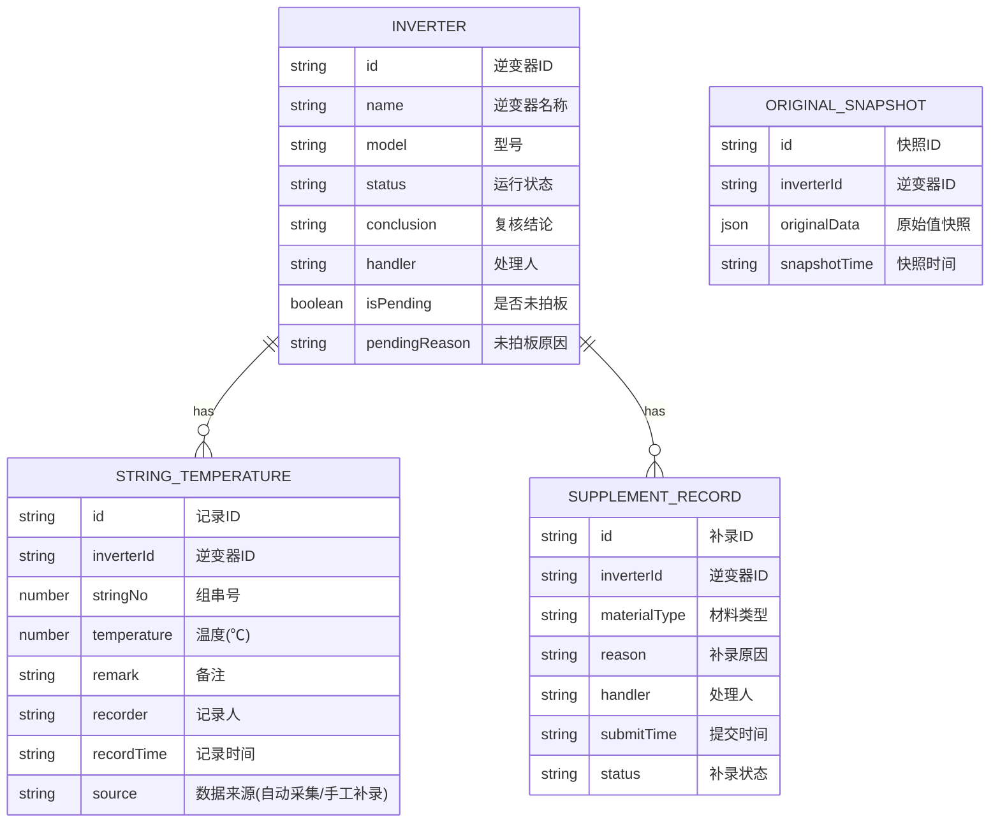

## 1. 架构设计



## 2. 技术描述

- **前端框架**: React@18 + TypeScript
- **构建工具**: Vite@5
- **样式方案**: TailwindCSS@3 + CSS变量主题
- **路由**: React Router DOM@6
- **状态管理**: React Context + useReducer（轻量方案，避免过度设计）
- **本地存储**: localStorage（持久化原始值快照和补录记录）
- **后端**: 无后端，全部使用前端Mock数据
- **图标**: Lucide React（线性工业风格图标）
- **字体**: Google Fonts (JetBrains Mono + Noto Sans SC)

## 3. 路由定义

| Route | 页面 | 说明 |
|-------|------|------|
| `/` | 逆变器复核台主页 | 逆变器列表、可展开组串温度备注、老周测试数据 |
| `/supplement` | 补录材料页 | 补录表单、白话提示区 |
| `/review` | 复盘对比页 | 原始值保留、补录前后差异对比 |
| `/export` | 摘要导出页 | 导出预览、复制/下载功能 |

## 4. 数据模型

### 4.1 数据模型定义



### 4.2 TypeScript 类型定义

```typescript
// 逆变器
interface Inverter {
  id: string;
  name: string;
  model: string;
  status: 'normal' | 'warning' | 'error';
  conclusion: 'passed' | 'failed' | 'pending';
  handler: string;
  isPending: boolean;
  pendingReason?: string;
  stringTemperatures: StringTemperature[];
  supplementRecords: SupplementRecord[];
}

// 组串温度
interface StringTemperature {
  id: string;
  inverterId: string;
  stringNo: number;
  temperature: number;
  remark: string;
  recorder: string;
  recordTime: string;
  source: 'auto' | 'manual';
  originalTemperature?: number;
  originalRemark?: string;
}

// 补录记录
interface SupplementRecord {
  id: string;
  inverterId: string;
  materialType: string;
  reason: string;
  handler: string;
  submitTime: string;
  status: 'pending' | 'completed' | 'delayed';
}

// 原始值快照
interface OriginalSnapshot {
  id: string;
  inverterId: string;
  originalData: StringTemperature[];
  snapshotTime: string;
}

// 导出摘要
interface ExportSummary {
  totalCount: number;
  abnormalCount: number;
  passedCount: number;
  pendingCount: number;
  reasons: { reason: string; count: number }[];
  handlers: { name: string; count: number }[];
  pendingRecords: { inverterName: string; reason: string; handler: string }[];
  exportTime: string;
}
```

### 4.3 Mock数据说明

**预置老周手工补录测试数据**：
- 逆变器：INV-003 号华为SUN2000-100KTL-M0
- 组串号：#12 组串
- 原始值：温度 62.5℃，备注 "组串温度偏高，待核实"，来源"自动采集"
- 老周补录后：温度 58.3℃，备注 "组串温度已核实，为散热片积尘导致，已清理"，来源"手工补录"，记录人"老周"
- 用于验证：补录前后差异对比、原始值保留、导出读回功能

**数据存储策略**：
- 基础数据：硬编码在 `src/data/mockData.ts`
- 用户操作产生的补录记录：存入 localStorage
- 原始值快照：在用户首次查看某逆变器时自动创建快照存入 localStorage，刷新不丢失
- 老周测试数据：硬编码包含补录前后完整数据，用于演示

## 5. 核心功能实现要点

### 5.1 可展开组串温度备注
- 使用 `<details>` 标签 + CSS 动画实现平滑展开收起
- 展开时显示时间轴样式的补录记录
- 老周补录记录用橙色边框高亮标记

### 5.2 白话提示功能
- 补录页面检测到 `status: 'delayed'` 时自动显示提示
- 提示文案："⚠️ 注意：这份材料补录晚了3天到，会影响本月复核进度。如果是测温仪校准数据，需要在备注里说明原因，不然班组长那边不好交代。"
- 可关闭，关闭后7天内不重复显示（localStorage记录）

### 5.3 复盘页原始值保留
- 进入复盘页时从 localStorage 读取 `originalSnapshots`
- 若不存在则自动从 mock 数据生成快照
- 左右两列对比，左列显示原始值（带删除线样式），右列显示当前值
- 温度差异超过 3℃ 时用红色高亮标记

### 5.4 导出摘要功能
- 前端动态生成摘要文本，格式为：
```
【光伏逆变器复核摘要 - 2024年X月】
────────────────────────
总计复核：XX 台
异常数量：XX 台
已通过：XX 台
未拍板：XX 台

原因分类：
  组串温度偏高：XX 台
  通讯中断：XX 台
  ...

处理人清单：
  张三：XX 台
  李四：XX 台
  老周：XX 台

未拍板记录：
  INV-003：散热片积尘待确认 - 老周
  ...

导出时间：2024-XX-XX XX:XX
```
- 支持一键复制到剪贴板
- 支持下载为 `.txt` 文件

### 5.5 localStorage 键名规范
- `inverter_snapshots`: 原始值快照
- `supplement_records`: 用户补录记录
- `tips_closed`: 已关闭的提示ID
