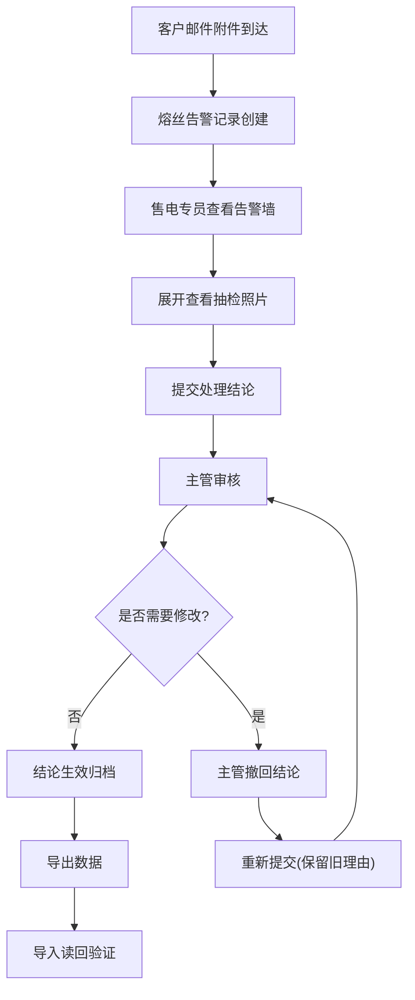

## 1. 产品概述

能源汇流箱熔丝告警墙是面向售电专员和主管的专业运维工具，核心解决汇流箱熔丝从客户邮件附件到处理结果的全流程可追溯问题，确保数据不丢失、流程不断线。

- 目标用户：售电专员、运维主管
- 核心价值：熔丝抽检全流程可视化、异常数据保护、操作留痕可追溯

## 2. 核心功能

### 2.1 用户角色

| 角色 | 说明 | 核心权限 |
|------|------|----------|
| 售电专员 | 日常处理熔丝告警的一线人员 | 查看熔丝列表、展开查看抽检照片、提交处理结果、导出数据 |
| 运维主管 | 负责审核和撤回结论的管理人员 | 撤回结论、重新提交、查看历史记录、补录数据 |

### 2.2 功能模块

1. **告警墙主页**：熔丝告警列表展示、状态筛选、全流程追踪
2. **可展开详情区**：熔丝抽检照片展示、邮件附件信息、处理历史
3. **异常保护机制**：异常值保留、附件丢失页面保护、旧理由不被覆盖
4. **主管审核功能**：撤回结论、重新提交、历史版本对比
5. **补录功能**：叶师傅手工补录样例、人工补录样例、导出读回验证

### 2.3 页面详情

| 页面名称 | 模块名称 | 功能描述 |
|-----------|-------------|---------------------|
| 告警墙主页 | 熔丝列表卡片 | 展示熔丝编号、设备位置、当前状态、处理进度、最近更新时间 |
| 告警墙主页 | 可展开详情区 | 点击展开显示抽检照片、邮件附件原始信息、处理历史时间线 |
| 告警墙主页 | 状态筛选栏 | 按告警状态、处理进度、时间范围筛选 |
| 告警墙主页 | 导出/导入按钮 | 导出当前列表数据、导入已导出文件验证读回一致性 |
| 详情弹窗 | 照片展示区 | 熔丝抽检照片轮播、放大查看、补录照片对比 |
| 详情弹窗 | 处理操作区 | 提交处理结果、撤回结论、重新提交、添加备注 |
| 详情弹窗 | 历史记录区 | 展示所有操作历史，包括撤回前的旧理由和新备注 |

## 3. 核心流程

售电专员查看熔丝告警列表 → 点击展开查看抽检照片和邮件附件 → 提交处理结果 → 主管审核 → 如需修改则撤回结论 → 重新提交（保留旧理由）→ 导出数据归档

## 4. 用户界面设计

### 4.1 设计风格
- **主色调**：工业蓝 (#1e40af) 作为主色，告警红 (#dc2626) 标记异常，成功绿 (#059669) 标记正常
- **辅助色**：琥珀橙 (#d97706) 标记待处理，中性灰 (#374151) 作为文本主色
- **设计风格**：工业风/仪表板式设计，强调数据清晰度和操作可靠性，避免花哨装饰
- **字体**：标题使用 "JetBrains Mono" 等宽字体增强专业感，正文使用 "Noto Sans SC" 确保可读性
- **卡片风格**：深灰色边框 + 轻微阴影，悬停时边框高亮，展开时平滑过渡动画
- **图标风格**：使用 lucide-react 线性图标，保持统一的工业感

### 4.2 页面设计概述

| 页面名称 | 模块名称 | UI Elements |
|-----------|-------------|-------------|
| 告警墙主页 | 顶部状态栏 | 告警总数统计、异常数量、待处理数量、已完成数量 |
| 告警墙主页 | 列表卡片 | 左侧状态色条、中间核心信息、右侧展开箭头、底部操作按钮 |
| 告警墙主页 | 可展开区域 | 抽检照片网格、邮件附件信息面板、处理历史时间线 |
| 详情弹窗 | 照片对比区 | 左右分栏显示补录前后照片差异，标注差异点 |
| 详情弹窗 | 历史记录 | 时间线布局，每条记录显示操作人、时间、内容，旧理由用特殊样式标记 |

### 4.3 响应式
- 桌面端优先设计（1280px+），主列表采用网格布局
- 平板端（768px-1279px）调整为单列卡片布局
- 移动端（<768px）简化显示，保留核心信息和操作

### 4.4 交互细节
- 卡片展开/收起使用平滑高度过渡动画（300ms ease）
- 状态变化时使用背景色闪烁提示（2次淡入淡出）
- 照片查看支持点击放大、轮播切换
- 重要操作（撤回、提交）前有确认弹窗
- 表单输入时实时校验，附件丢失时显示警告但不清空已填内容
