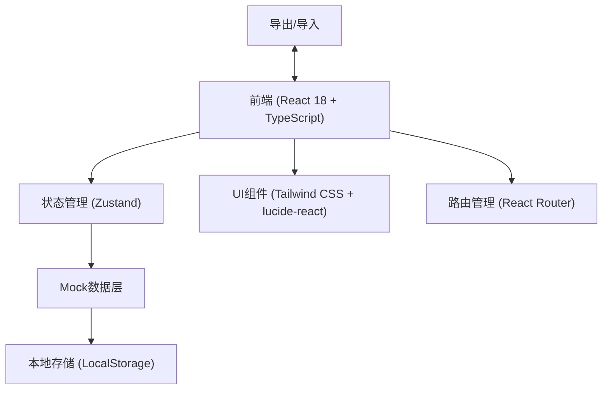
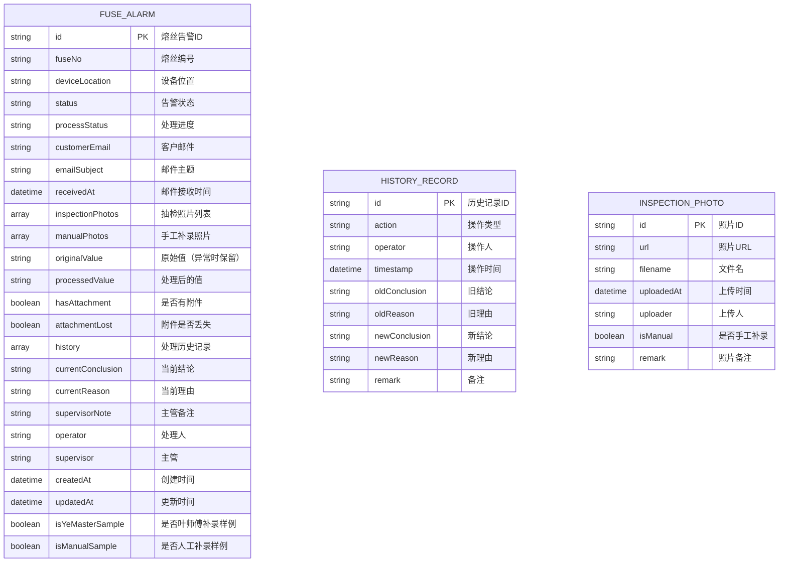

## 1. 架构设计



## 2. 技术描述

- **前端**：React 18 + TypeScript + Vite
- **状态管理**：Zustand
- **样式**：Tailwind CSS 3
- **图标**：lucide-react
- **路由**：react-router-dom
- **后端**：无（纯前端，使用Mock数据 + LocalStorage持久化）
- **数据持久化**：LocalStorage + JSON导出/导入

## 3. 路由定义

| 路由 | 用途 |
|-------|---------|
| / | 告警墙主页 - 熔丝告警列表 |
| /fuse/:id | 熔丝详情弹窗（通过路由参数打开） |

## 4. 数据模型

### 4.1 数据模型定义



### 4.2 TypeScript 类型定义

```typescript
export type AlarmStatus = 'normal' | 'abnormal' | 'pending' | 'resolved';
export type ProcessStatus = 'received' | 'processing' | 'pending_review' | 'completed' | 'withdrawn';
export type ActionType = 'create' | 'submit' | 'withdraw' | 'resubmit' | 'manual_upload' | 'export' | 'import';

export interface InspectionPhoto {
  id: string;
  url: string;
  filename: string;
  uploadedAt: string;
  uploader: string;
  isManual: boolean;
  remark: string;
}

export interface HistoryRecord {
  id: string;
  action: ActionType;
  operator: string;
  timestamp: string;
  oldConclusion?: string;
  oldReason?: string;
  newConclusion?: string;
  newReason?: string;
  remark: string;
}

export interface FuseAlarm {
  id: string;
  fuseNo: string;
  deviceLocation: string;
  status: AlarmStatus;
  processStatus: ProcessStatus;
  customerEmail: string;
  emailSubject: string;
  receivedAt: string;
  inspectionPhotos: InspectionPhoto[];
  manualPhotos: InspectionPhoto[];
  originalValue: string;
  processedValue: string;
  hasAttachment: boolean;
  attachmentLost: boolean;
  history: HistoryRecord[];
  currentConclusion: string;
  currentReason: string;
  supervisorNote: string;
  operator: string;
  supervisor: string;
  createdAt: string;
  updatedAt: string;
  isYeMasterSample: boolean;
  isManualSample: boolean;
}
```

## 5. 核心模块结构

```
src/
├── components/
│   ├── AlarmCard.tsx          # 熔丝告警卡片（含可展开区域）
│   ├── AlarmList.tsx          # 告警列表
│   ├── PhotoGallery.tsx       # 照片展示区
│   ├── HistoryTimeline.tsx    # 历史记录时间线
│   ├── StatusFilter.tsx       # 状态筛选栏
│   ├── DetailModal.tsx        # 详情弹窗
│   ├── PhotoCompare.tsx       # 补录照片对比
│   ├── ActionBar.tsx          # 操作按钮栏
│   └── StatCard.tsx           # 统计卡片
├── store/
│   └── useAlarmStore.ts       # Zustand状态管理
├── types/
│   └── index.ts               # 类型定义
├── data/
│   └── mockData.ts            # Mock数据（含叶师傅样例、人工补录样例）
├── utils/
│   ├── export.ts              # 导出工具
│   ├── import.ts              # 导入工具
│   └── idGenerator.ts         # ID生成器
├── pages/
│   └── AlarmWall.tsx          # 告警墙主页
├── App.tsx
├── main.tsx
└── index.css
```

## 6. 关键功能实现要点

### 6.1 可展开区域实现
- 使用 CSS `max-height` + `overflow` 过渡动画
- 展开状态通过卡片组件内部 state 管理
- 照片使用 CSS Grid 布局，支持响应式

### 6.2 异常值保留机制
- `originalValue` 字段在首次创建时写入，永不修改
- `processedValue` 字段存储处理后的值
- 当 `status === 'abnormal'` 时，UI 同时显示原始值和处理值，用删除线标记原始值

### 6.3 附件丢失保护
- `attachmentLost` 标记附件丢失状态
- 提交时检查：如果 `attachmentLost === true`，显示警告但允许提交
- 已填写的表单内容在任何情况下都不会被自动清空

### 6.4 撤回/重新提交 - 旧理由保留
- 撤回操作创建 `HistoryRecord`，保存 `oldConclusion` 和 `oldReason`
- 重新提交时，旧理由在历史记录中保留，新备注追加到 `supervisorNote`
- UI 中历史记录区分显示"旧理由"和"新备注"，使用不同样式

### 6.5 叶师傅补录样例
- Mock 数据中预置一条 `isYeMasterSample: true` 的记录
- 该记录包含补录前和补录后的照片
- 提供"查看差异"按钮，打开 PhotoCompare 组件对比

### 6.6 人工补录样例（刷新一致性检查）
- Mock 数据中预置一条 `isManualSample: true` 的记录
- 使用固定的 ID（如 `'MANUAL-SAMPLE-001'`）
- 状态管理中确保该记录在 LocalStorage 中的 key 固定
- 导出时 ID 保持不变，导入后可通过 ID 定位同一条记录

### 6.7 导出/读回功能
- 导出为 JSON 格式，包含完整数据结构
- 导入时进行数据校验，确保 ID 不变
- 导入后与现有数据合并，同 ID 记录不重复创建
