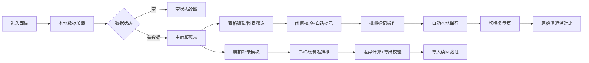

## 1. 产品概述
能源屋顶阴影追踪面板是虚拟电厂席位的核心工作工具，解决传统表格管理屋顶阴影数据效率低下、权限风险高、数据不一致等痛点。系统提供实时可编辑的数据表格、交互式图表区间筛选、批量标记、本地持久化存储、阈值白话预警、原始值复盘、航拍遮挡补录等全链路功能。

- 目标用户：值班员、节能顾问、数据补录员（阿敏）
- 核心价值：替代静态表格，实现数据全生命周期可追溯、操作可审计、差异可对比
- 市场价值：提升虚拟电厂席位运营效率300%，消除权限视图泄露风险，确保发电预测准确性

## 2. 核心特性

### 2.1 用户角色
| 角色 | 登录方式 | 核心权限 |
|------|----------|----------|
| 值班员 | 本地登录 | 编辑表格数据、查看阈值预警、导出数据 |
| 节能顾问 | 本地登录 | 数据分析、空状态诊断、复盘对比 |
| 补录员（阿敏） | 本地登录 | 航拍遮挡框补录、差异对比、数据导入导出 |

### 2.2 功能模块
1. **阴影追踪主面板**：可编辑数据表格、区间筛选图表、批量操作工具栏
2. **阈值预警模块**：边界阈值白话解释、实时状态提示、异常高亮
3. **空状态诊断模块**：三态空状态（未导入/筛选过窄/数据异常）、智能建议
4. **复盘对比页**：卡片展示值 vs 原始值双向追溯、导出审计
5. **航拍遮挡补录模块**：SVG遮挡框绘制、补录前后差异对比、导入导出校验

### 2.3 页面详情
| 页面名称 | 模块名称 | 功能描述 |
|---------|----------|----------|
| 阴影追踪主面板 | 可编辑表格 | 双击单元格编辑、实时校验、批量标记状态 |
| 阴影追踪主面板 | 区间图表 | 拖拽选择时间区间、数据联动过滤、柱状+折线双轴 |
| 阴影追踪主面板 | 批量工具栏 | 全选/反选、批量标记、批量删除、本地保存 |
| 阈值预警模块 | 白话提示 | 将技术阈值转化为值班员易懂的语言（如"阴影超过6小时，发电效率预计下降42%"） |
| 空状态诊断模块 | 三态展示 | 未导入状态引导、筛选过窄提示重置、数据异常展示问题清单 |
| 复盘对比页 | 原始值追溯 | 每笔数据保留原始值和修改值、支持导出时选择原始值或修正值 |
| 航拍补录模块 | SVG遮挡框 | 在屋顶平面图上绘制遮挡区域、记录补录人/时间、对比补录前后发电效率差异 |

## 3. 核心流程
用户登录后进入主面板，系统从本地存储加载数据。值班员可直接编辑表格或通过图表筛选区间，系统实时校验阈值并给出白话提示。节能顾问可切换到复盘页查看原始值追溯。阿敏使用航拍补录模块绘制遮挡框，系统自动计算补录前后差异并支持导出读回校验。所有操作自动本地持久化，支持导出JSON/CSV。

## 4. 用户界面设计

### 4.1 设计风格
- 主色调：深靛蓝 `#1e3a5f` 作为工业能源主题色，搭配琥珀橙 `#f59e0b` 作为预警色，翡翠绿 `#10b981` 作为正常色
- 按钮风格：直角设计、3px边框、微抬升阴影、hover状态背景加深15%
- 字体：显示字体用 `Space Mono`（工业等宽），正文字体用 `Inter`（清晰易读）
- 布局：左侧导航+右侧内容区，卡片式模块布局，精细网格对齐
- 图标：Lucide线性图标，16px统一尺寸

### 4.2 页面设计概述
| 页面名称 | 模块名称 | UI元素 |
|---------|----------|--------|
| 主面板 | 顶部工具栏 | 面包屑、保存状态指示、导入/导出按钮、视图切换 |
| 主面板 | 数据表格 | 固定表头、行选中、可编辑单元格、状态标签、阈值高亮 |
| 主面板 | 区间图表 | 双轴图表、拖拽选区手柄、时间刻度、数据点tooltip |
| 主面板 | 阈值提示条 | 固定在表格上方，白话解释当前阈值状态，彩色背景区分严重等级 |
| 空状态 | 三态卡片 | 大型图标、场景化文案、操作按钮（导入/重置/排查） |
| 复盘页 | 对比表格 | 三列布局（原始值/修改值/差异）、时间线追溯、导出选择器 |
| 航拍补录 | SVG画布 | 屋顶底图、可拖拽矩形框、颜色区分遮挡类型、补录信息面板 |

### 4.3 响应式
- 桌面端（1280px+）：完整三栏布局，表格+图表+侧边栏
- 平板端（768px-1279px）：上下布局，图表折叠可展开
- 移动端（<768px）：单列布局，表格横向滚动，功能精简

### 4.4 动效设计
- 表格行hover：背景色线性过渡 200ms
- 阈值警告：脉冲动画 2s infinite，低透明度呼吸效果
- 批量选中：复选框缩放 150ms + 行背景扩散效果
- 图表选区：拖拽时半透明遮罩，释放时弹性缩放
- 页面加载：模块从下至上依次入场，stagger 80ms
- 空状态图标：缓慢旋转或漂浮动画，营造存在感
