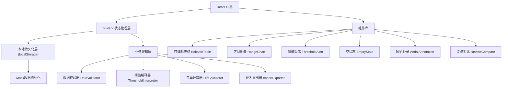
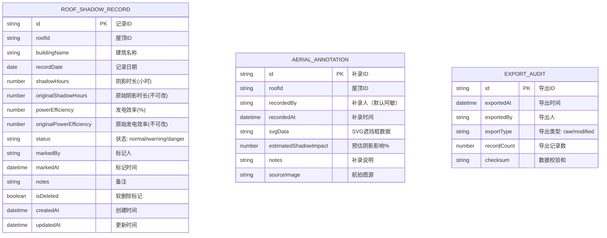

## 1. 架构设计



## 2. 技术描述
- **前端**：React@18 + TypeScript + Vite@5 + tailwindcss@3 + zustand@4 + lucide-react@0.294 + recharts@2.10
- **初始化工具**：vite-init (react-ts模板)
- **后端**：无（纯前端本地应用，数据存储在localStorage）
- **数据库**：localStorage + IndexedDB（用于大量航拍数据）
- **数据**：内置Mock数据，支持JSON/CSV导入导出

## 3. 路由定义
| Route | 页面/模块 | 用途 |
|-------|----------|------|
| / | 阴影追踪主面板 | 可编辑表格、区间图表、批量操作 |
| /review | 复盘对比页 | 原始值追溯、差异对比、导出审计 |
| /aerial | 航拍补录页 | SVG遮挡框绘制、差异计算、导入导出校验 |

## 4. 数据模型

### 4.1 数据模型定义


### 4.2 TypeScript 类型定义
```typescript
export interface RoofShadowRecord {
  id: string;
  roofId: string;
  buildingName: string;
  recordDate: string;
  shadowHours: number;
  originalShadowHours: number;
  powerEfficiency: number;
  originalPowerEfficiency: number;
  status: 'normal' | 'warning' | 'danger';
  markedBy?: string;
  markedAt?: string;
  notes?: string;
  isDeleted: boolean;
  createdAt: string;
  updatedAt: string;
}

export interface AerialAnnotation {
  id: string;
  roofId: string;
  recordedBy: string;
  recordedAt: string;
  svgData: string;
  shapes: AnnotationShape[];
  estimatedShadowImpact: number;
  notes?: string;
  sourceImage?: string;
}

export interface AnnotationShape {
  id: string;
  type: 'rect' | 'polygon';
  x: number;
  y: number;
  width?: number;
  height?: number;
  points?: string;
  color: string;
  label: string;
  shadowHours: number;
}

export interface ThresholdConfig {
  warningShadowHours: number;
  dangerShadowHours: number;
  warningEfficiency: number;
  dangerEfficiency: number;
}

export interface EmptyStateType {
  type: 'no-data' | 'filter-too-narrow' | 'data-corrupted';
  title: string;
  description: string;
  action: { label: string; onClick: () => void };
}
```

## 5. 状态管理 (Zustand Store)

```typescript
interface ShadowStore {
  // 数据
  records: RoofShadowRecord[];
  annotations: AerialAnnotation[];
  selectedIds: string[];
  filterRange: { start: string; end: string } | null;
  
  // 操作
  addRecord: (record: Omit<RoofShadowRecord, 'id' | 'createdAt' | 'updatedAt'>) => void;
  updateRecord: (id: string, updates: Partial<RoofShadowRecord>) => void;
  batchUpdateStatus: (ids: string[], status: RoofShadowRecord['status']) => void;
  batchDelete: (ids: string[]) => void;
  toggleSelection: (id: string) => void;
  selectAll: () => void;
  clearSelection: () => void;
  setFilterRange: (range: { start: string; end: string } | null) => void;
  
  // 导入导出
  importData: (data: RoofShadowRecord[]) => void;
  exportData: (type: 'raw' | 'modified') => RoofShadowRecord[];
  
  // 持久化
  loadFromStorage: () => void;
  saveToStorage: () => void;
  
  // 注释
  addAnnotation: (annotation: Omit<AerialAnnotation, 'id'>) => void;
  updateAnnotation: (id: string, updates: Partial<AerialAnnotation>) => void;
  deleteAnnotation: (id: string) => void;
}
```

## 6. 核心模块设计

### 6.1 可编辑表格 (EditableTable)
- 双击单元格进入编辑模式
- 数字输入实时校验范围
- 编辑时保留原始值用于对比
- 支持键盘导航（Tab/Enter/Arrow keys）
- 行选中复选框，支持Shift多选

### 6.2 区间图表 (RangeChart)
- 基于Recharts实现双轴图表（柱状+折线）
- 支持鼠标拖拽选择时间区间
- 选区手柄可拖拽调整
- 图表数据与表格联动过滤
- 数据点hover显示详细信息

### 6.3 阈值解释器 (ThresholdInterpreter)
- 将技术阈值转化为白话提示
- 示例：shadowHours > 6 → "今天阴影超过6小时，发电效率预计下降42%"
- 支持自定义阈值配置
- 三级预警（正常/警告/危险）对应不同颜色

### 6.4 空状态诊断 (EmptyState)
- 三态检测逻辑：
  1. records.length === 0 → 'no-data'（未导入）
  2. filteredRecords.length === 0 且 records.length > 0 → 'filter-too-narrow'（筛选过窄）
  3. 数据校验失败 → 'data-corrupted'（数据异常）
- 每种状态有对应图标、文案和操作按钮

### 6.5 航拍补录 (AerialAnnotation)
- SVG画布支持屋顶平面图背景
- 鼠标拖拽绘制矩形遮挡框
- 每个框可设置颜色、标签、预估阴影时长
- 自动计算补录前后发电效率差异
- 支持导出SVG+JSON，导入时校验数据完整性

### 6.6 本地持久化
- 使用localStorage存储主数据
- 自动保存防抖（500ms延迟）
- 保存状态指示器（保存中/已保存/保存失败）
- 数据版本号，支持迁移

## 7. 目录结构
```
src/
├── components/
│   ├── EditableTable/
│   │   ├── EditableTable.tsx
│   │   ├── EditableCell.tsx
│   │   └── TableToolbar.tsx
│   ├── RangeChart/
│   │   ├── RangeChart.tsx
│   │   └── SelectionBrush.tsx
│   ├── ThresholdAlert/
│   │   └── ThresholdAlert.tsx
│   ├── EmptyState/
│   │   └── EmptyState.tsx
│   ├── AerialAnnotation/
│   │   ├── AerialCanvas.tsx
│   │   ├── AnnotationShape.tsx
│   │   └── AnnotationPanel.tsx
│   └── ReviewCompare/
│       ├── ReviewTable.tsx
│       └── DiffViewer.tsx
├── store/
│   └── useShadowStore.ts
├── hooks/
│   ├── useThreshold.ts
│   ├── useLocalStorage.ts
│   └── useImportExport.ts
├── utils/
│   ├── thresholdInterpreter.ts
│   ├── dataValidator.ts
│   ├── diffCalculator.ts
│   └── mockData.ts
├── types/
│   └── index.ts
├── pages/
│   ├── MainPanel.tsx
│   ├── ReviewPage.tsx
│   └── AerialPage.tsx
└── App.tsx
```
