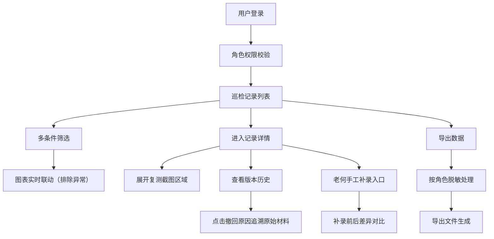

## 1. 产品概述
能源组件热斑巡检板是面向新能源电站运维团队的专业巡检数据管理平台，解决热斑检测记录追溯、版本管理、角色权限控制等核心痛点。通过可视化界面实现热斑复测记录的全生命周期管理，确保现场处理、供应商报价、管理层审批各环节数据一致性。

## 2. 核心 Features

### 2.1 User Roles
| Role | Registration Method | Core Permissions |
|------|---------------------|------------------|
| 现场工程师 | 企业账号登录 | 录入巡检数据、上传复测截图、查看自己录入的记录 |
| 管理员（老何） | 企业账号登录 | 全量数据查看、手工补录、数据导出、审批撤回 |
| 供应商 | 企业账号登录 | 查看授权记录、报价版本比对、敏感内容脱敏 |

### 2.2 Feature Module
1. **巡检记录列表页**：数据筛选、多条件查询、图表统计、敏感字段脱敏
2. **记录详情页**：可展开复测截图区域、版本历史追溯、撤回原因链路、补录标记
3. **导出功能**：按角色脱敏导出、Excel/PDF格式、导出审计日志
4. **人工补录功能**：老何专用补录入口、补录前后差异对比、数据一致性校验

### 2.3 Page Details
| Page Name | Module Name | Feature description |
|-----------|-------------|---------------------|
| 巡检记录列表 | 筛选区域 | 多条件组合筛选、时间范围、状态筛选、筛选后图表实时联动 |
| 巡检记录列表 | 数据表格 | 敏感字段按角色脱敏显示、补录记录高亮标记、行内快捷操作 |
| 巡检记录列表 | 统计图表 | 热斑趋势图、处理率柱状图、排除筛选异常数据干扰 |
| 记录详情 | 基础信息 | 完整字段展示、敏感内容角色控制 |
| 记录详情 | 复测截图区域 | 可展开/折叠、多图轮播、图片对比、老何补录专用插槽 |
| 记录详情 | 版本历史 | 撤回原因覆盖记录、点击跳转原始材料、完整追溯链路 |
| 记录详情 | 补录对比 | 补录前后数据差异高亮、导出读回一致性验证 |
| 导出弹窗 | 角色脱敏 | 按当前用户角色自动处理敏感内容、导出格式选择 |

## 3. Core Process

用户登录后进入巡检记录列表，通过筛选条件定位目标记录，点击进入详情页查看完整信息。在详情页可展开复测截图区域查看热斑图像，追溯历史版本变更记录。管理员老何可通过专用入口进行手工补录，补录后自动生成对比视图。所有导出操作均按当前用户角色对敏感内容进行脱敏处理，浏览器存储同样遵循角色权限控制。

## 4. User Interface Design

### 4.1 Design Style
- 主色调：工业蓝 (#0F3460) 搭配警示橙 (#E94560) 用于热斑标记
- 辅助色：成功绿 (#16C79A)、警告黄 (#FFC93C)
- 字体：展示字体使用 Space Grotesk，正文字体使用 JetBrains Mono
- 按钮风格：微立体、圆角 4px、悬停阴影提升
- 布局风格：卡片式分区、左侧导航、顶部状态栏、数据密度适中
- 图标风格：lucide-react 线性图标，关键状态使用实心图标强调

### 4.2 Page Design Overview
| Page Name | Module Name | UI Elements |
|-----------|-------------|-------------|
| 巡检记录列表 | 顶部筛选区 | 下拉选择器、日期范围、搜索框、重置按钮、卡片容器阴影 |
| 巡检记录列表 | 统计图表区 | 渐变面积图、分组柱状图、数据卡片、动效加载 |
| 巡检记录列表 | 数据表格区 | 斑马纹、悬停高亮、敏感字段脱敏遮罩、补录标记角标 |
| 记录详情 | 截图展开区 | 手风琴交互、图片网格、放大预览、左右对比滑块 |
| 记录详情 | 版本时间线 | 垂直时间轴、状态节点、可点击追溯链接、覆盖记录标记 |
| 记录详情 | 补录对比区 | 左右分栏、差异高亮、差异点计数、确认按钮 |

### 4.3 Responsiveness
- 桌面端优先设计，最小支持 1280px 宽度
- 平板端适配：图表区域自适应缩放，表格支持横向滚动
- 移动端：卡片堆叠展示，筛选区折叠为抽屉，详情页分段展示

### 4.4 交互细节
- 可展开区域使用平滑过渡动画，展开时图片淡入加载
- 筛选条件变更时图表数据平滑过渡更新，异常数据标记闪烁提示
- 版本追溯点击时高亮原始记录，左侧时间线同步滚动定位
- 敏感内容遮罩支持角色切换时实时更新，无需刷新页面
- 老何补录入口使用脉冲动画提示，补录完成后生成金色标记
