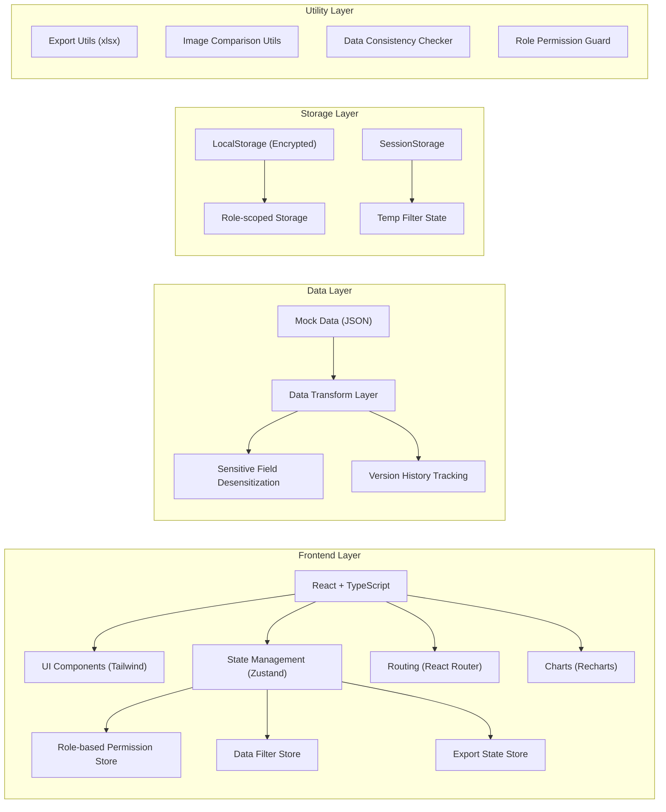
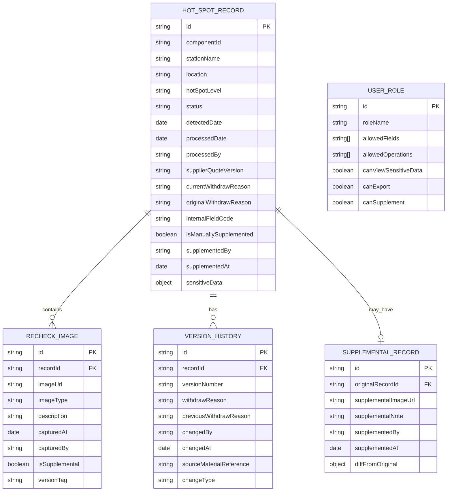

## 1. Architecture Design



## 2. Technology Description

- **Frontend Framework**: React@18 + TypeScript@5 + Vite@5
- **Styling**: TailwindCSS@3.4 + CSS Variables for theming
- **State Management**: Zustand@4 (stores for auth, data, filters, UI state)
- **Routing**: React Router DOM@6
- **Charts**: Recharts@2
- **Icons**: Lucide React@0.344
- **Excel Export**: xlsx@0.18
- **Data Source**: Mock JSON data with sample hot-spot inspection records
- **Initialization Tool**: vite-init with react-ts template

## 3. Route Definitions

| Route | Purpose |
|-------|---------|
| / | 重定向到 /inspection |
| /inspection | 巡检记录列表页（筛选、图表、表格） |
| /inspection/:id | 记录详情页（截图区域、版本历史、补录对比） |
| /inspection/:id/compare | 补录前后对比页 |
| /role-switch | 角色切换测试页（用于验证权限控制） |

## 4. Data Model

### 4.1 Data Model Definition



### 4.2 Mock Data Definition

**热斑巡检记录 (HotSpotRecord)**
```typescript
interface HotSpotRecord {
  id: string;
  componentId: string;
  stationName: string;
  location: string;
  hotSpotLevel: '严重' | '中等' | '轻微';
  status: '待处理' | '处理中' | '已完成' | '已撤回';
  detectedDate: string;
  processedDate?: string;
  processedBy: string;
  supplierQuoteVersion: string;
  currentWithdrawReason: string;
  originalWithdrawReason: string;
  internalFieldCode: string;
  isManuallySupplemented: boolean;
  supplementedBy?: string;
  supplementedAt?: string;
  sensitiveData: {
    componentCost: number;
    repairCost: number;
    supplierContact: string;
    internalComments: string;
  };
  recheckImages: RecheckImage[];
  versionHistory: VersionHistory[];
  supplementalRecord?: SupplementalRecord;
}
```

**复测截图 (RecheckImage)**
```typescript
interface RecheckImage {
  id: string;
  imageUrl: string;
  imageType: '红外热成像' | '可见光' | '无人机航拍';
  description: string;
  capturedAt: string;
  capturedBy: string;
  isSupplemental: boolean;
  versionTag: string;
}
```

**版本历史 (VersionHistory)**
```typescript
interface VersionHistory {
  id: string;
  versionNumber: string;
  withdrawReason: string;
  previousWithdrawReason: string;
  changedBy: string;
  changedAt: string;
  sourceMaterialReference: string;
  changeType: '撤回原因变更' | '状态变更' | '补录' | '报价版本更新';
}
```

## 5. Core Module Design

### 5.1 敏感内容权限控制模块

- **位置**: `src/utils/desensitize.ts`
- **功能**: 基于用户角色对敏感字段进行全链路脱敏
  - 页面显示：表格、详情、弹窗中的敏感字段
  - 导出文件：Excel/PDF 导出时自动脱敏
  - 浏览器存储：LocalStorage 存储前加密，按角色隔离

### 5.2 可展开复测截图模块

- **位置**: `src/components/RecheckImageGallery.tsx`
- **功能**: 手风琴式展开区域，展示热斑复测截图
  - 支持图片预览、缩放、左右对比
  - 老何补录截图专用插槽，金色边框标记
  - 版本标签显示，点击追溯对应版本

### 5.3 筛选图表联动模块

- **位置**: `src/hooks/useFilteredChartData.ts`
- **功能**: 筛选条件变更时图表数据实时更新
  - 排除筛选后无数据的异常状态干扰汇总统计
  - 异常数据标记，不纳入正常趋势计算
  - 平滑过渡动画，数据变化可视化

### 5.4 版本追溯模块

- **位置**: `src/components/VersionTimeline.tsx`
- **功能**: 撤回原因历史记录可视化
  - 垂直时间轴展示所有版本变更
  - 点击历史记录跳转对应原始材料
  - 覆盖记录高亮显示，清晰展示变更链路

### 5.5 人工补录对比模块

- **位置**: `src/components/SupplementCompareView.tsx`
- **功能**: 老何手工补录数据对比
  - 左右分栏展示原始数据与补录数据
  - 差异点高亮标记，差异计数
  - 导出读回一致性验证
  - 页面刷新后数据引用一致性校验

## 6. 样例数据设计

### 6.1 老何手工补录样例

- **记录ID**: `REC-2024-001`
- **补录人**: 老何
- **补录时间**: 2024-12-15 14:30
- **补录内容**: 添加一张最新的热斑复测截图
- **用途**: 验证补录前后差异对比、导出读回功能

### 6.2 人工补录一致性样例

- **记录ID**: `REC-2024-002`
- **补录人**: 老何
- **补录时间**: 2024-12-16 09:15
- **用途**: 验证刷新后列表、详情、导出是否指向同一条记录
- **校验点**: 
  - 列表页 `REC-2024-002` 标记为补录
  - 详情页显示完整补录信息
  - 导出文件包含相同补录数据
  - 刷新后所有引用ID保持一致
