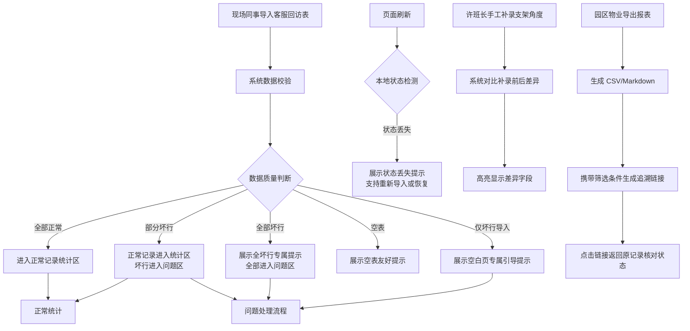

## 1. 产品概述

能源跟踪支架对账页是一款面向光伏电站运维团队的专业对账工具，解决跟踪支架运维记录与实际处理状态不一致的问题。通过区分正常记录与问题记录、支持多维度筛选核对、提供手工补录与差异对比功能，帮助许班长等运维管理人员准确追溯每一条支架记录的处理版本与状态。

- 核心目标：确保客服回访表中的坏行数据得到妥善处理，正常数据准确统计，实现每一条跟踪支架记录可追溯、可核对
- 目标用户：运维班长（许班长）、现场同事、园区物业管理人员

## 2. 核心 Features

### 2.1 用户角色

| 角色 | 注册方式 | 核心权限 |
|------|----------|----------|
| 运维班长 | 系统内置 | 查看全部记录、手工补录支架角度、导出报表、核对状态差异 |
| 现场同事 | 系统内置 | 导入客服回访表、标记处理状态 |
| 园区物业 | 系统内置 | 导出 CSV/Markdown、按筛选条件追溯记录 |

### 2.2 功能模块

1. **主对账页面**：客服回访表数据导入、正常记录统计区、问题记录区、筛选工具栏
2. **手工补录模块**：支架角度补录表单、补录前后差异对比、数据导入导出
3. **导出模块**：CSV 导出、Markdown 导出、筛选条件持久化
4. **状态反馈模块**：空表提示、全坏行提示、刷新状态丢失提示、仅坏行导入空白提示

### 2.3 页面详情

| 页面名称 | 模块名称 | 功能描述 |
|----------|----------|----------|
| 能源跟踪支架对账页 | 顶部筛选栏 | 支持按支架编号、处理状态、日期范围、处理人筛选；筛选条件可通过 URL 参数持久化，支持复制链接返回同一条记录 |
| 能源跟踪支架对账页 | 正常记录统计区 | 展示验证通过的跟踪支架记录，支持分页、排序、统计汇总 |
| 能源跟踪支架对账页 | 问题记录区（固定悬浮） | 展示坏行记录，标注错误类型（数据缺失、格式错误、状态冲突等），支持标记处理、备注添加 |
| 能源跟踪支架对账页 | 导入功能区 | 支持 Excel/CSV 导入客服回访表，导入时实时校验数据质量 |
| 能源跟踪支架对账页 | 手工补录支架角度表 | 独立表格区域，支持许班长手工录入支架角度调整记录，自动对比补录前后数据差异 |
| 能源跟踪支架对账页 | 导出功能区 | 一键导出当前筛选结果为 CSV 或 Markdown 格式 |
| 能源跟踪支架对账页 | 状态反馈层 | 根据不同场景展示差异化反馈：空表/全坏行/状态丢失/仅坏行导入 |

## 3. 核心流程

## 4. 用户界面设计

### 4.1 设计风格

- **主色调**：工业蓝 `#1e3a5f`，代表专业可靠的能源运维场景
- **辅助色**：警示橙 `#f59e0b` 标记问题记录，成功绿 `#10b981` 标记正常记录，差异红 `#ef4444` 标记数据差异
- **中性色**：采用 slate 色系，确保数据表格的可读性
- **按钮风格**：直角硬朗风格，2px 边框，悬停时有微妙的背景色变化和阴影增强
- **字体**：标题使用 "JetBrains Mono" 等宽字体，体现工程感；正文使用 "Inter" 保证可读性
- **布局风格**：左右分栏布局，左侧 70% 正常记录区，右侧 30% 问题记录区（可折叠）；顶部固定筛选栏与导出工具栏
- **图标风格**：使用 lucide-react 线性图标，保持简洁专业

### 4.2 页面设计概览

| 页面名称 | 模块名称 | UI 元素 |
|----------|----------|----------|
| 能源跟踪支架对账页 | 顶部筛选栏 | 深色背景、白色文字、下拉筛选器、日期选择器、搜索框、导出按钮组 |
| 能源跟踪支架对账页 | 正常记录统计区 | 斑马纹表格、固定表头、可排序列、状态标签、分页控件、统计汇总卡片 |
| 能源跟踪支架对账页 | 问题记录区 | 浅橙色背景、错误图标、可展开的错误详情、快速处理按钮、备注输入框 |
| 能源跟踪支架对账页 | 手工补录表 | 可编辑表格、差异高亮单元格、版本切换标签、对比视图按钮 |
| 能源跟踪支架对账页 | 状态反馈层 | 居中卡片布局、场景化图标、引导性文案、操作按钮（重新导入/恢复数据/查看示例） |

### 4.3 响应式

- Desktop-first 设计，主布局适配 1280px 以上屏幕
- 平板端：问题记录区改为底部抽屉式布局
- 移动端：筛选栏折叠为汉堡菜单，表格横向滚动，重点数据卡片化展示
- 所有交互元素最小触摸尺寸 44px

### 4.4 动效设计

- 数据导入时：表格行逐行淡入（staggered animation），坏行有轻微的红色脉冲提示
- 筛选变化时：数据区平滑过渡（300ms ease-out）
- 问题记录处理：已处理行平滑滑出问题区，同时在正常区淡入
- 差异对比：补录后差异字段有黄色高亮闪烁动画（1.5s），引导用户注意
- 状态反馈：不同场景有专属的进入动画，空表状态有轻微的悬浮效果
