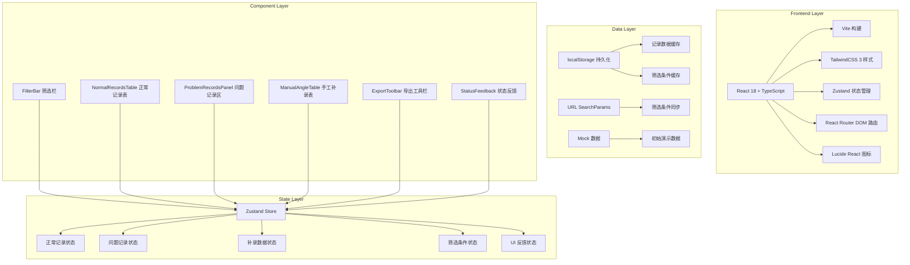
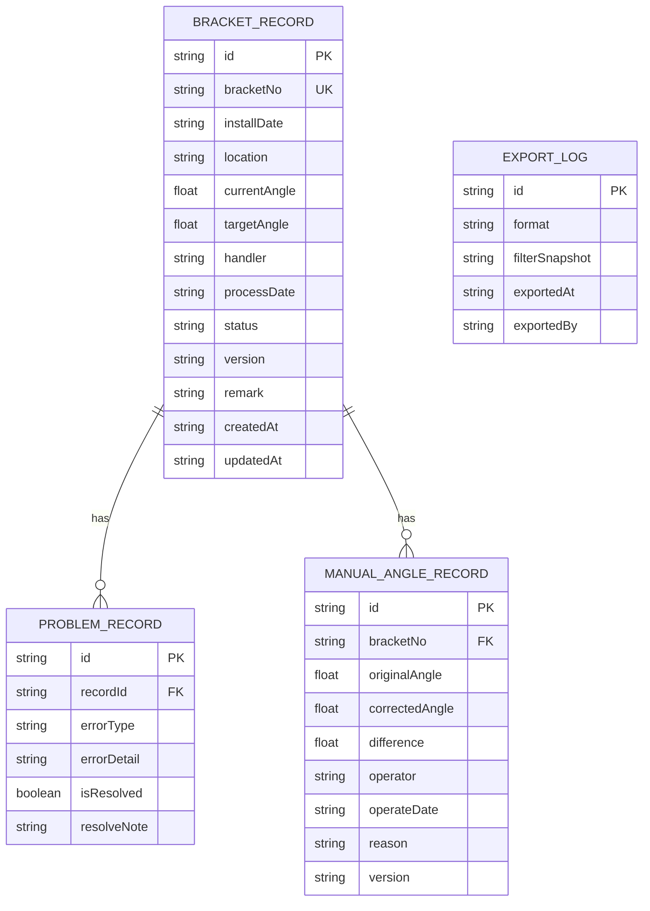

## 1. 架构设计



## 2. 技术描述

- **前端框架**: React@18 + TypeScript@5 + Vite@5
- **样式方案**: TailwindCSS@3.4 + PostCSS@8
- **状态管理**: Zustand@4.5（轻量、不可变更新、支持 devtools）
- **路由管理**: React Router DOM@6.22
- **图标库**: Lucide React@0.344
- **导出工具**: 内置 CSV/Markdown 生成器（零第三方依赖）
- **数据持久化**: localStorage + URL SearchParams
- **初始化工具**: vite-init
- **后端**: 无（纯前端应用，使用 Mock 数据）
- **数据库**: 无，数据存储于浏览器 localStorage

## 3. 路由定义

| 路由 | 用途 |
|------|------|
| `/` | 能源跟踪支架对账页（首页，包含所有功能模块） |
| `/record/:id` | 单条记录详情页（通过筛选条件回跳时定位） |

**URL 参数设计**：
- `?bracketId=XXX` - 按支架编号筛选
- `?status=processed/pending/problem` - 按处理状态筛选
- `?dateFrom=YYYY-MM-DD&dateTo=YYYY-MM-DD` - 按日期范围筛选
- `?handler=姓名` - 按处理人筛选
- `?view=normal/problem/manual` - 视图切换
- `?highlight=id1,id2` - 高亮指定记录（用于核对）

## 4. API 定义

本项目为纯前端应用，所有数据操作通过 localStorage 模拟。以下为 TypeScript 类型定义：

```typescript
// 跟踪支架记录基础类型
interface BracketRecord {
  id: string;
  bracketNo: string;           // 支架编号
  installDate: string;         // 安装日期
  location: string;            // 位置
  currentAngle: number;        // 当前角度
  targetAngle: number;         // 目标角度
  handler: string;             // 处理人
  processDate: string;         // 处理日期
  status: 'pending' | 'processed' | 'problem' | 'manual';
  version: string;             // 版本号（用于追溯）
  remark: string;              // 备注
  createdAt: string;
  updatedAt: string;
}

// 问题记录扩展类型
interface ProblemRecord extends BracketRecord {
  errorType: 'missing_data' | 'format_error' | 'status_conflict' | 'angle_abnormal';
  errorDetail: string;
  isResolved: boolean;
  resolveNote: string;
}

// 手工补录角度记录
interface ManualAngleRecord {
  id: string;
  bracketNo: string;
  originalAngle: number;       // 原始角度
  correctedAngle: number;      // 补录角度
  difference: number;          // 差值
  operator: string;            // 操作人（许班长）
  operateDate: string;
  reason: string;              // 补录原因
  version: string;
}

// 筛选条件
interface FilterParams {
  bracketId?: string;
  status?: string;
  dateFrom?: string;
  dateTo?: string;
  handler?: string;
  page: number;
  pageSize: number;
  sortBy: string;
  sortOrder: 'asc' | 'desc';
}

// 页面状态反馈类型
type PageStatus = 
  | 'normal'           // 正常显示
  | 'empty'            // 空表
  | 'all_problem'      // 全是坏行
  | 'state_lost'       // 刷新后状态丢失
  | 'only_problem'     // 只导入坏行，正常区空白
  | 'loading';         // 加载中

// 导出配置
interface ExportConfig {
  format: 'csv' | 'markdown';
  includeNormal: boolean;
  includeProblem: boolean;
  includeManual: boolean;
  filterParams: FilterParams;
}
```

## 5. 数据模型

### 5.1 数据模型定义



### 5.2 数据初始化脚本

```typescript
// Mock 初始数据
const mockNormalRecords: BracketRecord[] = [
  {
    id: 'rec-001',
    bracketNo: 'PV-ST-001',
    installDate: '2025-03-15',
    location: 'A区-1排-1号',
    currentAngle: 45,
    targetAngle: 45,
    handler: '张工',
    processDate: '2025-06-01',
    status: 'processed',
    version: 'v2.1',
    remark: '夏季模式调整完成',
    createdAt: '2025-06-01T10:00:00Z',
    updatedAt: '2025-06-01T14:30:00Z'
  },
  {
    id: 'rec-002',
    bracketNo: 'PV-ST-002',
    installDate: '2025-03-15',
    location: 'A区-1排-2号',
    currentAngle: 42,
    targetAngle: 45,
    handler: '李工',
    processDate: '2025-06-02',
    status: 'pending',
    version: 'v1.0',
    remark: '待调整',
    createdAt: '2025-06-02T09:00:00Z',
    updatedAt: '2025-06-02T09:00:00Z'
  }
];

const mockProblemRecords: ProblemRecord[] = [
  {
    id: 'prob-001',
    bracketNo: 'PV-ST-003',
    installDate: '2025-03-16',
    location: 'A区-2排-1号',
    currentAngle: 0,
    targetAngle: 45,
    handler: '',
    processDate: '',
    status: 'problem',
    version: 'v1.0',
    remark: '',
    createdAt: '2025-06-03T08:00:00Z',
    updatedAt: '2025-06-03T08:00:00Z',
    errorType: 'missing_data',
    errorDetail: '处理人和处理日期为空',
    isResolved: false,
    resolveNote: ''
  },
  {
    id: 'prob-002',
    bracketNo: 'PV-ST-004',
    installDate: '2025-13-45',
    location: 'B区-1排-1号',
    currentAngle: 180,
    targetAngle: 45,
    handler: '王工',
    processDate: '2025-06-03',
    status: 'problem',
    version: 'v1.5',
    remark: '现场同事说已处理',
    createdAt: '2025-06-03T11:00:00Z',
    updatedAt: '2025-06-03T16:00:00Z',
    errorType: 'angle_abnormal',
    errorDetail: '当前角度180°超出正常范围(0-90°)，日期格式错误',
    isResolved: false,
    resolveNote: ''
  }
];

const mockManualRecords: ManualAngleRecord[] = [
  {
    id: 'manual-001',
    bracketNo: 'PV-ST-002',
    originalAngle: 42,
    correctedAngle: 45,
    difference: 3,
    operator: '许班长',
    operateDate: '2025-06-08',
    reason: '客服回访确认角度偏差，现场手工调整',
    version: 'v2.0'
  }
];
```

## 6. 核心模块设计

### 6.1 Zustand Store 设计

```typescript
// src/store/useBracketStore.ts
interface BracketState {
  // 数据
  normalRecords: BracketRecord[];
  problemRecords: ProblemRecord[];
  manualRecords: ManualAngleRecord[];
  
  // UI 状态
  pageStatus: PageStatus;
  filterParams: FilterParams;
  selectedRecordId: string | null;
  isProblemPanelCollapsed: boolean;
  
  // 操作
  importRecords: (file: File) => Promise<ImportResult>;
  resolveProblem: (id: string, note: string) => void;
  addManualRecord: (record: Omit<ManualAngleRecord, 'id' | 'difference'>) => void;
  updateFilterParams: (params: Partial<FilterParams>) => void;
  syncFilterToURL: () => void;
  loadFromURLParams: () => void;
  exportData: (config: ExportConfig) => Blob;
  checkStateIntegrity: () => boolean;
  restoreFromBackup: () => void;
}
```

### 6.2 核心工具函数

```typescript
// src/utils/dataValidator.ts - 数据校验，识别坏行
export const validateRecord = (record: unknown): ValidationResult => {
  const errors: string[] = [];
  const warnings: string[] = [];
  
  // 必填字段检查
  // 格式检查
  // 范围检查
  // 逻辑一致性检查
  
  return { isValid: errors.length === 0, errors, warnings, errorType };
};

// src/utils/export.ts - 导出功能
export const exportToCSV = (data: any[], filename: string): void => {};
export const exportToMarkdown = (data: any[], filename: string): void => {};
export const generateTraceableURL = (filterParams: FilterParams, recordId?: string): string => {};

// src/utils/diff.ts - 差异对比
export const calculateAngleDiff = (original: number, corrected: number): DiffResult => {};
export const findRecordChanges = (oldRecord: BracketRecord, newRecord: BracketRecord): string[] => {};
```

### 6.3 组件拆分

```
src/
├── components/
│   ├── FilterBar.tsx          # 顶部筛选栏
│   ├── NormalRecordsTable.tsx # 正常记录表格
│   ├── ProblemRecordsPanel.tsx# 问题记录区
│   ├── ManualAngleTable.tsx   # 手工补录表
│   ├── ExportToolbar.tsx      # 导出工具栏
│   ├── StatusFeedback.tsx     # 多场景状态反馈
│   ├── RecordRow.tsx          # 表格行组件
│   ├── DiffHighlight.tsx      # 差异高亮组件
│   └── StatCard.tsx           # 统计卡片
├── hooks/
│   ├── useURLSync.ts          # URL 同步 hook
│   ├── useDataImport.ts       # 数据导入 hook
│   └── useStatePersistence.ts # 状态持久化 hook
├── store/
│   └── useBracketStore.ts     # Zustand store
├── utils/
│   ├── dataValidator.ts       # 数据校验
│   ├── export.ts              # 导出工具
│   ├── diff.ts                # 差异对比
│   └── mockData.ts            # Mock 数据
├── types/
│   └── index.ts               # 类型定义
├── pages/
│   └── BracketReconciliation.tsx # 主页面
└── App.tsx
```

## 7. 状态反馈场景处理逻辑

| 场景 | 触发条件 | 处理逻辑 | UI 表现 |
|------|----------|----------|---------|
| 空表 | `normalRecords.length === 0 && problemRecords.length === 0 && manualRecords.length === 0` | 显示空状态引导 | 居中卡片，图标+文案"暂无数据，请导入客服回访表"，提供导入按钮和示例数据按钮 |
| 全是坏行 | `normalRecords.length === 0 && problemRecords.length > 0` | 标记 `pageStatus = 'all_problem'` | 顶部醒目警告条，说明"本次导入全部为问题记录"，问题区高亮显示 |
| 状态丢失 | 页面刷新后 `localStorage` 数据与 URL 参数不匹配 | 检测完整性失败后标记 `pageStatus = 'state_lost'` | 模态框提示"检测到页面刷新，本地状态可能已丢失"，提供"恢复上次会话"和"重新导入"选项 |
| 仅坏行导入 | 导入后 `normalRecords.length === 0 && problemRecords.length > 0 && 是新导入操作` | 标记 `pageStatus = 'only_problem'` | 正常区显示特殊空白提示"本次导入无正常记录，所有数据已移至问题区处理"，问题区展开 |
| 正常 | 其他情况 | 正常渲染左右分栏 | 左侧正常表格，右侧问题面板 |
