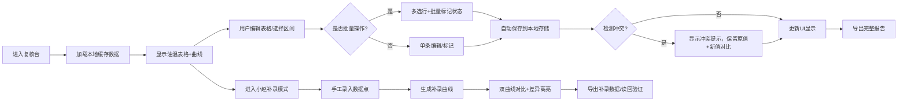

## 1. 产品概述

能源箱变油温复核台是面向园区能源管理员和值班人员的交互式油温数据复核工具，解决夜间油温曲线人工汇总效率低、异常数据易混淆、多用户操作冲突等问题。工具支持表格实时编辑、图表区间缩放、批量状态标记、本地离线保存，确保在网络或附件异常时数据不丢失，真正交付给值班室日常使用。

## 2. 核心特性

### 2.1 用户角色

| 角色 | 登录方式 | 核心权限 |
|------|---------|---------|
| 能源管理员 | 本地单机使用 | 完整编辑、标记、导出、导入权限 |
| 值班人员 | 本地单机使用 | 查看、标记异常、补录数据权限 |

### 2.2 功能模块

1. **油温数据表格**：实时编辑、行内修改、状态标记、附件关联
2. **夜间曲线图表**：区间缩放、时间轴拖动、多曲线叠加对比
3. **批量操作区**：多选批量标记、批量导出、批量重置
4. **小赵补录曲线**：手工补录数据录入、补录前后差异对比、导出读回
5. **本地数据管理**：自动保存、手动存档、数据导入导出

### 2.3 页面详情

| 页面名称 | 模块名称 | 功能描述 |
|---------|---------|---------|
| 复核台主页 | 顶部工具栏 | 日期选择、刷新、保存、导出、导入、小赵补录入口 |
| 复核台主页 | 油温数据表格 | 设备名称、测点、时间、油温值、状态列、附件列、备注，支持行内编辑 |
| 复核台主页 | 夜间曲线图 | 22:00-次日06:00 油温曲线，支持区间选择缩放，显示异常点 |
| 复核台主页 | 批量操作面板 | 选中行批量标记正常/异常/待复核，批量删除标记 |
| 复核台主页 | 小赵补录面板 | 手工输入时间-油温值，生成补录曲线，与原始曲线同图对比 |
| 复核台主页 | 状态栏 | 显示保存状态、冲突提示、附件缺失提示 |

## 3. 核心流程

## 4. 用户界面设计

### 4.1 设计风格
- **主色调**：深工业蓝 `#0F172A` 背景，琥珀橙 `#F59E0B` 异常高亮，翠绿 `#10B981` 正常标记
- **辅助色**：冷灰 `#334155` 边框，浅蓝 `#3B82F6` 选中等交互态
- **按钮风格**：扁平化直角按钮，2px 边框，hover 时背景填充，active 时内阴影
- **字体**：等宽字体 `JetBrains Mono` 用于数据表格，`Noto Sans SC` 用于标题和说明
- **布局风格**：三栏固定式布局，左侧表格固定高度滚动，右侧上中下分图表区、补录区、批量操作区
- **图标风格**：Lucide 线性图标，异常状态用实心警示图标

### 4.2 页面设计概述

| 页面名称 | 模块名称 | UI 元素 |
|---------|---------|---------|
| 复核台主页 | 顶部工具栏 | 深色底，白色文字，图标+文字按钮，保存状态指示灯 |
| 复核台主页 | 数据表格 | 斑马纹行，hover 高亮，异常行琥珀色背景，可编辑单元格双击进入编辑态 |
| 复核台主页 | 曲线图 | 深色画布，网格线浅灰，曲线2px宽，异常点红色圆点标记，选区间半透明蓝色遮罩 |
| 复核台主页 | 补录面板 | 可折叠面板，输入框组，补录曲线用虚线橙色，原始曲线实线蓝色，差异区域粉色高亮 |
| 复核台主页 | 批量操作区 | 底部固定条，选中计数，三个状态按钮，重置按钮 |

### 4.3 响应式
- 桌面优先设计（1920×1080 最佳），最小支持 1280px 宽度
- 表格横向滚动支持，小屏下图表区域自动调整高度
- 触摸设备下表格行高增加至 48px，按钮最小 40×40px

### 4.4 动效设计
- 数据保存成功：状态栏绿色对勾淡入淡出，1.2s
- 异常标记：行背景色从琥珀色闪到正常色再回到琥珀色，0.8s 强调
- 区间选择：鼠标拖动画布时实时绘制半透明蓝色遮罩
- 冲突提示：顶部滑入黄色警示条，抖动 2 次吸引注意
- 曲线加载：从左到右逐步绘制，duration 1.5s，ease-out
