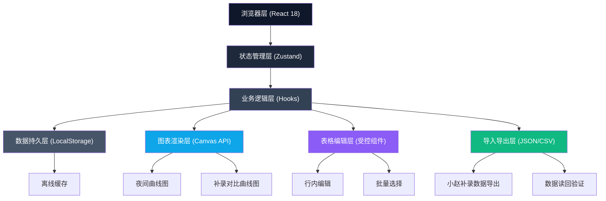
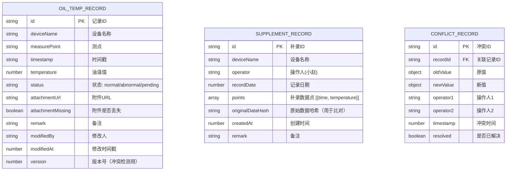

## 1. 架构设计



## 2. 技术描述

- **前端框架**：React@18 + TypeScript + Vite@5
- **状态管理**：Zustand@4，集中管理油温数据、编辑状态、冲突状态
- **样式方案**：TailwindCSS@3 + CSS 变量，工业深色主题
- **图表方案**：原生 Canvas API 实现高性能曲线图，区间选择、缩放、多曲线叠加
- **数据持久化**：localStorage 自动保存，IndexedDB 作为大文件附件缓存
- **图标库**：lucide-react
- **后端**：无后端，纯前端离线应用

## 3. 路由定义

| 路由 | 用途 |
|------|------|
| `/` | 油温复核台主页，包含所有功能模块 |

## 4. 数据模型

### 4.1 数据模型定义



### 4.2 TypeScript 类型定义

```typescript
type RecordStatus = 'normal' | 'abnormal' | 'pending' | 'unmarked';

interface OilTempRecord {
  id: string;
  deviceName: string;
  measurePoint: string;
  timestamp: string;
  temperature: number;
  status: RecordStatus;
  attachmentUrl?: string;
  attachmentMissing?: boolean;
  remark?: string;
  modifiedBy?: string;
  modifiedAt: number;
  version: number;
}

interface SupplementPoint {
  time: string;
  temperature: number;
}

interface SupplementRecord {
  id: string;
  deviceName: string;
  operator: string;
  recordDate: string;
  points: SupplementPoint[];
  originalDataHash: string;
  createdAt: number;
  remark?: string;
}

interface ConflictRecord {
  id: string;
  recordId: string;
  oldValue: OilTempRecord;
  newValue: OilTempRecord;
  operator1: string;
  operator2: string;
  timestamp: number;
  resolved: boolean;
}

interface AppState {
  records: OilTempRecord[];
  supplementRecords: SupplementRecord[];
  conflicts: ConflictRecord[];
  selectedIds: string[];
  chartRange: { start: string; end: string };
  editingCell: { recordId: string; field: string } | null;
  saveStatus: 'idle' | 'saving' | 'saved' | 'error';
  lastSavedAt: number | null;
}
```

## 5. 核心模块设计

### 5.1 Zustand Store (src/store/useOilTempStore.ts)

- `records`: 油温记录数组
- `supplementRecords`: 小赵补录记录
- `conflicts`: 冲突记录
- `selectedIds`: 批量选择的记录ID
- Actions:
  - `updateRecord(id, updates)`: 更新单条记录，版本号+1，自动保存
  - `batchUpdateStatus(ids, status)`: 批量更新状态
  - `addSupplementRecord(record)`: 添加小赵补录记录
  - `detectConflict(recordId, newValue)`: 检测并发冲突
  - `resolveConflict(conflictId, choice)`: 解决冲突（保留原值/使用新值/合并）
  - `exportData()`: 导出完整数据 JSON
  - `importData(json)`: 导入数据，冲突检测
  - `autoSave()`: 防抖自动保存到 localStorage

### 5.2 自定义 Hooks

- `useEditableTable()`: 表格行内编辑逻辑
- `useChartInteraction()`: 图表区间选择、缩放、平移
- `useLocalStorage(key)`: 本地存储读写，带版本号
- `useConflictDetection()`: 冲突检测与提示
- `useSupplementComparison()`: 补录数据与原始数据对比

### 5.3 组件结构

```
src/
├── components/
│   ├── Toolbar.tsx          # 顶部工具栏
│   ├── OilTempTable.tsx     # 油温数据表格
│   ├── EditableCell.tsx     # 可编辑单元格
│   ├── TempChart.tsx        # 夜间曲线图 (Canvas)
│   ├── BatchActionBar.tsx   # 批量操作底栏
│   ├── SupplementPanel.tsx  # 小赵补录面板
│   ├── ConflictAlert.tsx    # 冲突提示条
│   ├── StatusBar.tsx        # 底部状态栏
│   └── AttachmentCell.tsx   # 附件列单元格（丢失保护）
├── hooks/
│   ├── useEditableTable.ts
│   ├── useChartInteraction.ts
│   ├── useLocalStorage.ts
│   ├── useConflictDetection.ts
│   └── useSupplementComparison.ts
├── store/
│   └── useOilTempStore.ts
├── utils/
│   ├── hash.ts              # 数据哈希计算
│   ├── export.ts            # 导出导入工具
│   ├── conflict.ts          # 冲突检测算法
│   └── mockData.ts          # 模拟数据
├── types/
│   └── index.ts
├── pages/
│   └── ReviewDesk.tsx       # 复核台主页
├── App.tsx
├── main.tsx
└── index.css
```

## 6. 关键技术实现

### 6.1 附件丢失保护机制
- 提交时检查 `attachmentUrl` 是否有效
- 若附件丢失但用户确认提交，保留原值，标记 `attachmentMissing: true`
- 表格中用黄色警告图标标记，不覆盖原有数据

### 6.2 并发冲突处理
- 每条记录带 `version` 版本号
- 修改时对比内存中版本与存储版本
- 不一致时触发冲突，展示原值与新值对比
- 提供"保留原值"、"使用新值"、"合并备注"三个选项
- 无论选择哪个，页面数据都不会被清空

### 6.3 Canvas 图表交互
- 原生 Canvas 2D 绘制，高性能渲染 1000+ 数据点
- 鼠标拖拽选择区间，实时更新 `chartRange`
- 滚轮缩放，Shift+拖拽平移
- 双曲线叠加（原始+补录），差异区域填充

### 6.4 本地存储策略
- 防抖 500ms 自动保存到 localStorage
- 手动保存触发全量持久化
- IndexedDB 存储附件缓存
- 数据导入时做完整性校验
