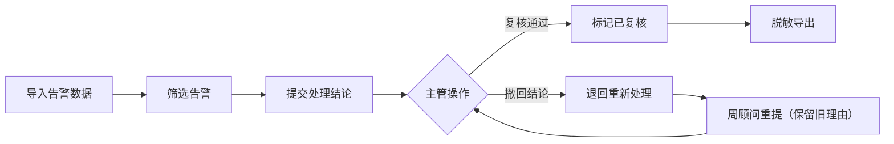
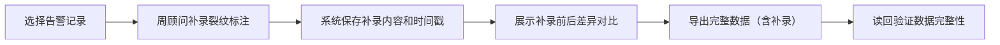

## 1. 产品概述
能源风机叶片告警墙是面向能源行业的风机叶片缺陷管理系统，用于处理风机叶片检测告警的全流程管理，包括告警导入、筛选、撤回、复核、导出等核心功能。

- **核心问题**：解决告警数据处理过程中的数据一致性、权限安全、操作留痕等问题
- **目标用户**：周顾问（一线处理人员）、主管（审核管理人员）
- **产品价值**：确保告警数据处理流程完整可追溯，保护敏感数据，提升处理效率

## 2. 核心 Features

### 2.1 用户角色
| 角色 | 注册方式 | 核心权限 |
|------|----------|----------|
| 周顾问 | 系统内置账号 | 导入、筛选、补录标注、导出、查看告警列表 |
| 主管 | 系统内置账号 | 撤回、复核、查看完整操作历史、对比新旧备注 |

### 2.2 Feature Module
1. **告警墙主页面**：告警卡片列表、数据概览、核心操作按钮
2. **告警详情面板**：告警详情、操作历史、补录标注
3. **导入功能**：批量导入告警数据，重复站点处理
4. **筛选功能**：多条件组合筛选告警
5. **撤回功能**：主管撤回已提交结论，保留历史理由
6. **复核功能**：复核告警结论，记录复核意见
7. **导出功能**：脱敏导出，数据一致性校验

### 2.3 Page Details
| Page Name | Module Name | Feature description |
|-----------|-------------|---------------------|
| 告警墙主页面 | 数据概览卡片 | 显示告警总数、待处理、已处理、已复核统计，数字与导出一致 |
| 告警墙主页面 | 告警卡片列表 | 展示叶片告警信息，状态标签，支持批量操作 |
| 告警墙主页面 | 操作工具栏 | 精简按钮：导入、筛选、撤回、复核、导出 |
| 告警墙主页面 | 周顾问补录区 | 手工补录叶片裂纹标注入口，展示补录前后差异 |
| 告警详情面板 | 基本信息 | 风机站点、叶片编号、缺陷类型、严重程度 |
| 告警详情面板 | 操作历史 | 完整时间线：提交→撤回→重提，旧理由与新备注并存显示 |
| 告警详情面板 | 补录标注 | 周顾问手工添加裂纹标注，支持图片和文字描述 |

## 3. 核心流程

### 3.1 告警处理主流程
周顾问导入告警数据→筛选待处理告警→提交处理结论→主管复核（或撤回）→导出报告

### 3.2 补录与导出读回流程
周顾问手工补录叶片裂纹标注→系统记录补录前后差异→导出包含补录信息→读回验证数据完整性

## 4. User Interface Design

### 4.1 Design Style
- **主色调**：工业蓝 `#1e40af`（代表能源行业专业性），辅助色：警示橙 `#f97316`、成功绿 `#10b981`
- **背景**：深灰工业风 `#0f172a` 渐变，营造监控大屏氛围
- **字体**：标题使用 `JetBrains Mono` 等宽字体（技术感），正文使用 `Noto Sans SC`
- **按钮风格**：方形微圆角，工业风，hover 时有轻微发光效果
- **布局**：卡片式网格布局，左侧数据概览，右侧告警列表，底部操作栏
- **图标**：使用 lucide-react 线性图标，保持工业简洁风格

### 4.2 Page Design Overview
| Page Name | Module Name | UI Elements |
|-----------|-------------|-------------|
| 告警墙主页面 | 数据概览 | 4个统计卡片，数字使用大号等宽字体，卡片带 subtle 边框动画 |
| 告警墙主页面 | 告警卡片 | 深灰背景卡片，状态标签使用不同颜色，hover 时轻微上浮 |
| 告警墙主页面 | 操作工具栏 | 5个核心按钮（导入/筛选/撤回/复核/导出），精简布局 |
| 告警墙主页面 | 补录区 | 橙色高亮卡片，显示"周顾问手工补录"标识 |
| 告警详情面板 | 操作历史 | 垂直时间线，不同颜色区分不同角色操作，旧理由半透明显示 |
| 告警详情面板 | 差异对比 | 左右分栏对比补录前后数据，差异部分高亮标记 |

### 4.3 Responsiveness
- **桌面优先设计**：1920px 为主，支持 1440px 和 2560px 自适应
- **平板适配**：1024px 下调整为单列布局，卡片宽度自适应
- **触控优化**：按钮最小高度 44px，触控区域充足

### 4.4 特殊场景交互
1. **站点同名处理**：出现同名站点时，弹窗提示选择正确站点，保留当前页面数据不刷新
2. **导出数据不一致**：导出时检测到数字与卡片对不上，保留原值并添加备注标记
3. **手机号脱敏**：权限视图中手机号中间4位显示为 `****`，导出时根据权限决定是否脱敏
4. **撤回重提交**：旧理由使用灰色斜体显示在新备注上方，中间用分隔线区分
