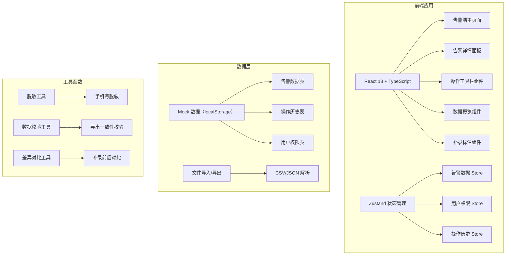
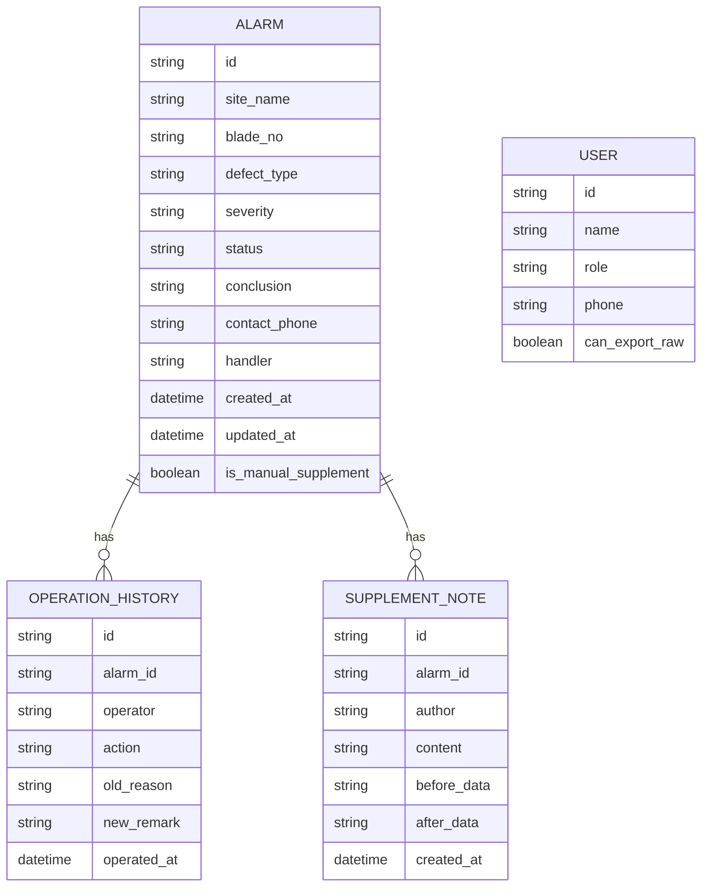

## 1. 架构设计



## 2. 技术描述

- **前端**：React@18 + TypeScript@5 + Vite@5 + tailwindcss@3
- **状态管理**：Zustand@4
- **路由**：react-router-dom@6
- **图标**：lucide-react@0.294
- **后端**：无后端，使用 localStorage 模拟数据持久化
- **数据格式**：支持 CSV/JSON 导入导出
- **数据存储**：localStorage 作为 Mock 数据库

## 3. 路由定义

| 路由 | 用途 |
|-------|---------|
| / | 告警墙主页面（单页应用，无其他路由） |

## 4. 数据模型

### 4.1 数据模型定义



### 4.2 TypeScript 类型定义

```typescript
export type AlarmStatus = 'pending' | 'processing' | 'completed' | 'reviewed' | 'withdrawn';
export type Severity = 'low' | 'medium' | 'high' | 'critical';
export type UserRole = 'consultant' | 'supervisor';

export interface User {
  id: string;
  name: string;
  role: UserRole;
  phone: string;
  canExportRaw: boolean;
}

export interface Alarm {
  id: string;
  siteName: string;
  bladeNo: string;
  defectType: string;
  severity: Severity;
  status: AlarmStatus;
  conclusion: string;
  contactPhone: string;
  handler: string;
  createdAt: string;
  updatedAt: string;
  isManualSupplement: boolean;
  originalData?: Record<string, unknown>;
}

export interface OperationHistory {
  id: string;
  alarmId: string;
  operator: string;
  action: 'submit' | 'withdraw' | 'review' | 'resubmit' | 'supplement';
  oldReason?: string;
  newRemark?: string;
  operatedAt: string;
}

export interface SupplementNote {
  id: string;
  alarmId: string;
  author: string;
  content: string;
  beforeData: string;
  afterData: string;
  createdAt: string;
}

export interface ExportConfig {
  maskPhone: boolean;
  includeHistory: boolean;
  includeSupplement: boolean;
}
```

## 5. 核心工具函数

### 5.1 脱敏工具
```typescript
// 手机号脱敏：138****1234
export const maskPhone = (phone: string): string => {
  if (!phone || phone.length < 7) return phone;
  return phone.replace(/(\d{3})\d{4}(\d{4})/, '$1****$2');
};
```

### 5.2 导出校验工具
```typescript
// 导出数据与卡片数字一致性校验，不一致时保留原值并标记
export const validateExportConsistency = (
  alarms: Alarm[],
  cardStats: Record<string, number>
): { data: Alarm[]; warnings: string[] } => {
  const warnings: string[] = [];
  const exportStats = {
    total: alarms.length,
    pending: alarms.filter(a => a.status === 'pending').length,
  };
  
  Object.entries(cardStats).forEach(([key, value]) => {
    if (exportStats[key as keyof typeof exportStats] !== value) {
      warnings.push(`[${key}] 卡片显示${value}，实际${exportStats[key as keyof typeof exportStats]}，已保留原值`);
    }
  });
  
  return { data: alarms, warnings };
};
```

### 5.3 同名站点处理
```typescript
// 检测同名站点，不清空页面，返回冲突列表
export const detectDuplicateSites = (
  newAlarms: Alarm[],
  existingAlarms: Alarm[]
): { conflicts: Alarm[]; safeToAdd: Alarm[] } => {
  const existingSiteNames = new Set(existingAlarms.map(a => a.siteName));
  const conflicts = newAlarms.filter(a => existingSiteNames.has(a.siteName));
  const safeToAdd = newAlarms.filter(a => !existingSiteNames.has(a.siteName));
  return { conflicts, safeToAdd };
};
```

## 6. 项目结构

```
src/
├── components/
│   ├── AlarmCard.tsx          # 告警卡片组件
│   ├── AlarmDetailPanel.tsx   # 告警详情面板
│   ├── DataOverview.tsx       # 数据概览卡片
│   ├── OperationToolbar.tsx   # 操作工具栏
│   ├── SupplementForm.tsx     # 补录标注表单
│   ├── HistoryTimeline.tsx    # 操作历史时间线
│   ├── DiffViewer.tsx         # 差异对比组件
│   ├── FilterPanel.tsx        # 筛选面板
│   └── DuplicateSiteModal.tsx # 同名站点处理弹窗
├── store/
│   ├── useAlarmStore.ts       # 告警数据状态管理
│   ├── useUserStore.ts        # 用户权限状态管理
│   └── useHistoryStore.ts     # 操作历史状态管理
├── utils/
│   ├── mask.ts                # 脱敏工具
│   ├── export.ts              # 导出校验工具
│   ├── import.ts              # 导入解析工具
│   ├── diff.ts                # 差异对比工具
│   └── duplicate.ts           # 同名站点处理
├── types/
│   └── index.ts               # 类型定义
├── mock/
│   └── initialData.ts         # 初始化 Mock 数据
├── pages/
│   └── AlarmWall.tsx          # 告警墙主页面
├── App.tsx
├── main.tsx
└── index.css
```
