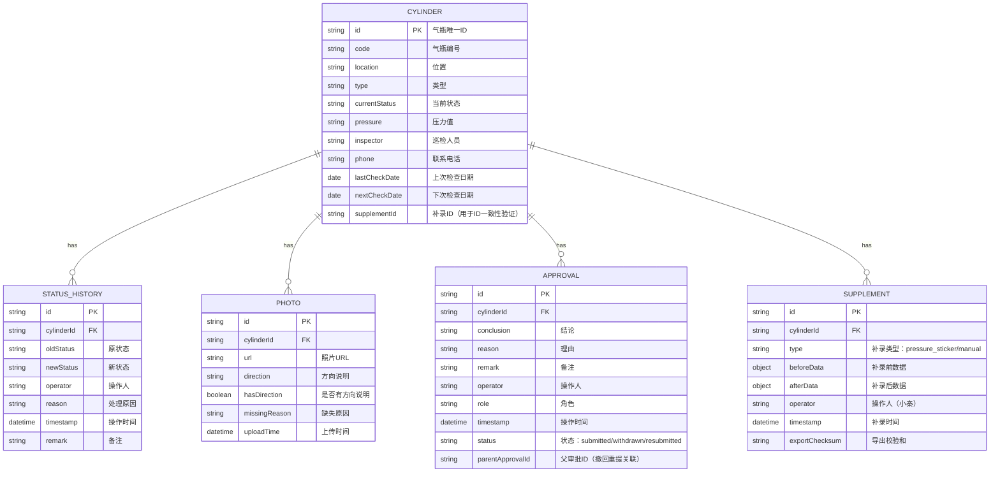

## 1. 架构设计

```mermaid
graph TD
    A["用户浏览器 --> B["前端应用
React 18 + TypeScript
    B --> C["状态管理层
Zustand Store
    B --> D["路由层
React Router
    B --> E["UI组件层
Tailwind CSS + lucide-react
    C --> F["数据持久化
LocalStorage
    C --> G["Mock数据层
内置测试数据
```

## 2. 技术描述

- **前端**：React@18 + TypeScript + Vite@5
- **样式**：tailwindcss@3
- **状态管理**：zustand@4
- **路由**：react-router-dom@6
- **图标**：lucide-react@0.344.0
- **数据持久化**：LocalStorage（确保刷新后数据不丢失）
- **后端**：无后端，纯前端应用，数据存储在LocalStorage
- **初始化工具**：vite-init

## 3. 路由定义

| 路由 | 页面 | 说明 |
|------|------|------|
| / | 追踪面板（首页） | 气瓶列表、状态概览、处理历史、异常提示、补录样例 |
| /cylinder/:id | 气瓶详情 | 气瓶信息、状态变更、照片展示、审批流程 |
| /supplement | 补录管理 | 手工补录、差异对比、导出读回、补录样例验证 |

## 4. 数据模型

### 4.1 核心数据模型



### 4.2 状态定义

```typescript
// 气瓶状态
type CylinderStatus = 
  | 'normal'      // 正常
  | 'processing'  // 处理中
  | 'completed'   // 已处理
  | 'inspecting'  // 巡检中
  | 'overdue'     // 逾期
  | 'repaired';   // 已维修

// 审批状态
type ApprovalStatus = 
  | 'submitted'   // 已提交
  | 'withdrawn'   // 已撤回
  | 'resubmitted'; // 重新提交
```

## 5. 核心数据结构定义

```typescript
interface Cylinder {
  id: string;
  code: string;
  location: string;
  type: string;
  currentStatus: CylinderStatus;
  pressure: string;
  inspector: string;
  phone: string;
  lastCheckDate: string;
  nextCheckDate: string;
  supplementId?: string;
  createdAt: string;
  updatedAt: string;
}

interface StatusHistory {
  id: string;
  cylinderId: string;
  oldStatus: CylinderStatus;
  newStatus: CylinderStatus;
  operator: string;
  reason: string;
  timestamp: string;
  remark?: string;
}

interface Photo {
  id: string;
  cylinderId: string;
  url: string;
  direction?: string;
  hasDirection: boolean;
  missingReason?: string;
  uploadTime: string;
}

interface Approval {
  id: string;
  cylinderId: string;
  conclusion: string;
  reason: string;
  remark?: string;
  operator: string;
  role: string;
  timestamp: string;
  status: ApprovalStatus;
  parentApprovalId?: string;
}

interface SupplementRecord {
  id: string;
  cylinderId: string;
  type: 'pressure_sticker' | 'manual';
  beforeData: Record<string, any>;
  afterData: Record<string, any>;
  operator: string;
  timestamp: string;
  exportChecksum?: string;
}

interface Anomaly {
  id: string;
  type: 'photo_missing_direction' | 'permission_phone_leak';
  cylinderId: string;
  readableReason: string;
  technicalDetails: string;
  detectedAt: string;
  resolved: boolean;
}
```

## 6. 模块划分

```
src/
├── components/          # 组件
│   ├── layout/         # 布局组件
│   ├── cylinder/       # 气瓶相关组件
│   ├── timeline/       # 时间线组件
│   ├── anomaly/        # 异常提示组件
│   ├── approval/       # 审批组件
│   └── supplement/     # 补录组件
├── pages/              # 页面
│   ├── Dashboard.tsx   # 追踪面板
│   ├── CylinderDetail.tsx # 气瓶详情
│   └── Supplement.tsx  # 补录管理
├── store/              # 状态管理
│   └── useCylinderStore.ts
├── types/              # 类型定义
│   └── index.ts
├── utils/              # 工具函数
│   ├── storage.ts      # LocalStorage操作
│   ├── export.ts       # 导出导入
│   └── mock.ts         # Mock数据生成
├── App.tsx
├── main.tsx
└── index.css
```
