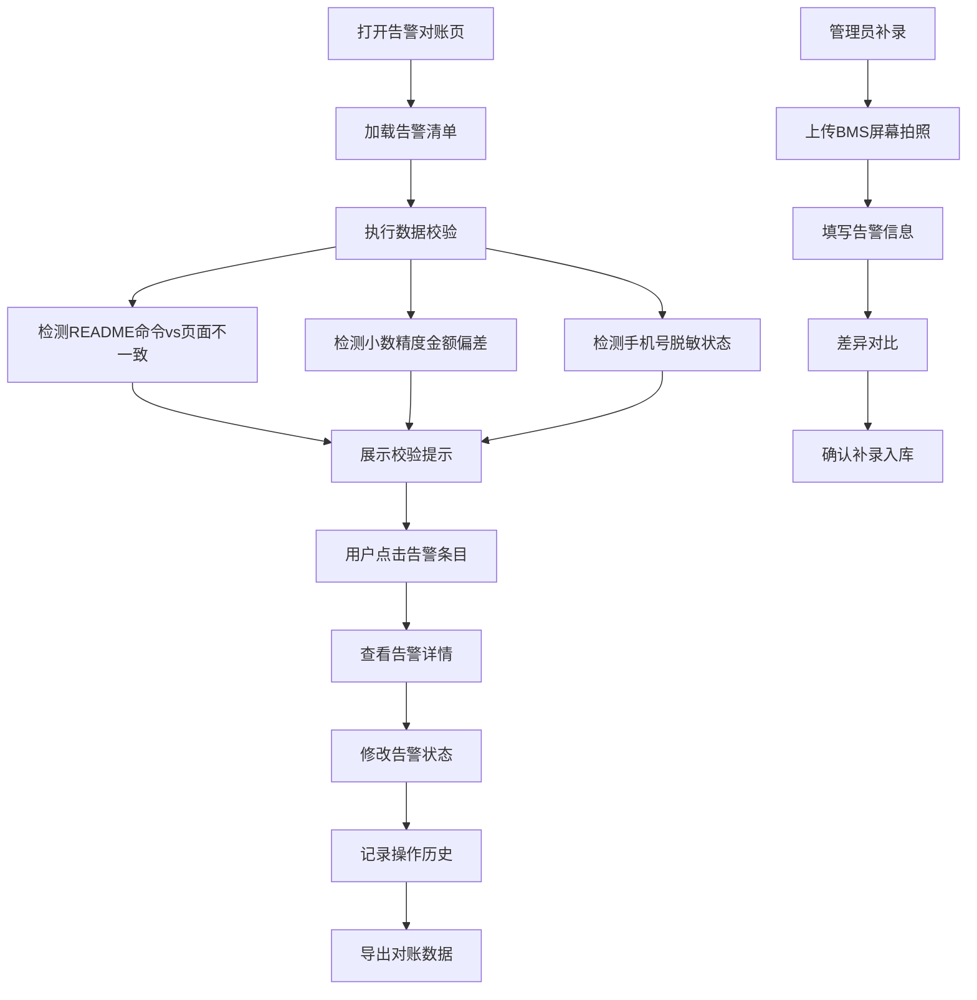

## 1. 产品概述

能源BMS告警对账系统是一套针对资产管理移交场景的告警管理工具，解决传统表格记录BMS告警时存在的权限视图泄露手机号、对账困难、状态跟踪混乱等问题。

- **核心目标**：提供BMS告警的全生命周期管理，支持筛选查询、详情查看、状态修改、历史追溯、数据导出
- **目标用户**：资产管理人员、运维人员、财务对账人员
- **产品价值**：提升告警处理效率，避免敏感信息泄露，确保对账数据一致性

## 2. 核心功能

### 2.1 用户角色

| 角色 | 说明 | 核心权限 |
|------|------|----------|
| 普通用户 | 运维/资产管理人员 | 查看告警清单、筛选、导出、修改状态、回看历史 |
| 管理员 | 孟经理等管理人员 | 所有普通用户权限 + 手工补录告警 |

### 2.2 功能模块

1. **告警清单页**：可筛选的告警列表、统计概览、校验提示、导出功能
2. **告警详情页**：完整告警信息、状态修改、操作历史时间线
3. **手工补录页**：BMS屏幕拍照上传、告警信息补录、差异对比
4. **样例展示区**：故意设计的不一致样例，用于验证校验功能

### 2.3 页面详情

| 页面名称 | 模块名称 | 功能描述 |
|---------|----------|----------|
| 告警清单页 | 顶部统计区 | 展示告警总数、待处理数、已处理数、金额总计 |
| 告警清单页 | 筛选区 | 按告警级别、时间范围、站点、状态多条件筛选 |
| 告警清单页 | 校验提示区 | 实时检测数据不一致（README命令vs页面、小数精度、手机号脱敏） |
| 告警清单页 | 告警列表 | 可点击进入详情，支持批量操作和导出 |
| 告警详情页 | 基础信息 | 展示告警完整信息，手机号脱敏显示 |
| 告警详情页 | 状态修改 | 下拉选择状态，记录修改原因 |
| 告警详情页 | 历史时间线 | 展示告警所有操作历史、修改记录 |
| 手工补录页 | 图片上传 | 支持BMS屏幕拍照上传和预览 |
| 手工补录页 | 信息补录 | 填写告警信息，与自动导入数据做差异对比 |
| 导出预览页 | 内容预览 | 导出前预览数据，确认与页面显示一致 |

## 3. 核心流程

### 3.1 主要用户流程

用户打开系统 → 查看告警清单 → 使用筛选条件定位告警 → 点击查看详情 → 修改告警状态 → 回看操作历史 → 导出对账数据

### 3.2 手工补录流程

管理员进入补录页 → 上传BMS屏幕拍照 → 填写告警信息 → 系统自动对比补录与现有数据差异 → 确认补录 → 数据入库

### 3.3 校验检测流程

系统加载数据 → 检测README命令与页面显示不一致 → 检测小数精度导致金额偏差 → 检测手机号是否脱敏 → 在顶部展示校验提示

## 4. 用户界面设计

### 4.1 设计风格

- **主色调**：工业蓝 `#1e3a8a`，代表专业、可靠
- **辅助色**：告警红 `#dc2626`（严重）、警告橙 `#f59e0b`（一般）、正常绿 `#16a34a`（已处理）
- **字体**：标题使用 "JetBrains Mono" 等宽字体，正文使用 "Noto Sans SC" 无衬线字体
- **按钮风格**：方角、细边框、悬浮时轻微上移 + 阴影加深
- **布局风格**：顶栏 + 侧边筛选 + 主内容区，卡片式布局，数据表格带斑马纹
- **图标风格**：使用线性风格图标，状态用小圆点指示灯样式

### 4.2 页面设计要点

| 页面名称 | 模块名称 | UI 元素 |
|---------|----------|---------|
| 告警清单页 | 统计卡片 | 4个数字卡片，底部带趋势箭头，背景渐变 |
| 告警清单页 | 校验提示条 | 顶部固定，黄色背景带警告图标，可展开详情 |
| 告警清单页 | 筛选面板 | 左侧可折叠，多条件组合筛选 |
| 告警清单页 | 数据表格 | 支持排序、行悬停高亮、状态标签彩色显示 |
| 告警详情页 | 信息分区 | 卡片分区展示，关键信息高亮显示 |
| 告警详情页 | 时间线 | 左侧竖线连接，每个节点带状态图标和时间 |
| 手工补录页 | 图片预览区 | 带网格的上传区，支持拖拽，图片可放大查看 |
| 手工补录页 | 差异对比 | 左右分栏，红色标注差异字段 |

### 4.3 响应式设计

- 桌面端（1280px+）：完整三栏布局
- 平板端（768px-1280px）：筛选面板可收起为图标
- 移动端（<768px）：单列布局，筛选改为顶部下拉

### 4.4 动效设计

- 页面加载：统计数字从0滚动到目标值
- 状态变更：状态标签颜色渐变过渡
- 校验提示：检测到问题时，提示条从顶部滑入，轻微抖动
- 行悬停：背景色渐变，轻微左移2px

