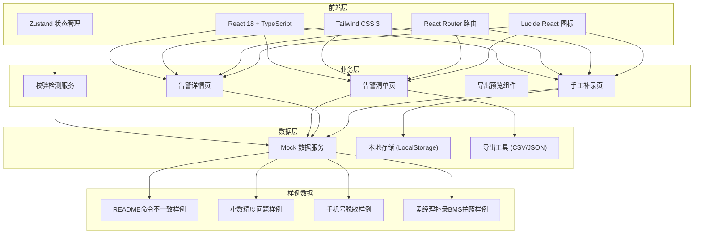
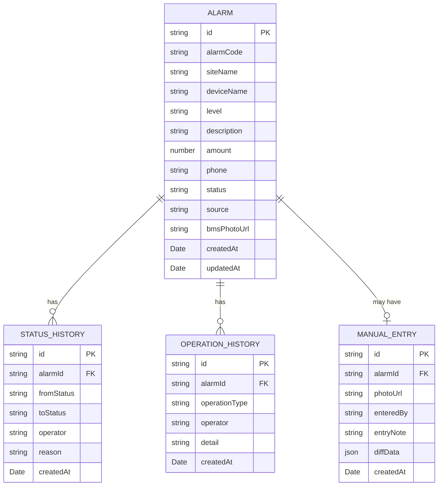

## 1. 架构设计



## 2. 技术描述

- **前端框架**: React@18 + TypeScript + Vite
- **样式方案**: Tailwind CSS@3
- **状态管理**: Zustand
- **路由管理**: React Router DOM@6
- **图标库**: Lucide React
- **初始化工具**: vite-init
- **后端**: 无后端，使用Mock数据和LocalStorage持久化
- **数据存储**: 浏览器LocalStorage + 内存Mock数据
- **导出格式**: CSV + JSON

## 3. 路由定义

| 路由 | 页面名称 | 说明 |
|------|---------|------|
| `/` | 告警清单页 | 首页，展示可筛选的告警列表和统计信息 |
| `/alarm/:id` | 告警详情页 | 展示告警详情、修改状态、回看历史 |
| `/manual-entry` | 手工补录页 | 孟经理手工补录BMS屏幕拍照和告警信息 |
| `/export-preview` | 导出预览页 | 导出前数据预览和确认 |

## 4. 数据模型

### 4.1 数据实体关系



### 4.2 核心数据类型

```typescript
type AlarmLevel = 'critical' | 'warning' | 'info';
type AlarmStatus = 'pending' | 'processing' | 'resolved' | 'ignored';
type DataSource = 'auto' | 'manual';

interface Alarm {
  id: string;
  alarmCode: string;
  siteName: string;
  deviceName: string;
  level: AlarmLevel;
  description: string;
  amount: number;
  amountDisplay: string;
  phone: string;
  phoneMasked: string;
  status: AlarmStatus;
  source: DataSource;
  bmsPhotoUrl?: string;
  createdAt: string;
  updatedAt: string;
}

interface StatusHistory {
  id: string;
  alarmId: string;
  fromStatus: AlarmStatus;
  toStatus: AlarmStatus;
  operator: string;
  reason: string;
  createdAt: string;
}

interface ValidationIssue {
  type: 'readme_inconsistency' | 'decimal_precision' | 'phone_leak';
  severity: 'error' | 'warning';
  message: string;
  details: string;
  affectedIds: string[];
}

interface ManualEntry {
  id: string;
  alarmId?: string;
  photoUrl: string;
  enteredBy: string;
  entryNote: string;
  alarmData: Partial<Alarm>;
  diffData: Record<string, { old: any; new: any }>;
  createdAt: string;
}
```

## 5. 项目目录结构

```
src/
├── components/          # 可复用组件
│   ├── AlarmTable.tsx       # 告警列表表格
│   ├── AlarmFilter.tsx      # 筛选面板
│   ├── StatCard.tsx         # 统计卡片
│   ├── ValidationBanner.tsx # 校验提示条
│   ├── StatusTimeline.tsx   # 状态时间线
│   ├── StatusBadge.tsx      # 状态标签
│   ├── LevelBadge.tsx       # 级别标签
│   ├── PhotoUploader.tsx    # 图片上传组件
│   └── DiffViewer.tsx       # 差异对比组件
├── pages/               # 页面组件
│   ├── AlarmList.tsx        # 告警清单页
│   ├── AlarmDetail.tsx      # 告警详情页
│   └── ManualEntry.tsx      # 手工补录页
├── stores/              # 状态管理
│   └── useAlarmStore.ts     # 告警数据Store
├── hooks/               # 自定义Hooks
│   ├── useValidation.ts     # 数据校验Hook
│   └── useExport.ts         # 导出功能Hook
├── utils/               # 工具函数
│   ├── mockData.ts          # Mock数据生成
│   ├── formatters.ts        # 格式化工具（金额、手机号脱敏）
│   └── validators.ts        # 校验规则
├── types/               # 类型定义
│   └── index.ts             # 核心类型
├── App.tsx
├── main.tsx
└── index.css
```

## 6. 关键功能实现要点

### 6.1 小数精度问题模拟

在`utils/formatters.ts`中实现故意的精度问题：
- 页面显示使用 `toFixed(2)` 四舍五入
- 内部计算使用浮点数累加
- README命令输出使用精确值
- 校验逻辑检测两者差异

### 6.2 README命令不一致模拟

在`utils/validators.ts`中：
- 预定义一条告警数据，页面显示和README命令输出不一致
- 校验时对比两者并标记问题
- 提供修复按钮同步数据

### 6.3 手机号脱敏

在`utils/formatters.ts`中：
- `maskPhone()` 函数将手机号转为 `138****1234` 格式
- 提供`showRawPhone`调试开关（仅开发环境）
- 校验逻辑检测是否有未脱敏的手机号显示

### 6.4 手工补录与差异对比

在`components/DiffViewer.tsx`中：
- 对比补录数据与现有数据
- 高亮显示差异字段
- 导出时包含差异说明

### 6.5 导出功能

在`hooks/useExport.ts`中：
- 支持CSV和JSON格式
- 导出前预览数据
- 校验导出数据与页面显示一致性
- 导出文件包含补录图片URL和差异说明

