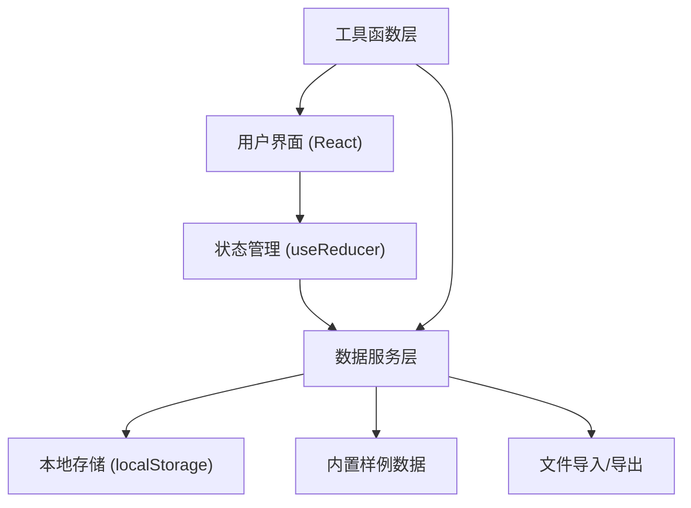
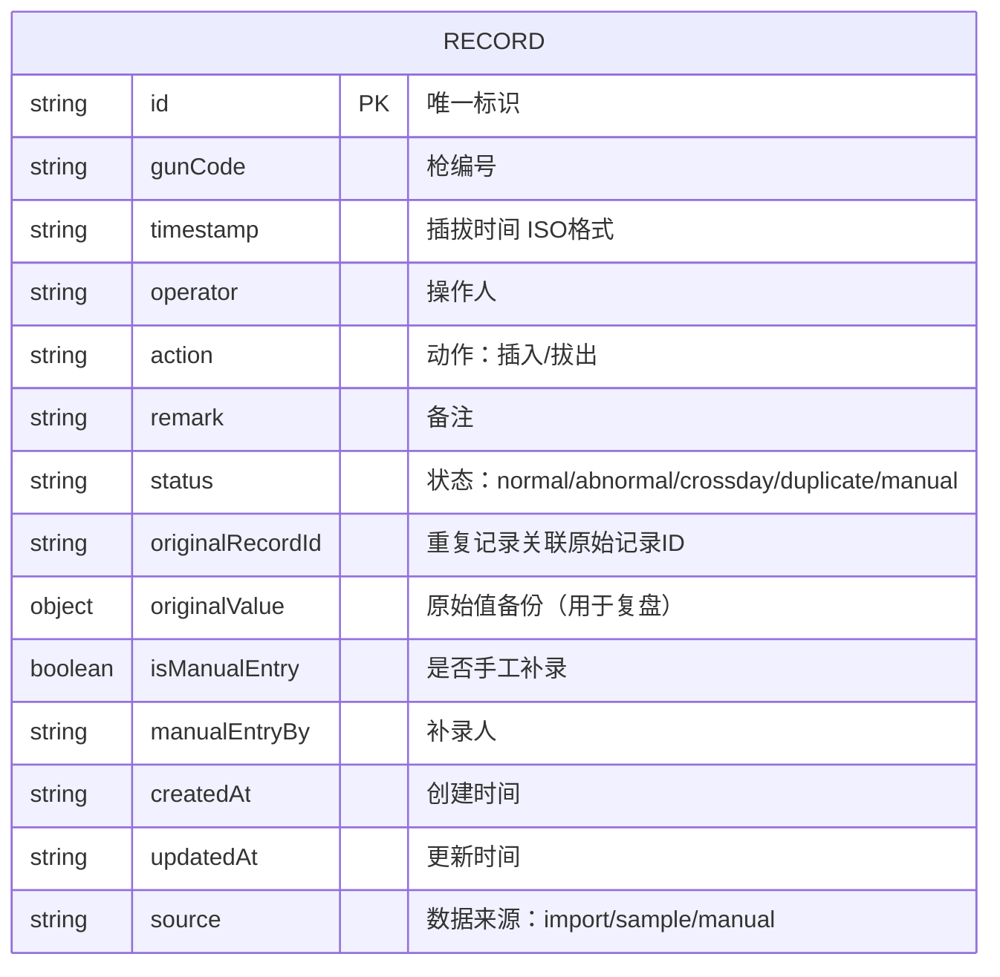

## 1. 架构设计

本项目为纯前端单页应用，所有数据存储在浏览器本地（localStorage），无需后端服务。



## 2. 技术选型说明

- **前端框架**：React@18 + TypeScript@5 - 类型安全，组件化开发
- **构建工具**：Vite@5 - 快速开发体验，热更新
- **样式方案**：Tailwind CSS@3 - 原子化CSS，快速构建工业风格界面
- **图标库**：Lucide React - 线性图标，符合工业设计风格
- **状态管理**：React useReducer + Context - 轻量级状态管理，无需额外依赖
- **数据持久化**：localStorage - 浏览器本地存储，离线可用
- **文件处理**：原生 File API + JSON 格式 - 无需额外库

## 3. 目录结构

```
src/
├── types/              # TypeScript 类型定义
│   └── index.ts        # 核心数据类型
├── data/               # 内置样例数据
│   └── samples.ts      # 正常/异常/空数据样例
├── hooks/              # 自定义 Hooks
│   ├── useRecords.ts   # 记录管理 Hook
│   └── useStorage.ts   # 本地存储 Hook
├── utils/              # 工具函数
│   ├── time.ts         # 时间处理（含跨日排序逻辑）
│   ├── importExport.ts # 导入导出工具
│   └── validation.ts   # 数据校验（异常检测）
├── components/         # React 组件
│   ├── Layout/         # 布局组件
│   ├── RecordTable/    # 记录表格组件
│   ├── StatusBadge/    # 状态标签组件
│   ├── ActionBar/      # 操作栏组件
│   ├── FilterPanel/    # 筛选面板组件
│   ├── CrossDayAlert/  # 跨日提示组件
│   ├── ReviewPanel/    # 复盘页组件
│   ├── ManualEntryModal/ # 手工补录弹窗
│   └── SampleSelector/ # 样例选择器
├── context/            # React Context
│   └── RecordContext.tsx # 全局状态上下文
├── App.tsx             # 根组件
├── main.tsx            # 入口文件
└── index.css           # 全局样式 + Tailwind
```

## 4. 路由定义

本项目为单页应用，使用状态切换而非路由：

| 视图状态 | 显示内容 |
|---------|---------|
| main | 主复核台页面（默认） |
| review | 复盘页（对比原始值和新值） |

## 5. 数据模型

### 5.1 核心数据结构



### 5.2 TypeScript 类型定义

```typescript
// 记录状态枚举
export type RecordStatus = 'normal' | 'abnormal' | 'crossday' | 'duplicate' | 'manual';

// 插拔动作
export type PlugAction = 'insert' | 'remove';

// 数据来源
export type DataSource = 'import' | 'sample' | 'manual';

// 枪线插拔记录
export interface GunRecord {
  id: string;
  gunCode: string;
  timestamp: string;
  operator: string;
  action: PlugAction;
  remark: string;
  status: RecordStatus;
  originalRecordId?: string;
  originalValue?: Partial<GunRecord>;
  isManualEntry: boolean;
  manualEntryBy?: string;
  createdAt: string;
  updatedAt: string;
  source: DataSource;
}

// 操作历史记录
export interface OperationLog {
  id: string;
  type: 'import' | 'manual' | 'delete' | 'update' | 'sample_load';
  timestamp: string;
  description: string;
  recordsAffected: number;
  user?: string;
}

// 应用状态
export interface AppState {
  records: GunRecord[];
  operationLogs: OperationLog[];
  currentView: 'main' | 'review';
  selectedRecordIds: string[];
  filter: {
    status?: RecordStatus;
    gunCode?: string;
    dateRange?: [string, string];
  };
  alerts: AlertMessage[];
}

// 提示消息
export interface AlertMessage {
  id: string;
  type: 'info' | 'warning' | 'error' | 'success';
  message: string;
  plainText?: string;
}

// 内置样例类型
export type SampleType = 'normal' | 'abnormal' | 'empty' | 'linjie';
```

### 5.3 内置样例数据定义

```typescript
// 正常数据样例
export const normalSamples: GunRecord[] = [
  {
    id: 'sample-normal-1',
    gunCode: 'CG-001',
    timestamp: '2026-06-09T08:30:00',
    operator: '张工',
    action: 'insert',
    remark: '早班充电开始',
    status: 'normal',
    isManualEntry: false,
    createdAt: '2026-06-09T08:30:00',
    updatedAt: '2026-06-09T08:30:00',
    source: 'sample'
  },
  // ... 更多样例
];

// 异常数据样例（含跨日排序问题）
export const abnormalSamples: GunRecord[] = [
  {
    id: 'sample-abnormal-1',
    gunCode: 'CG-003',
    timestamp: '2026-06-08T23:45:00',
    operator: '王工',
    action: 'insert',
    remark: '夜间充电',
    status: 'crossday',
    isManualEntry: false,
    createdAt: '2026-06-08T23:45:00',
    updatedAt: '2026-06-08T23:45:00',
    source: 'sample'
  },
  // ... 更多样例
];

// 林姐手工补录样例
export const linjieSample: GunRecord = {
  id: 'sample-linjie-1',
  gunCode: 'CG-004',
  timestamp: '2026-06-09T14:20:00',
  operator: '林姐',
  action: 'insert',
  remark: '现场巡视发现未登记，手工补录',
  status: 'manual',
  isManualEntry: true,
  manualEntryBy: '林姐',
  createdAt: '2026-06-09T15:00:00',
  updatedAt: '2026-06-09T15:00:00',
  source: 'manual'
};
```

## 6. 核心算法逻辑

### 6.1 跨日时间段检测与排序

```typescript
// 检测是否存在跨日排序问题
export function detectCrossDayIssues(records: GunRecord[]): AlertMessage[] {
  const alerts: AlertMessage[] = [];
  
  // 按枪编号分组
  const grouped = groupBy(records, r => r.gunCode);
  
  Object.entries(grouped).forEach(([gunCode, gunRecords]) => {
    // 按时间排序
    const sorted = [...gunRecords].sort((a, b) => 
      new Date(a.timestamp).getTime() - new Date(b.timestamp).getTime()
    );
    
    // 检查相邻记录是否跨日且顺序异常
    for (let i = 0; i < sorted.length - 1; i++) {
      const curr = sorted[i];
      const next = sorted[i + 1];
      
      const currDate = new Date(curr.timestamp);
      const nextDate = new Date(next.timestamp);
      
      // 检查是否跨日（当天23点后到次日0点后）
      const isCrossDay = currDate.getHours() >= 22 && 
                        nextDate.getHours() <= 2 &&
                        nextDate.getDate() > currDate.getDate();
      
      if (isCrossDay && curr.action === 'insert' && next.action === 'remove') {
        alerts.push({
          id: `crossday-${gunCode}-${i}`,
          type: 'warning',
          message: `${gunCode} 存在跨日操作：${formatTime(curr.timestamp)} 插入，${formatTime(next.timestamp)} 拔出`,
          plainText: `值班员请注意：${gunCode} 号枪在昨晚${currDate.getHours()}点${currDate.getMinutes()}分插上，今天凌晨${nextDate.getHours()}点${nextDate.getMinutes()}分拔出。系统已按实际时间排序，但跨日记录已标记，请留意充电时长是否合理。`
        });
      }
    }
  });
  
  return alerts;
}
```

### 6.2 重复记录检测

```typescript
// 检测重复记录（同枪号、同时间、同动作视为重复）
export function detectDuplicates(newRecords: GunRecord[], existingRecords: GunRecord[]): {
  unique: GunRecord[];
  duplicates: { newRecord: GunRecord; existingRecord: GunRecord }[];
} {
  const duplicates: { newRecord: GunRecord; existingRecord: GunRecord }[] = [];
  const unique: GunRecord[] = [];
  
  newRecords.forEach(newRecord => {
    const key = `${newRecord.gunCode}-${newRecord.timestamp}-${newRecord.action}`;
    const existing = existingRecords.find(r => 
      `${r.gunCode}-${r.timestamp}-${r.action}` === key
    );
    
    if (existing) {
      duplicates.push({ newRecord, existingRecord: existing });
    } else {
      unique.push({
        ...newRecord,
        id: generateId(),
        status: 'normal',
        isManualEntry: false,
        createdAt: new Date().toISOString(),
        updatedAt: new Date().toISOString(),
        source: 'import'
      });
    }
  });
  
  return { unique, duplicates };
}
```

## 7. 状态管理设计

使用 useReducer + Context 进行全局状态管理：

```typescript
// Action 类型
type Action =
  | { type: 'LOAD_RECORDS'; payload: GunRecord[] }
  | { type: 'ADD_RECORDS'; payload: GunRecord[] }
  | { type: 'ADD_RECORD_WITH_DUPLICATE_CHECK'; payload: GunRecord[] }
  | { type: 'UPDATE_RECORD'; payload: GunRecord }
  | { type: 'DELETE_RECORD'; payload: string }
  | { type: 'LOAD_SAMPLE'; payload: SampleType }
  | { type: 'CLEAR_ALL' }
  | { type: 'SET_VIEW'; payload: 'main' | 'review' }
  | { type: 'SET_FILTER'; payload: Partial<AppState['filter']> }
  | { type: 'ADD_ALERT'; payload: AlertMessage }
  | { type: 'DISMISS_ALERT'; payload: string }
  | { type: 'ADD_OPERATION_LOG'; payload: OperationLog }
  | { type: 'IMPORT_FROM_FILE'; payload: GunRecord[] }
  | { type: 'ADD_MANUAL_ENTRY'; payload: GunRecord };
```

## 8. 导入导出格式

使用 JSON 格式，结构如下：

```json
{
  "version": "1.0",
  "exportedAt": "2026-06-09T15:30:00.000Z",
  "exportedBy": "系统导出",
  "records": [
    {
      "id": "...",
      "gunCode": "CG-001",
      "timestamp": "2026-06-09T08:30:00",
      "operator": "张工",
      "action": "insert",
      "remark": "早班充电开始",
      "status": "normal",
      "isManualEntry": false,
      "createdAt": "2026-06-09T08:30:00",
      "updatedAt": "2026-06-09T08:30:00",
      "source": "sample"
    }
  ]
}
```

## 9. 性能优化策略

1. **数据分页**：超过 100 条记录时自动分页，每页 50 条
2. **虚拟滚动**：使用 CSS `content-visibility` 优化长列表渲染
3. **防抖筛选**：搜索框输入防抖 200ms
4. **memo 优化**：表格行组件使用 React.memo 避免不必要重渲染
5. **懒加载**：复盘页数据按需加载，不影响主页面性能

## 10. 浏览器兼容性

- Chrome >= 90
- Edge >= 90
- Firefox >= 88
- Safari >= 14
- 依赖特性：localStorage、File API、ES6+
