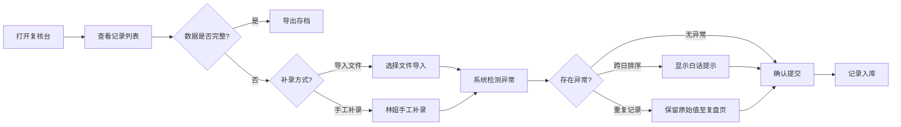

## 1. 产品概述

能源充电枪复核台是面向虚拟电厂运营值班室的枪线插拔记录管理工具，解决当前在聊天中粘贴记录、批量操作无回滚、数据质量难以保障的痛点。

- 核心目标：提供一个可信赖的、支持回滚和复核的充电枪插拔记录管理工具
- 目标用户：虚拟电厂运营值班员、数据复核人员
- 核心价值：替代聊天记录粘贴的低效工作方式，确保数据准确性，支持异常追溯

## 2. 核心功能

### 2.1 用户角色

| 角色 | 使用方式 | 核心权限 |
|------|---------|---------|
| 值班员 | 日常操作使用 | 查看记录、导入数据、手工补录、导出数据 |
| 复核员 | 数据质量检查 | 查看所有记录、对比差异、复盘历史操作 |

### 2.2 功能模块

1. **主复核台页面**：记录列表展示、状态筛选、快速操作
2. **数据导入模块**：支持导入、内置样例数据（正常/异常/空）
3. **跨日排序处理**：自动检测跨日时间段、白话提示、手动调整
4. **重复导入处理**：重复记录检测、原始值保留、复盘页展示
5. **手工补录模块**：林姐补录记录、补录前后差异对比
6. **导出/导入模块**：数据导出为文件、导入回读验证

### 2.3 页面详情

| 页面名称 | 模块名称 | 功能描述 |
|---------|---------|---------|
| 复核台主页 | 记录列表 | 展示所有枪线插拔记录，支持按状态、时间筛选 |
| 复核台主页 | 操作栏 | 导入数据、加载样例、导出数据、手工补录入口 |
| 复核台主页 | 状态标识 | 正常/异常/跨日/重复/补录 五种状态的可视化标识 |
| 复盘页 | 原始值对比 | 重复导入时保留原始值，展示新旧值差异 |
| 复盘页 | 操作历史 | 所有导入、补录、修改操作的历史追溯 |
| 补录弹窗 | 补录表单 | 林姐手工补录记录的表单，含备注字段 |
| 补录弹窗 | 差异预览 | 补录前后数据差异高亮对比 |
| 跨日提示 | 白话提示 | 当检测到跨日时间段排序异常时，用值班员易懂的语言提示 |

## 3. 核心流程

### 3.1 日常操作流程

值班员打开复核台 → 查看当日记录 → 发现缺失 → 选择导入数据或手工补录 → 系统自动检测异常 → 如有异常显示白话提示 → 确认无误后提交 → 记录入库并可导出

### 3.2 内置样例流程

值班员点击"加载样例数据" → 选择样例类型（正常/异常/空）→ 系统加载对应样例 → 可直接体验各种场景的处理逻辑 → 支持一键清除样例恢复空状态

## 4. 用户界面设计

### 4.1 设计风格

- **主色调**：工业蓝 (#1e3a5f) - 体现能源行业的稳重可靠
- **辅助色**：警示橙 (#f59e0b) - 异常提示；确认绿 (#10b981) - 正常状态；补录紫 (#8b5cf6) - 手工补录标识
- **背景色**：深灰渐变 (#0f172a → #1e293b) - 适合值班室长时间使用，减少眼睛疲劳
- **按钮风格**：直角、粗边框、强对比 - 工业工具风格，点击反馈清晰
- **字体**：标题使用 JetBrains Mono（等宽字体，数据对齐友好），正文使用 Noto Sans SC
- **布局风格**：网格化数据表格为主，左侧筛选栏，顶部操作栏，紧凑但不拥挤
- **图标风格**：线性图标，工业感，避免可爱风格

### 4.2 页面设计概述

| 页面名称 | 模块名称 | UI 元素 |
|---------|---------|---------|
| 复核台主页 | 顶部操作栏 | 深色背景、白色文字、橙色导入按钮、绿色样例按钮、紫色补录按钮 |
| 复核台主页 | 记录列表 | 斑马条纹表格、行悬停高亮、状态标签带颜色编码 |
| 复核台主页 | 状态标签 | 正常(绿色圆角)、异常(橙色带感叹号)、跨日(蓝色带月亮图标)、重复(黄色双线条)、补录(紫色带钢笔图标) |
| 跨日提示 | 提示条 | 顶部横幅，浅橙背景，黑色文字，开头写"值班员请注意：" |
| 复盘页 | 对比表格 | 左右两列对比，原始值灰色背景，新值白色背景，差异处红色边框高亮 |
| 补录弹窗 | 表单 | 深色背景，输入框带白色边框，必填项红星标记，底部"预览差异"按钮 |
| 补录弹窗 | 差异预览 | 上下对比，删除线显示原值，高亮显示新值 |

### 4.3 响应式

- 桌面端优先设计（1280px 起），适合值班室大屏显示器
- 支持平板自适应（768px-1280px），筛选栏变为可折叠
- 不强制支持手机端，核心使用场景为值班室桌面

### 4.4 交互动效

- 页面加载：数据行逐条淡入， staggered 动画
- 异常提示：轻微震动 + 背景色闪烁一次，引起注意但不刺眼
- 状态切换：标签颜色渐变过渡 200ms
- 按钮点击：按下时缩放 0.95，松开回弹
- 表格行悬停：背景色从深灰过渡到中灰，左侧出现 3px 宽的蓝色指示条

## 5. 数据样例设计

### 5.1 正常数据样例（3条）

| 枪编号 | 插拔时间 | 操作人 | 状态 | 备注 |
|-------|---------|--------|------|------|
| CG-001 | 2026-06-09 08:30:00 | 张工 | 插入 | 早班充电开始 |
| CG-001 | 2026-06-09 12:30:00 | 张工 | 拔出 | 充电完成 |
| CG-002 | 2026-06-09 09:15:00 | 李工 | 插入 | 备用充电 |

### 5.2 异常数据样例（含跨日排序问题）

| 枪编号 | 插拔时间 | 操作人 | 状态 | 异常类型 |
|-------|---------|--------|------|---------|
| CG-003 | 2026-06-08 23:45:00 | 王工 | 插入 | 跨日 |
| CG-003 | 2026-06-09 00:15:00 | 王工 | 拔出 | 跨日（排序乱） |
| CG-001 | 2026-06-09 08:30:00 | 张工 | 插入 | 重复 |

### 5.3 林姐手工补录记录

| 枪编号 | 插拔时间 | 操作人 | 状态 | 备注 | 补录标识 |
|-------|---------|--------|------|------|---------|
| CG-004 | 2026-06-09 14:20:00 | 林姐 | 插入 | 现场巡视发现未登记，手工补录 | ✅ 补录 |

## 6. 非功能需求

- **性能**：1000 条记录内加载 < 1s，筛选响应 < 300ms
- **可靠性**：所有操作在浏览器本地完成，不依赖后端，支持离线使用
- **易用性**：异常提示使用大白话，避免技术术语，值班员一看就懂
- **可追溯**：所有修改保留原始值，复盘页可查任意历史状态
