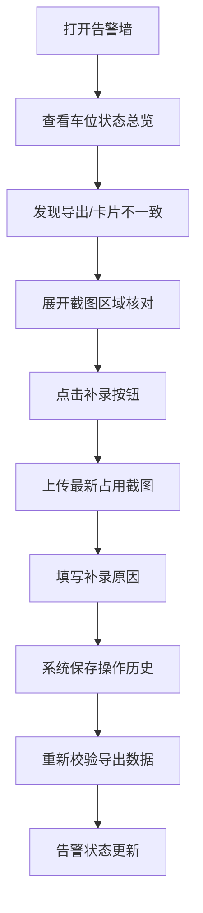

## 1. 产品概述

能源充电车位告警墙是面向物业值班室的实用工具，解决充电车位导出数据与实际卡片状态不一致的问题，将车位占用截图整合进可展开区域，支持手工补录、操作历史追踪和差异对比。

- **目标用户**：物业值班人员（如杜会计）、充电桩管理人员
- **核心问题**：导出数字与实际卡片对不上、截图分散难以追溯、补录操作无历史记录
- **价值**：提供一站式值班室工具，而非仅用于汇报的展示页面

## 2. 核心功能

### 2.1 用户角色

| 角色 | 登录方式 | 核心权限 |
|------|----------|----------|
| 值班人员 | 工号登录 | 查看告警、补录截图、导出数据、查看历史 |
| 管理员 | 管理员账号 | 所有权限 + 权限管理 |

### 2.2 功能模块

1. **告警看板页**：车位状态总览、告警卡片列表、导出校验对比
2. **操作历史页**：修改记录、操作人追踪、修改原因备注
3. **补录弹窗**：手工上传截图、补录说明、前后差异对比

### 2.3 页面详情

| 页面名称 | 模块名称 | 功能描述 |
|---------|----------|----------|
| 告警看板页 | 车位告警卡片 | 展示车位编号、状态、占用时长、导出值对比 |
| 告警看板页 | 可展开截图区域 | 点击展开查看历史截图、当前截图、补录截图 |
| 告警看板页 | 导出校验面板 | 实时对比系统导出数字与卡片实际状态 |
| 操作历史页 | 历史记录列表 | 展示谁改过、什么时候改、为什么改 |
| 操作历史页 | 变更详情 | 展示修改前后的字段差异、截图对比 |
| 补录弹窗 | 截图上传 | 支持手工上传车位占用截图 |
| 补录弹窗 | 差异对比 | 补录后自动对比前后状态变化 |

## 3. 核心流程

值班人员日常流程：打开告警墙 → 查看异常车位 → 展开截图确认 → 发现导出数据不符 → 手工补录最新截图 → 填写补录原因 → 系统记录操作历史 → 导出校验通过

## 4. 用户界面设计

### 4.1 设计风格

- **主色调**：工业蓝（#165DFF）+ 告警红（#F53F3F）+ 警告橙（#FF7D00）+ 正常绿（#00B42A）
- **辅色调**：深灰背景（#1D2129）+ 卡片浅灰（#2A2F3A）
- **按钮风格**：直角粗边框、高对比度、适合快速点击
- **字体**：等宽字体显示数字（JetBrains Mono），中文使用思源黑体
- **布局**：网格化告警墙布局，卡片紧凑排列，适合大屏监控
- **视觉风格**：工业监控风格，高对比度，数字醒目，状态色明确

### 4.2 页面设计概述

| 页面名称 | 模块名称 | UI 元素 |
|---------|----------|---------|
| 告警看板页 | 顶部状态栏 | 当前时间、值班人员、今日告警数、导出校验状态 |
| 告警看板页 | 车位卡片网格 | 车位编号大字显示、状态色块、可展开箭头 |
| 告警看板页 | 可展开区域 | 截图轮播、补录按钮、导出值/实际值对比表 |
| 操作历史页 | 时间轴列表 | 操作人头像、操作类型、时间、原因备注 |
| 操作历史页 | 差异面板 | 修改前后字段高亮对比、截图缩略图对比 |
| 补录弹窗 | 表单区域 | 截图预览、原因输入框、确认/取消按钮 |

### 4.3 响应式

- 桌面端优先，适配值班室大屏显示器（1920x1080及以上）
- 支持平板端查看，卡片自适应缩放
- 关键状态数字使用等宽字体，确保对齐易读

### 4.4 交互细节

- 卡片悬停时边框高亮，状态色加深
- 展开/收起使用平滑滑入动画
- 告警状态变化时有脉冲动画提醒
- 操作历史支持按操作人、时间范围筛选
