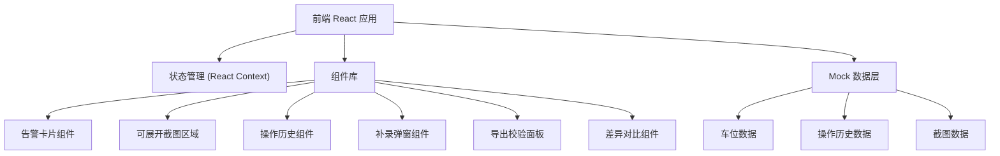

## 1. 架构设计



## 2. 技术描述

- **前端**：React@18 + TypeScript + tailwindcss@3 + vite
- **初始化工具**：npm create vite@latest
- **后端**：无，使用 Mock 数据模拟
- **数据持久化**：localStorage 存储操作历史和补录数据
- **图标**：Lucide React
- **字体**：JetBrains Mono (等宽数字) + Noto Sans SC (中文)

## 3. 路由定义

| 路由 | 用途 |
|------|------|
| / | 告警看板主页 |
| /history | 操作历史页面 |

## 4. 数据模型

### 4.1 车位数据模型

```typescript
interface ParkingSpot {
  id: string;
  spotNumber: string;
  status: 'available' | 'occupied' | 'charging' | 'offline' | 'mismatch';
  occupiedSince: string | null;
  exportValue: number;
  actualValue: number;
  screenshots: Screenshot[];
  lastUpdated: string;
  hasAlert: boolean;
  alertType?: 'export_mismatch' | 'long_occupation' | 'offline';
}

interface Screenshot {
  id: string;
  url: string;
  timestamp: string;
  source: 'system' | 'manual';
  uploadedBy?: string;
  remark?: string;
}

interface OperationHistory {
  id: string;
  spotId: string;
  spotNumber: string;
  operator: string;
  operatorRole: string;
  operationType: 'status_update' | 'screenshot_upload' | 'export_correction' | 'manual_entry';
  timestamp: string;
  reason: string;
  beforeData: Partial<ParkingSpot>;
  afterData: Partial<ParkingSpot>;
  screenshotBefore?: string;
  screenshotAfter?: string;
}

interface User {
  id: string;
  name: string;
  role: 'staff' | 'admin';
  employeeId: string;
}
```

### 4.2 初始数据

包含8个充电车位，其中3个设置为导出数据不一致状态，预置杜会计的补录操作历史记录。

## 5. 核心组件结构

```
src/
├── components/
│   ├── Dashboard/
│   │   ├── StatusBar.tsx          # 顶部状态栏
│   │   ├── ParkingGrid.tsx        # 车位卡片网格
│   │   └── ExportValidation.tsx   # 导出校验面板
│   ├── ParkingSpot/
│   │   ├── ParkingSpotCard.tsx    # 车位卡片
│   │   ├── ExpandablePanel.tsx    # 可展开区域
│   │   ├── ScreenshotGallery.tsx  # 截图展示
│   │   └── ValueComparison.tsx    # 数值对比
│   ├── History/
│   │   ├── HistoryTimeline.tsx    # 历史时间轴
│   │   └── DiffViewer.tsx         # 差异查看器
│   ├── Modals/
│   │   ├── ManualEntryModal.tsx   # 手工补录弹窗
│   │   └── DiffComparisonModal.tsx # 差异对比弹窗
│   └── Layout/
│       └── TabNavigation.tsx      # 标签导航
├── context/
│   └── ParkingContext.tsx         # 全局状态管理
├── data/
│   └── mockData.ts                # Mock 数据
├── types/
│   └── index.ts                   # 类型定义
├── utils/
│   └── helpers.ts                 # 工具函数
├── App.tsx
├── main.tsx
└── index.css
```

## 6. 状态管理

使用 React Context 管理全局状态：
- 车位列表数据
- 当前展开的车位ID
- 操作历史记录
- 当前登录用户
- 筛选条件

## 7. 关键功能实现要点

1. **可展开区域**：使用 CSS max-height + transition 实现平滑展开收起动画
2. **导出校验**：实时对比 exportValue 和 actualValue，不一致时高亮显示
3. **操作历史**：使用时间轴布局展示，支持按操作人、类型筛选
4. **差异对比**：高亮显示变化的字段，截图使用左右分栏对比
5. **本地存储**：补录操作和历史记录持久化到 localStorage
6. **杜会计测试数据**：预置一条手工补录记录，包含补录前后截图差异
