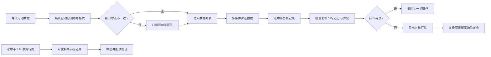

## 1. 产品概述
能源换电电池追踪面板，解决园区能源墙换电电池管理混乱问题。值班员通过导入、筛选、撤回、复核、导出五步流程，高效管理电池流转记录，避免异常数据混入正常汇总。

- 核心问题：电池编号新旧写法不一致无人提醒，异常数据混入后无迹可寻
- 目标用户：园区值班员、数据复核人员
- 核心价值：数据可追溯、异常可预警、操作可撤回、差异可对比

## 2. 核心 Features

### 2.1 用户角色
| 角色 | 注册方式 | 核心权限 |
|------|----------|----------|
| 值班员 | 本地使用无需注册 | 导入数据、筛选查看、撤回操作、导出数据 |
| 复核员 | 本地使用无需注册 | 复核数据、查看复盘页、对比补录差异 |

### 2.2 功能模块
1. **电池追踪主面板**：数据导入、多条件筛选、批量操作、导出
2. **复盘追溯页**：保留原始值、操作历史、异常标记
3. **补录流转表**：小廖手工补录、补录前后差异对比、导出读回验证
4. **系统功能**：本地持久化、样例数据加载、白话提示

### 2.3 页面详情
| 页面名称 | 模块名称 | 功能描述 |
|----------|----------|----------|
| 电池追踪主面板 | 顶部操作栏 | 导入CSV/Excel、一键加载样例数据、导出、撤回上一步 |
| 电池追踪主面板 | 筛选区 | 按电池编号、状态、日期、异常标记筛选 |
| 电池追踪主面板 | 数据表格 | 电池记录列表、编号格式提示、异常高亮、复选框选择 |
| 电池追踪主面板 | 复核区 | 选中数据批量复核、标记正常/异常 |
| 复盘追溯页 | 原始值展示 | 显示数据导入时的原始值，不被后续修改覆盖 |
| 复盘追溯页 | 操作时间线 | 每次操作（导入/修改/复核）的完整历史记录 |
| 补录流转表 | 补录表格 | 小廖手工补录电池箱流转记录 |
| 补录流转表 | 差异对比 | 补录前后数据并排对比，高亮差异项 |
| 补录流转表 | 导出读回 | 导出补录数据，再导入验证数据一致性 |

## 3. 核心流程

## 4. 界面设计

### 4.1 设计风格
- **主色调**：工业蓝 #165DFF（专业、稳重），警戒橙 #FF7D00（异常提示），成功绿 #00B42A（正常标记）
- **辅助色**：深灰 #1D2129（背景），中灰 #4E5969（文字），浅灰 #86909C（次要信息）
- **按钮风格**：直角矩形、2px边框、4px圆角，工业工装风格
- **字体**：标题用 "JetBrains Mono" 等宽字体（数据感），正文用 "PingFang SC"（清晰易读）
- **布局**：顶部操作栏 + 左侧筛选面板 + 右侧数据表格的典型工业控制台布局
- **视觉细节**：数据网格线、扫描线纹理、LED状态指示灯风格的状态标签

### 4.2 页面设计概览
| 页面名称 | 模块名称 | UI元素 |
|----------|----------|--------|
| 电池追踪主面板 | 操作栏 | 左侧功能按钮组、右侧状态指示、右上角版本号 |
| 电池追踪主面板 | 筛选面板 | 折叠式筛选条件，每个条件带清除按钮 |
| 电池追踪主面板 | 数据表格 | 斑马纹行、异常行橙底红字、编号格式异常带 tooltip 白话提示 |
| 复盘追溯页 | 原始值区 | 灰底锁定区域，"原始记录，不可修改"水印 |
| 复盘追溯页 | 时间线 | 垂直时间线，每个节点带操作人、时间、操作类型图标 |
| 补录流转表 | 差异对比 | 左右双栏布局，差异单元格黄色高亮闪烁 |

### 4.3 响应式
- 桌面端优先（1280px以上），主要在园区值班室大屏使用
- 平板端（768-1280px）：筛选面板变为顶部横向排列
- 移动端（<768px）：表格横向滚动，按钮简化为图标

### 4.4 动效设计
- 页面加载：数据行逐条渐入，顶部进度条模拟扫描效果
- 异常提示：编号格式异常时，单元格轻微震动1次后持续橙色呼吸
- 撤回操作：数据回滚时带反向过渡动画
- 差异对比：差异项黄色高亮脉冲动画
- 按钮交互：点击时微缩（scale: 0.97），200ms过渡
