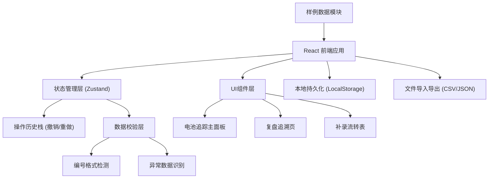
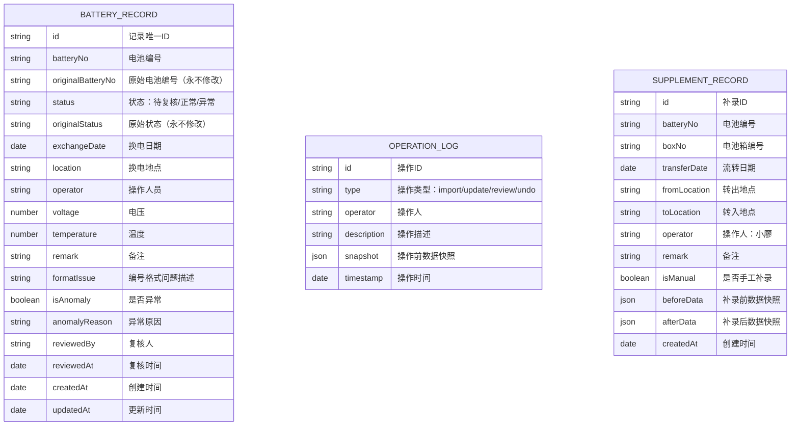

## 1. 架构设计



## 2. 技术选型说明

- **前端框架**：React@18 + TypeScript
- **构建工具**：Vite@5
- **样式方案**：TailwindCSS@3
- **状态管理**：Zustand（轻量，支持时间旅行调试，适合撤回功能）
- **UI组件**：原生实现 + HeadlessUI（按需使用）
- **图标库**：Lucide React
- **本地持久化**：LocalStorage 封装（带版本管理和数据迁移）
- **文件处理**：原生 File API + PapaParse（CSV解析）
- **无后端服务**：纯前端实现，所有数据本地存储

## 3. 路由定义

| 路由 | 页面用途 |
|------|----------|
| / | 电池追踪主面板（默认页） |
| /review | 复盘追溯页 |
| /supplement | 小廖补录流转表 |

## 4. 数据模型

### 4.1 数据实体关系



### 4.2 数据校验规则

- **电池编号新旧格式检测**：
  - 旧格式：`BAT-YYYY-NNN`（如 BAT-2024-001）
  - 新格式：`B-YYYYMM-NNNN`（如 B-202406-0001）
  - 检测逻辑：正则匹配 + 格式对比
  - 白话提示示例："注意：这条记录用的是旧编号格式 BAT-2024-001，现在已经统一改用 B-202406-0001 格式啦"

- **异常数据检测**：
  - 电压异常：<3.2V 或 >4.2V
  - 温度异常：<0°C 或 >55°C
  - 编号重复：同一电池编号在同一天出现多条记录

## 5. 核心模块设计

### 5.1 撤回功能实现
- 采用 Command 模式，每次操作生成快照压入历史栈
- 历史栈最大保留50步，超出自动清理最早记录
- 撤回时从栈顶弹出快照并恢复状态
- 支持多级撤回，每一步都可独立撤销

### 5.2 复盘页原始值保留机制
- 每条记录包含 `original*` 前缀的字段，创建时赋值，永不修改
- 复盘页专门展示原始值与当前值的对比
- 即使记录被删除，原始数据仍保留在归档表中

### 5.3 本地持久化方案
- 存储键名：`energy-battery-tracker-v1`
- 数据结构：`{ records, operationLogs, supplementRecords, version }`
- 自动保存：每次数据变更后延迟100ms写入
- 数据迁移：检测版本号，旧版本数据自动迁移到新格式
- 容量保护：单条记录超过100条时提示清理

### 5.4 导入导出格式
- 支持格式：CSV（通用）、JSON（完整数据，含操作历史）
- 导入时自动检测格式，识别表头映射
- 导出时可选：仅导出正常数据 / 导出全部数据 / 导出含操作历史

## 6. 构建命令

```json
{
  "dev": "vite",
  "build": "tsc && vite build",
  "preview": "vite preview",
  "lint": "eslint . --ext ts,tsx --report-unused-disable-directives --max-warnings 0",
  "typecheck": "tsc --noEmit"
}
```
