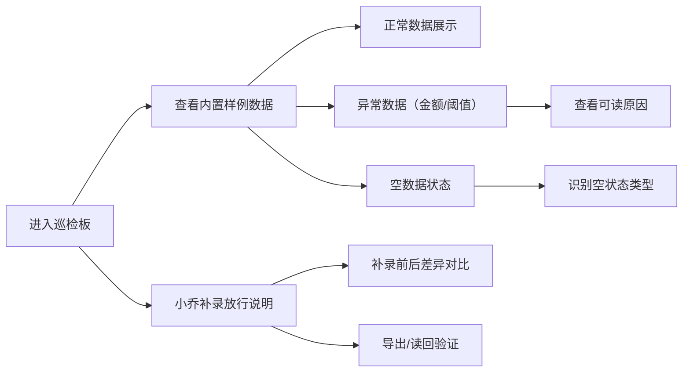

## 1. 产品概述

能源站内道闸巡检板是面向能源站抢修坐席和施工队长的道闸巡检管理工具，解决道闸放行说明在聊天中泄露隐私、数据异常原因不明确、空状态无提示等核心痛点。通过内置样例数据、可读原因展示、补录差异对比等功能，提升巡检工作效率和数据可信度。

## 2. 核心功能

### 2.1 用户角色
| 角色 | 注册方法 | 核心权限 |
|------|----------|----------|
| 抢修坐席 | 内部系统登录 | 查看道闸巡检数据、补录放行说明、导出数据 |
| 施工队长 | 内部系统登录 | 查看巡检数据、查看异常原因、确认空状态类型 |

### 2.2 功能模块
1. **道闸巡检看板**：道闸列表展示、状态筛选、数据概览
2. **异常原因展示**：金额精度问题说明、边界阈值解释
3. **空状态提示**：未导入数据、筛选过窄、材料全坏三类场景
4. **手工补录功能**：小乔补录道闸放行说明、补录前后差异对比
5. **数据导入导出**：JSON 格式导出、导入回显验证

### 2.3 页面详情
| 页面名称 | 模块名称 | 功能描述 |
|----------|----------|----------|
| 巡检看板首页 | 数据概览卡片 | 正常/异常/待处理道闸数量统计、放行说明数量 |
| 巡检看板首页 | 道闸列表 | 道闸编号、位置、状态、巡检时间、金额、阈值标记 |
| 巡检看板首页 | 状态筛选器 | 全部/正常/异常/未巡检 四类筛选 |
| 异常详情面板 | 金额精度说明 | 显示计算偏差值、原始值、精度影响原因 |
| 异常详情面板 | 边界阈值解释 | 显示阈值定义、当前值、超差原因、历史参考 |
| 空状态页面 | 场景提示 | 根据场景显示对应图标、说明文字、操作建议 |
| 放行说明面板 | 补录表单 | 小乔手工补录道闸放行说明表单 |
| 放行说明面板 | 差异对比 | 补录前后数据对比、变更高亮标记 |
| 工具条 | 导入导出 | JSON 格式导出当前数据、导入验证读回 |

## 3. 核心流程

用户进入巡检板 → 查看内置样例数据（正常/异常/空数据） → 点击异常项查看金额精度或阈值原因 → 切换筛选条件体验空状态提示 → 进入放行说明面板查看小乔补录记录 → 对比补录前后差异 → 导出数据并读回验证

## 4. 用户界面设计

### 4.1 设计风格
- **主色调**：工业蓝 #1e40af 作为主色，警示橙 #f97316 标记异常，成功绿 #10b981 标记正常
- **按钮风格**：直角硬朗边框，轻微阴影，工业设备感
- **字体**：标题使用 JetBrains Mono（工业等宽字体），正文使用 Inter
- **布局风格**：卡片式网格布局，左侧导航+右侧内容区，数据表格密集展示
- **图标风格**：线性图标，使用 Font Awesome，工业设备主题

### 4.2 页面设计概述
| 页面名称 | 模块名称 | UI 元素 |
|----------|----------|----------|
| 巡检看板首页 | 数据概览 | 三张统计卡片，数字跳动动画，状态色背景渐变 |
| 巡检看板首页 | 道闸列表 | 斑马条纹表格，异常行橙色高亮，悬停显示详情 |
| 异常详情面板 | 原因说明 | 折叠面板，展开显示计算公式、偏差值、参考标准 |
| 空状态页面 | 场景提示 | 大号场景图标 + 明确标题 + 操作建议按钮 |
| 放行说明面板 | 差异对比 | 左右分栏对比，新增内容绿色背景，删除内容删除线 |

### 4.3 响应式
桌面端优先设计，1280px 以下自适应为单列布局，表格支持横向滚动。

### 4.4 动效设计
- 数据加载时数字滚动动画
- 异常项呼吸灯效果
- 面板展开/收起平滑过渡
- 表格行悬停微上浮效果
