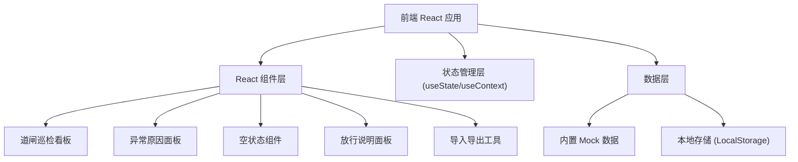

## 1. 架构设计



## 2. 技术描述

- **前端**：React@18 + TypeScript + tailwindcss@3 + vite@5
- **初始化工具**：npm create vite@latest
- **后端**：无后端，纯前端 Mock 数据
- **数据持久化**：LocalStorage 存储补录数据
- **图标库**：@fortawesome/fontawesome-svg-core + @fortawesome/free-solid-svg-icons

## 3. 路由定义

| 路由 | 用途 |
|------|------|
| / | 道闸巡检看板首页 |
| /pass-info | 放行说明面板（可通过 Tab 切换） |

## 4. 数据模型

### 4.1 道闸巡检记录类型定义

```typescript
interface GateInspection {
  id: string;
  gateNo: string;           // 道闸编号
  location: string;        // 位置
  status: 'normal' | 'abnormal' | 'pending'; // 状态
  inspectionTime: string; // 巡检时间
  amount: number;        // 金额
  amountIssue?: {        // 金额精度问题
    rawValue: number;
    displayValue: number;
    deviation: number;
    reason: string;
  };
  thresholdIssue?: {     // 边界阈值问题
    currentValue: number;
    threshold: number;
    unit: string;
    reason: string;
    historicalRef: string;
  };
  passDescription?: string; // 道闸放行说明
  operator?: string;      // 补录人
  isManualEntry?: boolean; // 是否手工补录
}

type EmptyStateType = 'no-import' | 'filter-narrow' | 'all-damaged';
```

### 4.2 初始数据

内置样例数据包含：
- 6 条正常数据
- 3 条异常数据（含金额精度和阈值问题
- 3 类空状态场景演示
- 1 条小乔手工补录记录

## 5. 组件结构

```
src/
├── App.tsx                 # 主应用组件
├── main.tsx                # 入口文件
├── index.css               # 全局样式+Tailwind
├── components/
│   ├── Dashboard.tsx        # 巡检看板
│   ├── GateList.tsx        # 道闸列表
│   ├── StatsCard.tsx       # 统计卡片
│   ├── FilterBar.tsx      # 筛选栏
│   ├── AmountIssuePanel.tsx   # 金额精度问题面板
│   ├── ThresholdIssuePanel.tsx # 阈值问题面板
│   ├── EmptyState.tsx     # 空状态组件
│   ├── PassInfoPanel.tsx # 放行说明面板
│   ├── DiffViewer.tsx    # 差异对比组件
│   └── ImportExport.tsx # 导入导出工具
├── data/
│   └── mockData.ts      # 内置样例数据
├── types/
│   └── index.ts         # 类型定义
└── utils/
    └── storage.ts       # 本地存储工具
```

## 6. 核心功能实现要点

### 6.1 内置样例数据
- 正常数据：金额精确，阈值内，有完整放行说明
- 金额精度问题：原始值 1234.567，显示值 1234.57，偏差 0.003，原因：JS 浮点数精度导致 3 厘偏差，影响班组对账
- 边界阈值问题：开启时长 72.5 小时，阈值 72 小时，原因：超过连续运行超阈值需检修

### 6.2 空状态场景
- 未导入：显示导入按钮，提示"尚未导入巡检数据"
- 筛选过窄：显示清除筛选按钮，提示"筛选条件过于严格"
- 材料全坏：显示红色警告，提示"所有道闸材料均已损坏"

### 6.3 小乔补录功能
- 补录人固定为"小乔"
- 记录补录时间
- 对比补录前后字段差异

### 6.4 导入导出
- JSON 格式导出所有道闸数据
- 导入时校验 JSON 格式
- 读回后与原数据对比显示
