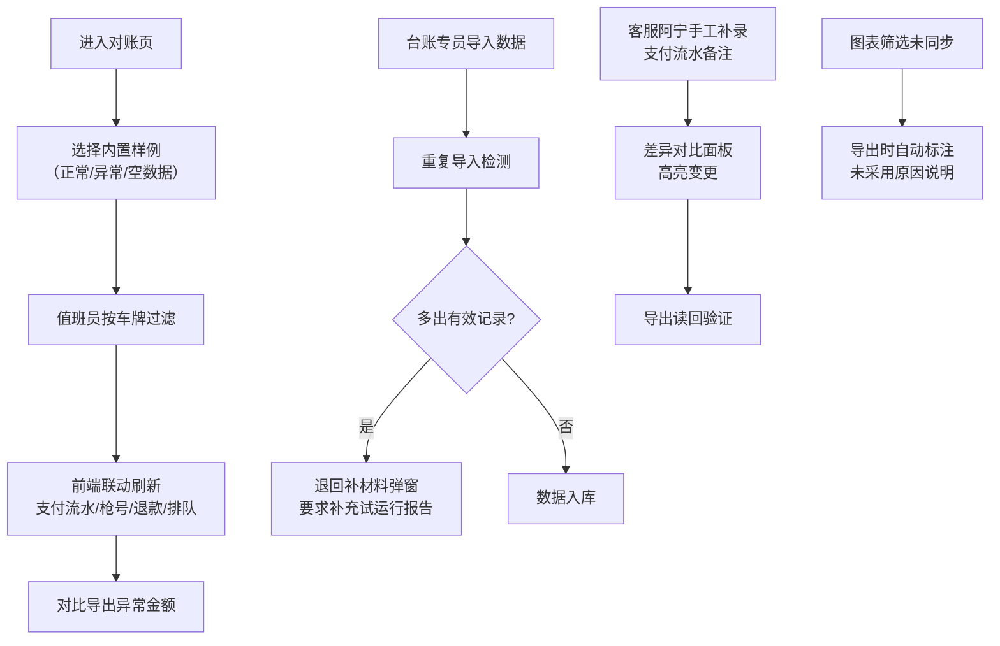

## 1. 产品概述
能源快充账单对账系统，解决资产台账专员在快充账单对账中支付流水备注与试运行报告不同步、重复导入难追溯、异常数据难识别的痛点。面向资产台账专员、值班员、客服人员，提供内置样例驱动的对账工作台，实现支付流水、枪号占用、退款重算与司机排队记录的全链路前端联动。

## 2. 核心功能

### 2.1 用户角色
| 角色 | 准入方式 | 核心权限 |
|------|----------|----------|
| 资产台账专员 | 系统内置账号 | 全量对账操作、数据导入导出、异常处理 |
| 值班员 | 系统内置账号 | 车牌过滤、异常金额对比、枪号筛选 |
| 客服（阿宁） | 系统内置账号 | 手工补录支付流水备注、差异确认 |

### 2.2 功能模块
1. **对账主工作台**：数据概览卡片、多维度筛选器、智能图表、对账明细表
2. **内置样例引擎**：正常对账样例、异常对账样例、空数据样例一键切换
3. **导入检测与退回**：重复导入识别、多出有效记录退回补材料、导入历史追溯
4. **补录与差异对比**：客服阿宁手工补录入口、补录前后数据差异高亮、导出读回验证
5. **前端联动看板**：支付流水状态、枪号占用实时图、退款重算轨迹、司机排队记录联动

### 2.3 页面详情
| 页面名称 | 模块名称 | 功能描述 |
|----------|----------|----------|
| 能源快充账单对账页 | 数据概览卡片 | 显示今日对账笔数、异常金额、退款笔数、排队车辆数关键指标 |
| 能源快充账单对账页 | 多维度筛选器 | 按车牌、支付流水备注、退款标记、枪号、日期范围筛选 |
| 能源快充账单对账页 | 智能图表区 | 柱状图展示枪号使用率、折线图展示金额趋势、饼图展示异常占比 |
| 能源快充账单对账页 | 对账明细表 | 展示支付流水、枪号、金额、状态、备注，支持异常行高亮 |
| 能源快充账单对账页 | 导入操作区 | 文件导入、重复检测、退回补材料弹窗 |
| 能源快充账单对账页 | 补录操作区 | 客服阿宁手工补录入口、差异对比面板 |
| 能源快充账单对账页 | 联动看板区 | 支付流水状态灯、枪号占用热力图、退款重算时间线、司机排队列表 |
| 能源快充账单对账页 | 导出功能 | 导出Excel、未采用筛选原因自动标注说明 |

## 3. 核心流程
值班员先按车牌过滤账单，系统自动联动显示对应枪号占用、支付流水、退款记录和司机排队信息；台账专员导入数据时系统检测重复，多出有效记录自动退回要求补充试运行报告；客服阿宁手工补录缺失的支付流水备注，系统高亮显示补录前后差异；导出时如筛选条件未被图表采用，自动在导出文件中说明未采用原因。

## 4. 用户界面设计

### 4.1 设计风格
- **主色调**：工业深蓝 `#0F172A` 作为背景，搭配能源橙 `#F97316` 作为强调色，状态绿 `#10B981`、告警红 `#EF4444`、待处理黄 `#F59E0B`
- **按钮风格**：3D微凸质感，4px圆角，hover时上移2px+阴影加深
- **字体**：标题使用 `Space Grotesk`，数据表格使用 `JetBrains Mono` 等宽字体确保数字对齐，正文使用 `Inter`
- **布局风格**：三栏不对称布局，左侧筛选区（20%）+ 中间主数据区（55%）+ 右侧联动看板（25%）
- **图标风格**：Lucide 线性图标，状态异常时图标闪烁动画

### 4.2 页面设计概述
| 页面名称 | 模块名称 | UI 元素 |
|----------|----------|---------|
| 能源快充账单对账页 | 数据概览卡片 | 4张渐变卡片，数字滚动动画，状态色边框 |
| 能源快充账单对账页 | 筛选器 | 下拉选择器带搜索、日期范围选择器、标签式多选 |
| 能源快充账单对账页 | 智能图表 | Recharts 图表，数据点hover高亮，筛选联动 |
| 能源快充账单对账页 | 对账明细表 | 固定表头，斑马纹，异常行红底闪烁，可展开详情 |
| 能源快充账单对账页 | 联动看板 | 枪号占用热力网格、退款重算垂直时间线、排队司机滚动列表 |
| 能源快充账单对账页 | 操作弹窗 | 毛玻璃背景，表单分步引导，确认按钮倒计时防误触 |

### 4.3 响应性
- Desktop-first 设计，1280px 以上完美展示
- 1024px-1280px：右侧联动看板折叠为可展开抽屉
- 768px-1024px：筛选区折叠为顶部横条
- 768px 以下：单列流式布局，图表简化为数据卡片

### 4.4 动效设计
- 页面加载：卡片从下往上 staggered 入场，延迟 100ms 间隔
- 数据更新：数字滚动动画（react-countup），状态变更时边框脉冲
- 异常检测：异常行呼吸灯效果（背景色渐变循环）
- 联动刷新：看板区域数据切换时 cross-fade 过渡
- 按钮交互：hover 上移 2px + 阴影扩散，active 下沉 1px
