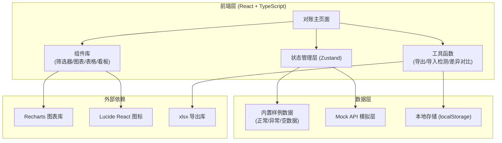
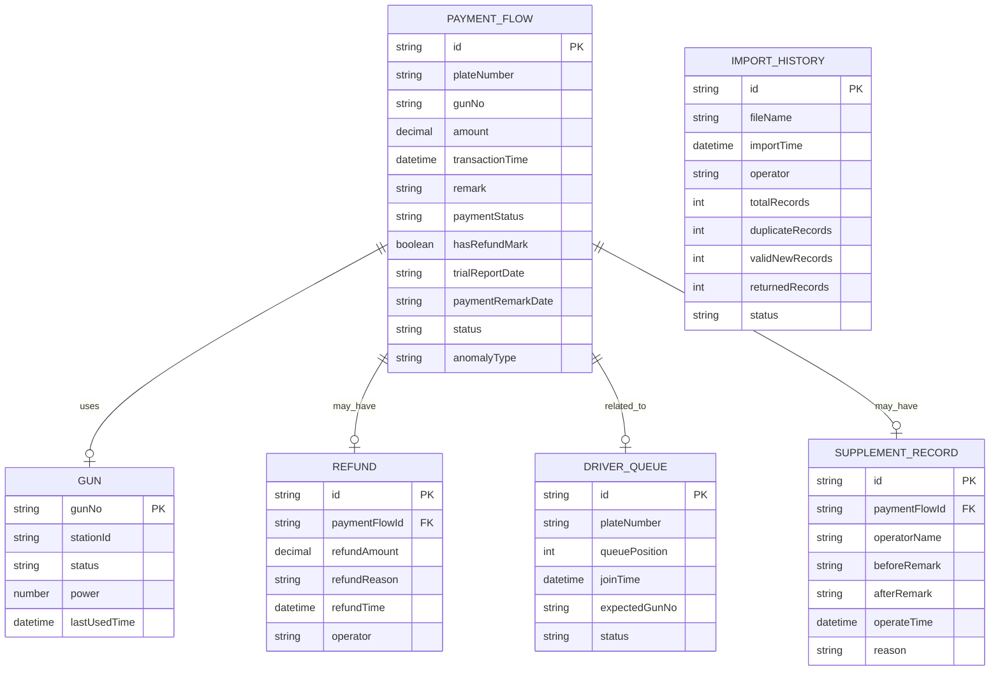

## 1. 架构设计



## 2. 技术描述

- **前端框架**: React@18 + TypeScript + Vite@5
- **状态管理**: Zustand@4，集中管理对账数据、筛选条件、联动状态
- **样式方案**: TailwindCSS@3 + CSS 变量主题系统
- **图表库**: Recharts@2，实现枪号使用率、金额趋势、异常占比图表
- **UI 组件**: 自研组件 + Lucide React@0.400 图标库
- **数据导出**: xlsx@0.18，支持导出时自动标注未采用筛选原因
- **初始化工具**: vite-init
- **后端**: 无后端，纯前端 Mock 数据 + localStorage 持久化
- **数据库**: 无数据库，使用内置 JSON 样例数据

## 3. 路由定义

| 路由 | 用途 |
|------|------|
| / | 能源快充账单对账页（唯一主页面） |

## 4. 数据模型

### 4.1 数据模型定义



### 4.2 数据类型定义

```typescript
// 支付流水
interface PaymentFlow {
  id: string;
  plateNumber: string;
  gunNo: string;
  amount: number;
  transactionTime: string;
  remark: string;
  paymentStatus: 'completed' | 'pending' | 'failed' | 'refunded';
  hasRefundMark: boolean;
  trialReportDate: string | null;
  paymentRemarkDate: string | null;
  status: 'normal' | 'anomaly' | 'pending';
  anomalyType: string | null;
  driverName: string;
  chargeDuration: number;
  startSoc: number;
  endSoc: number;
}

// 枪号信息
interface GunInfo {
  gunNo: string;
  stationId: string;
  status: 'available' | 'occupied' | 'maintenance';
  power: number;
  lastUsedTime: string;
  todayUsageCount: number;
}

// 退款记录
interface RefundRecord {
  id: string;
  paymentFlowId: string;
  refundAmount: number;
  refundReason: string;
  refundTime: string;
  operator: string;
  recalculationNote: string;
}

// 司机排队
interface DriverQueue {
  id: string;
  plateNumber: string;
  driverName: string;
  queuePosition: number;
  joinTime: string;
  expectedGunNo: string;
  status: 'waiting' | 'charging' | 'completed' | 'cancelled';
  waitDuration: number;
}

// 补录记录
interface SupplementRecord {
  id: string;
  paymentFlowId: string;
  operatorName: string;
  beforeRemark: string;
  afterRemark: string;
  operateTime: string;
  reason: string;
}

// 导入历史
interface ImportHistory {
  id: string;
  fileName: string;
  importTime: string;
  operator: string;
  totalRecords: number;
  duplicateRecords: number;
  validNewRecords: number;
  returnedRecords: number;
  status: 'completed' | 'partial' | 'returned';
  returnedReasons: string[];
}

// 筛选条件
interface FilterConditions {
  plateNumber: string[];
  paymentRemark: string;
  hasRefundMark: boolean | null;
  gunNo: string[];
  dateRange: [string, string] | null;
  status: string[];
}

// 对账状态
interface ReconciliationState {
  currentSample: 'normal' | 'anomaly' | 'empty';
  paymentFlows: PaymentFlow[];
  filteredFlows: PaymentFlow[];
  gunInfos: GunInfo[];
  refundRecords: RefundRecord[];
  driverQueues: DriverQueue[];
  supplementRecords: SupplementRecord[];
  importHistories: ImportHistory[];
  filters: FilterConditions;
  chartFiltersApplied: boolean;
  unappliedFilterReasons: string[];
  selectedFlowId: string | null;
}
```

## 5. 核心模块结构

```
src/
├── components/
│   ├── FilterPanel/          # 筛选面板
│   │   ├── PlateFilter.tsx   # 车牌筛选
│   │   ├── RemarkFilter.tsx  # 支付流水备注筛选
│   │   ├── RefundFilter.tsx  # 退款标记筛选
│   │   └── GunFilter.tsx     # 枪号筛选
│   ├── StatsCards/           # 数据概览卡片
│   ├── Charts/               # 图表组件
│   │   ├── GunUsageChart.tsx
│   │   ├── AmountTrendChart.tsx
│   │   └── AnomalyPieChart.tsx
│   ├── DataTable/            # 对账明细表
│   ├── ImportPanel/          # 导入操作区
│   │   └── ReturnModal.tsx   # 退回补材料弹窗
│   ├── SupplementPanel/      # 补录操作区
│   │   ├── SupplementForm.tsx
│   │   └── DiffCompare.tsx   # 差异对比
│   ├── LinkageBoard/         # 联动看板
│   │   ├── PaymentStatusLights.tsx
│   │   ├── GunHeatmap.tsx
│   │   ├── RefundTimeline.tsx
│   │   └── DriverQueueList.tsx
│   └── ExportPanel/          # 导出功能
├── store/
│   └── useReconciliationStore.ts  # Zustand 状态管理
├── data/
│   ├── samples/
│   │   ├── normal.ts         # 正常对账样例
│   │   ├── anomaly.ts        # 异常对账样例
│   │   └── empty.ts          # 空数据样例
│   └── mockApi.ts            # Mock API 层
├── utils/
│   ├── export.ts             # 导出工具（含未采用原因标注）
│   ├── importCheck.ts        # 重复导入检测
│   ├── diffCompare.ts        # 差异对比
│   └── formatters.ts         # 格式化工具
├── hooks/
│   ├── useFilterSync.ts      # 筛选同步Hook
│   └── useLinkageData.ts     # 联动数据Hook
├── pages/
│   └── ReconciliationPage.tsx
└── types/
    └── index.ts              # 类型定义
```

## 6. 关键技术点

1. **前端联动机制**：通过 Zustand store 单一数据源，筛选条件变更时自动触发支付流水、枪号占用、退款记录、司机队列的关联刷新

2. **重复导入检测算法**：基于 `plateNumber + gunNo + transactionTime` 组合键进行重复检测，识别出多出的有效记录后自动触发退回流程

3. **图表筛选未同步检测**：通过 `chartFiltersApplied` 标记追踪，导出时检查筛选条件与图表数据是否一致，不一致则在导出文件中自动添加 `未采用原因` 说明列

4. **补录差异对比**：保存补录前后快照，使用 `diff-match-patch` 算法实现字符级差异高亮显示

5. **样例数据切换**：三种内置样例一键切换，自动清空 localStorage 并重新加载对应数据集

6. **本地持久化**：用户操作（补录记录、导入历史）通过 localStorage 持久化，刷新页面不丢失
