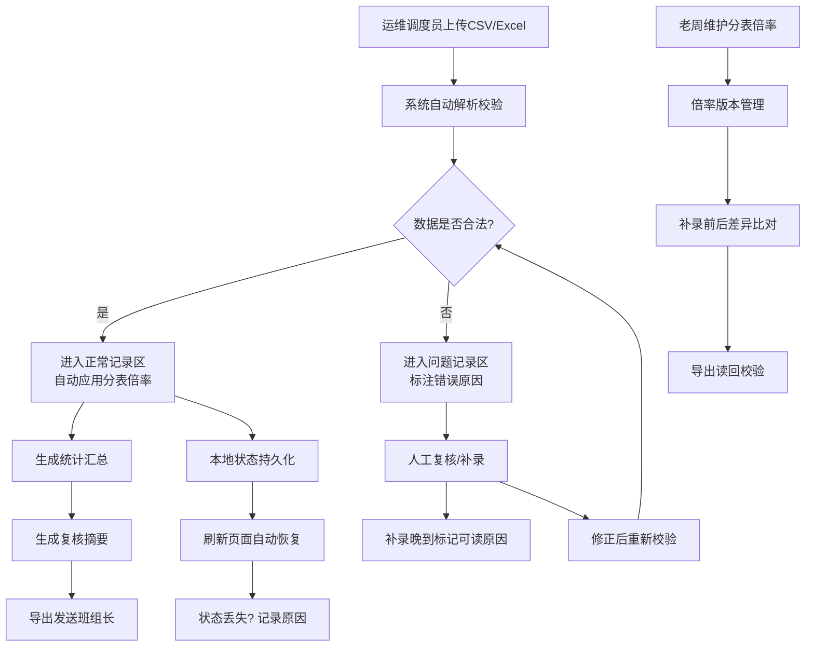

## 1. 产品概述

能源园区电表复核台是面向青岚光伏二区运维调度员的专业数据复核工具，解决设备导出CSV与旧版Excel台账数据不一致的痛点。通过自动化分拣、问题标记、状态持久化和报告导出，大幅提升电表数据复核效率，减少班组误判。

### 核心价值
- **数据分拣**：自动识别CSV坏行，隔离至问题区，正常数据进入统计
- **状态可追溯**：补录晚到、刷新丢状态等异常均保留可读原因
- **决策支持**：一键导出复核摘要，包含数量、原因、处理人、待拍板记录
- **倍率校验**：内置老周手工补录的分表倍率说明，支持差异比对

### 目标用户
| 角色 | 核心诉求 |
|------|----------|
| 光伏运维调度员 | 快速复核CSV数据，标记问题，减少人工对账 |
| 班组长 | 接收清晰的复核摘要，掌握待决策事项 |
| 老周（补录专员） | 维护分表倍率，校验补录前后数据差异 |

---

## 2. 核心功能

### 2.1 功能模块清单

1. **数据导入区**：CSV/Excel文件上传、数据解析、格式校验
2. **正常记录区**：已通过校验的电表数据列表、统计汇总、倍率应用
3. **问题记录区**：坏行展示、错误原因标注、人工复核、补录入口
4. **倍率管理区**：老周手工补录分表倍率说明、历史版本、差异比对
5. **报告导出区**：复核摘要生成、一键发送班组长、导出读回校验
6. **状态持久化**：本地存储、操作日志、异常原因追溯

### 2.2 页面详情

| 页面名称 | 模块名称 | 功能描述 |
|----------|----------|----------|
| 复核台主页面 | 顶部导航栏 | 品牌标识、操作人切换、导出按钮、状态总览 |
| 复核台主页面 | 数据导入区 | 拖拽上传、文件选择、解析进度、格式预览 |
| 复核台主页面 | 统计概览卡 | 总条数、正常数、问题数、待拍板数、处理人 |
| 复核台主页面 | 正常记录区 | 数据表格、分页、筛选、倍率应用预览 |
| 复核台主页面 | 问题记录区 | 坏行列表、错误原因标签、补录表单、处理记录 |
| 复核台主页面 | 倍率说明区 | 老周补录倍率、版本历史、补录前后差异对比 |
| 复核台主页面 | 操作日志区 | 刷新原因、补录晚到说明、处理时间线 |

---

## 3. 核心流程

### 关键业务规则
1. **坏行判定规则**：
   - 电表编号格式错误（非8位数字）
   - 读数为空或负数
   - 时间戳超出合理范围
   - 倍率字段缺失
2. **状态变更原因**：
   - `补录材料晚到`：记录晚到时长、责任班组
   - `刷新后状态丢失`：记录丢失数据范围、自动恢复提示
3. **摘要报告内容**：
   - 数量统计：正常/问题/待拍板各多少条
   - 原因分类：各类型错误占比
   - 处理人：当前操作人姓名
   - 待拍板：需班组长决策的记录清单

---

## 4. 用户界面设计

### 4.1 设计风格

**视觉定位**：工业级数据工作台 · 专业冷峻 · 数据可视化优先

- **主色调**：工业蓝 `#165DFF`（代表能源、科技、专业）
- **警示色**：琥珀橙 `#FF7D00`（问题记录、待处理）、危险红 `#F53F3F`（严重错误）
- **成功色**：翠绿 `#00B42A`（正常记录、校验通过）
- **中性色**：深灰 `#1D2129` 背景、中灰 `#4E5969` 文字、浅灰 `#86909C` 辅助

**排版**：
- 标题字体：`Noto Sans SC` 粗体，大字号强化层级
- 数据字体：`JetBrains Mono` 等宽字体，数字对齐精确
- 正文字体：`Noto Sans SC` 常规，保证中文可读性

**布局风格**：
- 顶部固定导航 + 三栏主体布局
- 左：问题记录区（固定宽度）
- 中：正常记录区（弹性宽度）
- 右：倍率说明 + 操作日志（固定宽度）
- 卡片式分区，深阴影层级，工业感分割线

**交互细节**：
- 数据行hover高亮，选中行左侧蓝色竖条标记
- 错误原因标签可点击展开详情
- 表格列支持拖拽调整宽度
- 重要操作前二次确认，操作后Toast反馈

### 4.2 页面设计概览

| 模块名称 | UI元素 | 设计要点 |
|----------|--------|----------|
| 统计概览卡 | 4张数据卡片横向排列 | 大数字、趋势箭头、彩色状态条、渐变背景 |
| 正常记录区 | 数据表格、筛选器、分页 | 斑马纹、固定表头、数字右对齐、可排序 |
| 问题记录区 | 带错误标签的列表、补录表单 | 每行左侧彩色状态条、展开/收起详情、时间线 |
| 倍率说明区 | 老周头像、倍率表格、差异对比 | 手工录入标记、版本切换、差异高亮 |
| 操作日志区 | 时间线列表、原因标签 | 自动滚动、可筛选、重要日志加粗 |

### 4.3 响应式设计

- **桌面端**（≥1440px）：三栏完整布局，最右侧日志区可折叠
- **笔记本**（≥1024px）：左右两栏，日志区改为底部抽屉
- **平板**（≥768px）：单栏流式布局，分区折叠
- **移动端**：核心功能保留（上传、查看、导出），复杂操作提示使用桌面端

---

## 5. 数据安全与持久化

### 本地存储策略
- 使用 `localStorage` 存储复核状态，键名带时间戳防覆盖
- 关键操作（补录、状态变更）自动写入操作日志
- 页面刷新时检测本地状态，如丢失则弹窗提示并记录原因

### 数据导出格式
- 复核摘要：Markdown格式，支持复制到飞书/微信
- 完整数据：Excel格式，含正常记录、问题记录、倍率说明三个Sheet
- 导出文件附带校验和，支持读回时完整性校验
