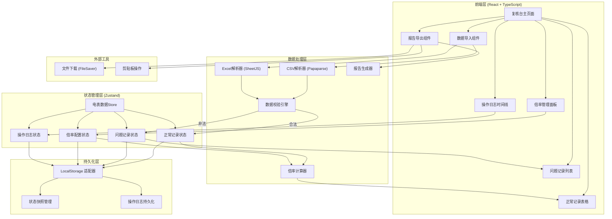

## 1. 架构设计



## 2. 技术栈说明

### 前端核心
- **框架**：React 18.2 + TypeScript 5.3
- **构建工具**：Vite 5.0
- **样式方案**：TailwindCSS 3.4 + CSS变量主题系统
- **状态管理**：Zustand 4.5（轻量、支持持久化中间件）
- **UI组件**：Headless UI（无样式、可定制）+ Heroicons

### 数据处理
- **CSV解析**：Papa Parse 5.4（流式解析、类型推断）
- **Excel解析**：SheetJS (xlsx) 0.18.5
- **表格组件**：TanStack Table 8.11（虚拟滚动、排序筛选）

### 工具库
- **文件下载**：FileSaver.js 2.0
- **日期处理**：date-fns 3.3
- **唯一ID**：nanoid 5.0
- **深拷贝**：structuredClone（原生API）

### 无后端设计
本应用采用纯前端架构，所有数据处理和存储均在浏览器本地完成：
- 无需后端服务，离线可用
- 数据通过文件导入/导出流转
- 本地存储加密（简单混淆）防误删

## 3. 路由定义

| 路由路径 | 页面名称 | 主要功能 |
|----------|----------|----------|
| `/` | 电表复核台主页 | 完整复核工作台，包含所有功能模块 |
| `/preview/:id` | 记录详情预览 | 单条记录的详细信息和操作历史 |
| `/report` | 复核报告预览 | 生成中的报告实时预览 |

## 4. 核心数据模型

### 4.1 TypeScript 类型定义

```typescript
// 电表记录基础类型
interface MeterRecord {
  id: string;
  meterNo: string;           // 电表编号
  reading: number;           // 电表读数
  readingTime: Date;         // 抄表时间
  multiplier: number;        // 倍率
  calculatedValue: number;   // 计算后数值 = reading * multiplier
  source: 'csv' | 'excel' | 'manual';  // 数据来源
  importedAt: Date;
  operator: string;          // 操作人
}

// 问题记录类型
interface ProblemRecord extends MeterRecord {
  errorType: 'format_error' | 'invalid_reading' | 'invalid_time' | 'missing_multiplier' | 'late_supplement';
  errorMessage: string;
  status: 'pending' | 'reviewing' | 'resolved' | 'rejected';
  reviewedBy?: string;
  reviewedAt?: Date;
  supplementNote?: string;   // 补录说明
  originalData: Record<string, any>;  // 原始数据快照
}

// 倍率配置类型
interface MultiplierConfig {
  id: string;
  meterNo: string;
  multiplier: number;
  effectiveDate: Date;
  expiryDate?: Date;
  enteredBy: 'zhou' | 'system';  // 老周手工录入标记
  note: string;            // 倍率说明
  createdAt: Date;
  version: number;
}

// 操作日志类型
interface OperationLog {
  id: string;
  timestamp: Date;
  operator: string;
  action: 'import' | 'validate' | 'supplement' | 'resolve' | 'export' | 'refresh' | 'status_lost';
  targetId?: string;
  description: string;
  reason?: string;         // 状态丢失、补录晚到等原因
  metadata?: Record<string, any>;
}

// 复核摘要类型
interface ReviewSummary {
  generatedAt: Date;
  operator: string;
  statistics: {
    totalRecords: number;
    normalRecords: number;
    problemRecords: number;
    pendingRecords: number;
  };
  errorBreakdown: Record<string, number>;
  pendingItems: ProblemRecord[];
  multiplierChanges: MultiplierConfig[];
}

// 应用状态类型
interface AppState {
  normalRecords: MeterRecord[];
  problemRecords: ProblemRecord[];
  multipliers: MultiplierConfig[];
  operationLogs: OperationLog[];
  currentOperator: string;
  lastSavedAt: Date | null;
  lastRefreshReason: string | null;
}
```

### 4.2 本地存储键名规范

```
storage_keys:
  - 'meter_review_app_state_v1'     # 主状态快照
  - 'meter_review_logs_v1'          # 操作日志（独立存储防丢失）
  - 'meter_review_backup_[timestamp]'  # 自动备份快照
```

## 5. 核心算法与校验规则

### 5.1 数据校验引擎

```typescript
// 校验规则优先级
const VALIDATION_RULES = [
  {
    field: 'meterNo',
    validate: (val) => /^\d{8}$/.test(val),
    errorType: 'format_error',
    message: '电表编号必须为8位数字'
  },
  {
    field: 'reading',
    validate: (val) => !isNaN(val) && val >= 0,
    errorType: 'invalid_reading',
    message: '电表读数不能为空或负数'
  },
  {
    field: 'readingTime',
    validate: (val) => {
      const date = new Date(val);
      const now = new Date();
      const threeMonthsAgo = new Date(now.setMonth(now.getMonth() - 3));
      return date > threeMonthsAgo && date < new Date();
    },
    errorType: 'invalid_time',
    message: '抄表时间超出合理范围（近3个月内）'
  },
  {
    field: 'multiplier',
    validate: (val) => !isNaN(val) && val > 0,
    errorType: 'missing_multiplier',
    message: '倍率字段缺失或无效'
  }
];
```

### 5.2 状态持久化策略

```typescript
// 自动保存频率：每30秒 + 关键操作后立即保存
// 状态丢失检测：页面加载时对比预期快照时间戳
// 恢复策略：优先从最近备份恢复，失败则记录原因并创建新会话
```

## 6. 报告生成规范

### 6.1 班组长摘要格式（Markdown）

```markdown
# 青岚光伏二区电表复核摘要

**生成时间**：2026-06-09 14:30:25
**处理人**：张调度
**复核范围**：2026-06-01 ~ 2026-06-08

## 一、数量统计

| 类别 | 数量 | 占比 |
|------|------|------|
| 总记录数 | 1,256 | 100% |
| ✅ 正常记录 | 1,189 | 94.7% |
| ⚠️ 问题记录 | 67 | 5.3% |
| 🔴 待拍板 | 12 | 0.95% |

## 二、问题原因分类

1. **电表编号格式错误**：28条（41.8%）
2. **电表读数异常**：15条（22.4%）
3. **补录材料晚到**：12条（17.9%）- 详见待拍板
4. **倍率缺失**：7条（10.4%）
5. **时间戳异常**：5条（7.5%）

## 三、待拍板记录（需班组长决策）

| 电表编号 | 问题描述 | 上报时间 | 建议处理 |
|----------|----------|----------|----------|
| 2024015X | 编号格式疑似录入错误 | 06-08 09:15 | 确认正确编号后补录 |
| ... | ... | ... | ... |

## 四、分表倍率变更说明

- 老周于06-07手工更新3台电表倍率
- 补录前后差异：总读数偏差 +0.8%（在允许范围内）

---
*此摘要由能源园区电表复核台自动生成*
```

## 7. 初始化老周手工补录倍率数据

```typescript
// 应用启动时内置的初始倍率数据
const INITIAL_MULTIPLIERS: MultiplierConfig[] = [
  {
    id: 'mult_001',
    meterNo: '20240001',
    multiplier: 40,
    effectiveDate: new Date('2026-01-01'),
    enteredBy: 'zhou',
    note: '老周手工补录：1#主变分表，CT变比40/5',
    createdAt: new Date('2026-06-01'),
    version: 1
  },
  {
    id: 'mult_002',
    meterNo: '20240002',
    multiplier: 60,
    effectiveDate: new Date('2026-01-01'),
    enteredBy: 'zhou',
    note: '老周手工补录：2#主变分表，CT变比60/5',
    createdAt: new Date('2026-06-01'),
    version: 1
  },
  {
    id: 'mult_003',
    meterNo: '20240015',
    multiplier: 80,
    effectiveDate: new Date('2026-03-15'),
    enteredBy: 'zhou',
    note: '老周手工补录：光伏阵列A区总表，3月15日起启用新倍率',
    createdAt: new Date('2026-06-05'),
    version: 2
  }
];
```
