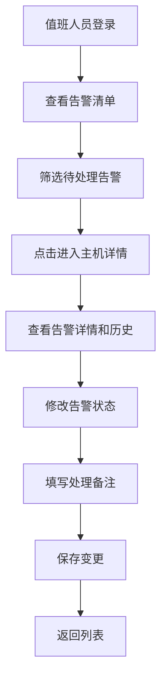
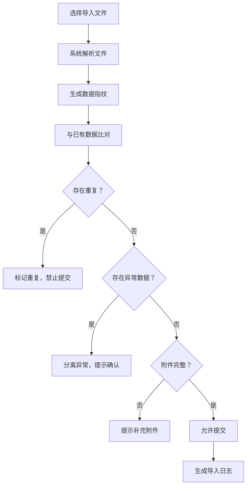
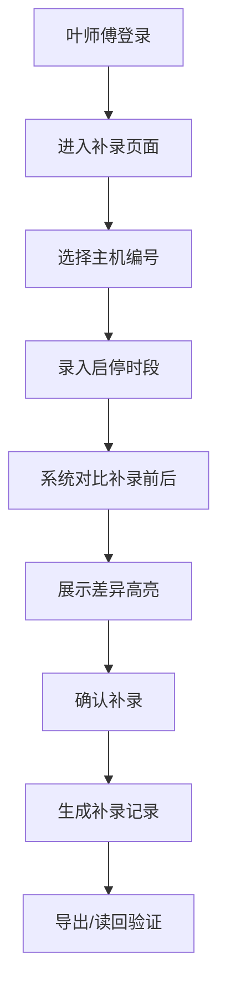

## 1. 产品概述

能源空调主机告警墙是为东郊煤改电片区值班团队设计的专业监控系统，解决值班交接时空调主机异常告警被混进正常汇总、复盘追溯困难的核心问题。

- 核心目标：确保异常告警不被遗漏、数据导入防重复、敏感信息按权限受控、手工补录可追溯
- 目标用户：片区值班人员、运维工程师、管理员、叶师傅（特殊补录权限）
- 产品价值：提升交接效率，避免异常被掩盖，确保数据完整性和安全性

## 2. 核心 Features

### 2.1 用户角色

| 角色 | 注册方式 | 核心权限 |
|------|----------|----------|
| 值班人员 | 工号登录 | 查看告警清单、处理告警、查看主机详情、修改告警状态 |
| 运维工程师 | 工号登录 | 全部值班人员权限 + 导入数据、导出报表 |
| 管理员 | 工号登录 | 全部运维权限 + 用户管理、权限配置、敏感数据查看 |
| 叶师傅 | 特殊工号登录 | 手工补录主机启停时段、查看补录差异对比 |

### 2.2 Feature 模块

1. **告警清单首页**：多维度筛选、告警列表展示、状态统计概览
2. **空调主机详情页**：主机基本信息、告警历史、状态修改、操作日志
3. **数据导入模块**：文件上传、重复检测、异常识别、附件完整性校验
4. **权限控制模块**：敏感内容脱敏、导出权限控制、本地存储加密
5. **手工补录模块**：叶师傅专属启停时段录入、补录前后差异对比、导出读回验证

### 2.3 页面详情

| 页面名称 | 模块名称 | Feature 描述 |
|----------|----------|--------------|
| 告警清单首页 | 筛选区域 | 按时间范围、告警等级、主机编号、处理状态多维度筛选 |
| 告警清单首页 | 统计概览 | 展示待处理、处理中、已完成、异常告警数量统计卡片 |
| 告警清单首页 | 告警列表 | 展示主机编号、告警类型、告警时间、当前状态、处理人，支持点击进入详情 |
| 空调主机详情页 | 主机信息 | 展示主机编号、位置、型号、运行参数、当前状态 |
| 空调主机详情页 | 状态修改 | 支持修改告警状态（待处理→处理中→已完成），记录修改人和时间 |
| 空调主机详情页 | 历史回看 | 时间轴展示该主机所有告警历史、处理记录、状态变更轨迹 |
| 数据导入页 | 文件上传 | 支持Excel/CSV批量导入，实时预览导入数据 |
| 数据导入页 | 重复检测 | 基于主机编号+告警时间指纹识别重复记录，高亮标记不允许重复提交 |
| 数据导入页 | 异常识别 | 自动识别异常数据（数值超出阈值、格式错误），异常项与正常数据分离展示 |
| 数据导入页 | 附件校验 | 检查附件完整性，缺失附件时禁止提交并提示补充 |
| 手工补录页 | 时段录入 | 叶师傅专属入口，录入主机启停时段（开始时间、结束时间、主机编号、备注） |
| 手工补录页 | 差异对比 | 可视化展示补录前后数据对比，高亮差异部分 |
| 手工补录页 | 导出读回 | 支持导出补录记录，读回验证导出数据完整性 |

## 3. 核心流程

### 3.1 告警处理流程

值班人员登录系统→查看告警清单→筛选待处理告警→点击进入主机详情→查看告警详情和历史记录→修改告警状态→填写处理备注→保存变更→返回列表继续处理

### 3.2 数据导入防重复流程

运维工程师选择导入文件→系统解析文件→生成数据指纹（主机编号+告警时间）→与已有数据比对→标记重复记录→分离异常数据→检查附件完整性→全部校验通过才允许提交→提交后生成导入日志

### 3.3 叶师傅补录流程

叶师傅登录→进入专属补录页面→选择主机编号→录入启停时段→系统自动对比补录前后数据→展示差异→确认补录→生成补录记录→支持导出和读回验证

## 4. 界面设计

### 4.1 设计风格

- **主色调**：工业深蓝 #165DFF 作为主色，搭配告警红 #F53F3F、警告橙 #FF7D00、成功绿 #00B42A
- **辅助色**：深灰背景 #1D2129，卡片背景 #2A2F3A，文字 #F2F3F5
- **按钮风格**：直角硬朗工业风，2px边框，hover状态有轻微发光效果
- **字体**：标题使用 Roboto Mono（等宽工业感），正文使用 Noto Sans SC
- **布局风格**：dashboard网格化布局，左侧导航+顶部状态栏+主内容区
- **图标风格**：线性简约工业图标，告警类使用醒目实心图标

### 4.2 页面设计概览

| 页面名称 | 模块名称 | UI 元素 |
|----------|----------|----------|
| 告警清单首页 | 筛选区域 | 下拉选择器、日期范围选择器、搜索框、重置按钮，悬浮阴影效果 |
| 告警清单首页 | 统计卡片 | 4个统计卡片，不同状态用不同颜色边框和图标，数字有动画效果 |
| 告警清单首页 | 告警列表 | 斑马纹表格行，异常行红色背景闪烁提示，状态标签使用胶囊样式 |
| 空调主机详情页 | 主机信息 | 卡片式布局，关键参数大号字体展示，运行状态实时指示灯 |
| 空调主机详情页 | 状态修改 | 状态流转按钮组，操作备注文本框，提交按钮带确认弹窗 |
| 空调主机详情页 | 历史时间轴 | 垂直时间轴，不同状态节点不同颜色，hover展开详情 |
| 数据导入页 | 上传区域 | 拖拽上传区域，虚线边框，hover变实线，文件图标动画 |
| 数据导入页 | 数据预览 | 表格预览，重复行灰色禁用，异常行黄色背景带警告图标 |
| 手工补录页 | 时段录入 | 表单布局，时间选择器带快捷选项，主机编号支持搜索 |
| 手工补录页 | 差异对比 | 左右分栏对比，差异部分红绿色高亮标注 |

### 4.3 响应式设计

- **Desktop-first**：1920px为基准设计，适配1280px以上屏幕
- **平板适配**：1024px-1280px，统计卡片改为2×2布局，导航栏折叠
- **触控优化**：按钮最小尺寸44×44px，下拉菜单增加触控区域

## 5. 权限与安全设计

### 5.1 敏感内容处理

| 敏感内容 | 值班人员 | 运维工程师 | 管理员 | 叶师傅 |
|----------|----------|------------|--------|--------|
| 主机具体位置坐标 | 脱敏显示（仅显示区域） | 脱敏显示 | 完整显示 | 脱敏显示 |
| 运行参数具体数值 | 范围显示 | 完整显示 | 完整显示 | 完整显示 |
| 历史处理人姓名 | 脱敏（姓氏+*） | 完整显示 | 完整显示 | 脱敏 |
| 导出Excel敏感字段 | 自动脱敏 | 可选择是否脱敏 | 完整导出 | 不可导出 |
| 浏览器本地存储 | 加密存储 | 加密存储 | 加密存储 | 加密存储 |

### 5.2 安全控制

- 页面级：无权限页面直接403，不显示导航入口
- 接口级：后端二次校验权限，前端脱敏仅为辅助
- 导出级：导出文件加水印和导出人信息，敏感字段按角色处理
- 存储级：localStorage存储内容全部AES加密，敏感数据不存本地
