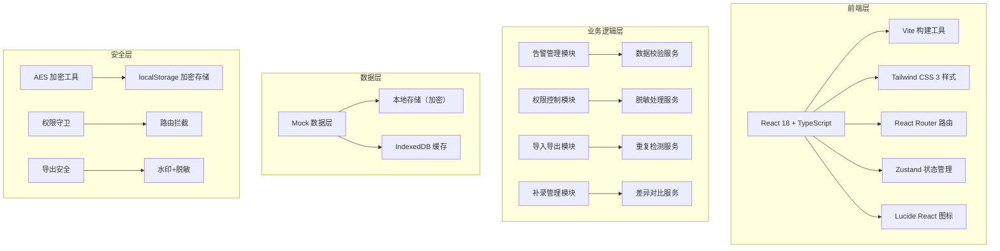
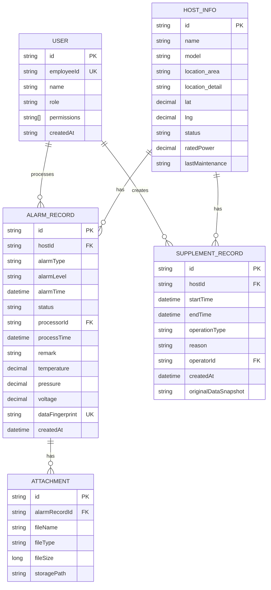

## 1. 架构设计



## 2. 技术描述

- **前端框架**: React@18.2.0 + TypeScript@5.3.0
- **构建工具**: Vite@5.0.0
- **样式方案**: Tailwind CSS@3.4.0
- **路由管理**: React Router DOM@6.20.0
- **状态管理**: Zustand@4.4.7
- **图标库**: Lucide React@0.294.0
- **日期处理**: Day.js@1.11.10
- **Excel处理**: SheetJS (xlsx)@0.18.5
- **加密工具**: CryptoJS@4.2.0
- **后端**: 无后端，使用Mock数据 + localStorage加密存储
- **数据库**: 浏览器端 IndexedDB + 加密localStorage

## 3. 路由定义

| 路由路径 | 页面名称 | 权限要求 | 说明 |
|----------|----------|----------|------|
| `/login` | 登录页 | 公开 | 工号登录，角色识别 |
| `/` | 告警清单首页 | 值班人员及以上 | 告警列表、筛选、统计概览 |
| `/host/:id` | 空调主机详情页 | 值班人员及以上 | 主机信息、状态修改、历史回看 |
| `/import` | 数据导入页 | 运维工程师及以上 | 文件上传、重复检测、异常识别 |
| `/supplement` | 手工补录页 | 仅叶师傅 | 启停时段录入、差异对比、导出读回 |
| `/403` | 无权限页 | 公开 | 权限不足提示页 |

## 4. API 类型定义

```typescript
// 用户角色类型
export type UserRole = 'operator' | 'engineer' | 'admin' | 'master_ye';

// 用户信息
export interface User {
  id: string;
  employeeId: string;
  name: string;
  role: UserRole;
  permissions: string[];
}

// 告警状态
export type AlarmStatus = 'pending' | 'processing' | 'completed' | 'abnormal';

// 告警等级
export type AlarmLevel = 'critical' | 'warning' | 'info';

// 告警记录
export interface AlarmRecord {
  id: string;
  hostId: string;
  hostName: string;
  alarmType: string;
  alarmLevel: AlarmLevel;
  alarmTime: string;
  status: AlarmStatus;
  processor?: string;
  processTime?: string;
  remark?: string;
  location: {
    area: string;
    detail?: string;
  };
  params: {
    temperature?: number;
    pressure?: number;
    voltage?: number;
  };
  attachments?: string[];
  dataFingerprint: string;
}

// 空调主机信息
export interface HostInfo {
  id: string;
  name: string;
  model: string;
  location: {
    area: string;
    detail?: string;
    coordinates?: { lat: number; lng: number };
  };
  status: 'running' | 'stopped' | 'error';
  params: {
    ratedPower: number;
    currentPower?: number;
    supplyTemp?: number;
    returnTemp?: number;
    pressure?: number;
  };
  lastMaintenance: string;
}

// 主机启停时段补录
export interface SupplementRecord {
  id: string;
  hostId: string;
  hostName: string;
  startTime: string;
  endTime: string;
  operationType: 'start' | 'stop';
  reason: string;
  operator: string;
  createTime: string;
  originalData?: Partial<SupplementRecord>;
  diffFields?: string[];
}

// 导入结果
export interface ImportResult {
  total: number;
  success: number;
  duplicate: number;
  abnormal: number;
  missingAttachments: number;
  records: ImportRecord[];
}

export interface ImportRecord {
  rowIndex: number;
  data: Partial<AlarmRecord>;
  status: 'valid' | 'duplicate' | 'abnormal' | 'missing_attachment';
  errorMessage?: string;
}

// 差异对比结果
export interface DiffResult {
  field: string;
  oldValue: any;
  newValue: any;
  changeType: 'add' | 'modify' | 'delete';
}
```

## 5. 数据模型

### 5.1 ER 图



### 5.2 初始化数据（Mock）

```typescript
// 初始Mock数据
export const mockUsers: User[] = [
  {
    id: '1',
    employeeId: 'OP001',
    name: '张值班',
    role: 'operator',
    permissions: ['alarm:view', 'alarm:process', 'host:view']
  },
  {
    id: '2',
    employeeId: 'EN001',
    name: '李运维',
    role: 'engineer',
    permissions: ['alarm:view', 'alarm:process', 'host:view', 'data:import', 'data:export']
  },
  {
    id: '3',
    employeeId: 'AD001',
    name: '王管理',
    role: 'admin',
    permissions: ['*']
  },
  {
    id: '4',
    employeeId: 'YE001',
    name: '叶师傅',
    role: 'master_ye',
    permissions: ['alarm:view', 'host:view', 'supplement:create', 'supplement:diff']
  }
];

export const mockHosts: HostInfo[] = [
  {
    id: 'HOST001',
    name: '1号主机',
    model: 'AC-MAX-2000',
    location: { area: 'A区', detail: '1号楼3层', coordinates: { lat: 39.9, lng: 116.4 } },
    status: 'running',
    params: { ratedPower: 200, currentPower: 185, supplyTemp: 7, returnTemp: 12, pressure: 0.45 },
    lastMaintenance: '2026-05-15'
  },
  {
    id: 'HOST002',
    name: '2号主机',
    model: 'AC-MAX-2000',
    location: { area: 'A区', detail: '2号楼1层', coordinates: { lat: 39.91, lng: 116.41 } },
    status: 'running',
    params: { ratedPower: 200, currentPower: 192, supplyTemp: 6.5, returnTemp: 11.8, pressure: 0.48 },
    lastMaintenance: '2026-05-20'
  },
  {
    id: 'HOST003',
    name: '3号主机',
    model: 'AC-PRO-1500',
    location: { area: 'B区', detail: '3号楼2层', coordinates: { lat: 39.89, lng: 116.42 } },
    status: 'error',
    params: { ratedPower: 150, currentPower: 0, supplyTemp: 15, returnTemp: 16, pressure: 0.2 },
    lastMaintenance: '2026-04-10'
  }
];
```

## 6. 核心技术实现要点

### 6.1 数据指纹去重机制

```typescript
// 生成数据指纹：主机ID + 告警时间戳 进行SHA256哈希
export function generateDataFingerprint(hostId: string, alarmTime: string): string {
  const timestamp = new Date(alarmTime).getTime();
  const raw = `${hostId}_${timestamp}`;
  return CryptoJS.SHA256(raw).toString();
}

// 检测重复记录
export function detectDuplicates(
  incomingRecords: Partial<AlarmRecord>[],
  existingRecords: AlarmRecord[]
): ImportRecord[] {
  const existingFingerprints = new Set(existingRecords.map(r => r.dataFingerprint));
  
  return incomingRecords.map((data, index) => {
    if (!data.hostId || !data.alarmTime) {
      return { rowIndex: index, data, status: 'abnormal', errorMessage: '缺少主机ID或告警时间' };
    }
    
    const fingerprint = generateDataFingerprint(data.hostId, data.alarmTime);
    
    if (existingFingerprints.has(fingerprint)) {
      return { rowIndex: index, data, status: 'duplicate', errorMessage: '记录已存在' };
    }
    
    return { rowIndex: index, data, status: 'valid' };
  });
}
```

### 6.2 敏感内容脱敏处理

```typescript
// 按角色脱敏处理
export function desensitizeByRole<T>(data: T, role: UserRole, sensitiveFields: string[]): T {
  const result = { ...data } as any;
  
  for (const field of sensitiveFields) {
    if (result[field] !== undefined) {
      switch (role) {
        case 'operator':
        case 'master_ye':
          result[field] = desensitizeValue(result[field], field);
          break;
        case 'engineer':
          // 部分字段脱敏
          if (['location.detail', 'coordinates'].includes(field)) {
            result[field] = desensitizeValue(result[field], field);
          }
          break;
        case 'admin':
          // 管理员不脱敏
          break;
      }
    }
  }
  
  return result;
}

function desensitizeValue(value: any, field: string): any {
  if (typeof value === 'string') {
    // 姓名脱敏：张**
    if (field.includes('name') && value.length > 1) {
      return value[0] + '*'.repeat(value.length - 1);
    }
    // 位置脱敏：仅保留区域
    if (field.includes('location') || field.includes('detail')) {
      return value.split(/[号楼层]/)[0] + '区域';
    }
  }
  // 坐标模糊
  if (field.includes('coordinates') && value?.lat && value?.lng) {
    return {
      lat: Math.round(value.lat * 100) / 100,
      lng: Math.round(value.lng * 100) / 100
    };
  }
  // 数值范围化
  if (typeof value === 'number' && field.match(/temperature|pressure|voltage|power/)) {
    if (value < 10) return '<10';
    if (value < 50) return '10-50';
    if (value < 100) return '50-100';
    return '>100';
  }
  return value;
}
```

### 6.3 本地存储加密

```typescript
import CryptoJS from 'crypto-js';

const SECRET_KEY = 'energy_alarm_wall_2026';

export const secureStorage = {
  set(key: string, value: any): void {
    const encrypted = CryptoJS.AES.encrypt(JSON.stringify(value), SECRET_KEY).toString();
    localStorage.setItem(key, encrypted);
  },
  
  get<T>(key: string): T | null {
    const encrypted = localStorage.getItem(key);
    if (!encrypted) return null;
    try {
      const decrypted = CryptoJS.AES.decrypt(encrypted, SECRET_KEY).toString(CryptoJS.enc.Utf8);
      return JSON.parse(decrypted) as T;
    } catch {
      return null;
    }
  },
  
  remove(key: string): void {
    localStorage.removeItem(key);
  }
};
```

### 6.4 导出安全控制

```typescript
// 导出Excel时添加水印和脱敏
export function exportWithSecurity(
  records: any[],
  user: User,
  options: { includeSensitive?: boolean; addWatermark?: boolean } = {}
): Blob {
  const { includeSensitive = false, addWatermark = true } = options;
  
  // 权限校验
  let processedRecords = records;
  if (!includeSensitive || user.role !== 'admin') {
    processedRecords = records.map(r => desensitizeByRole(r, user.role, ['location.detail', 'coordinates', 'processor', 'params']));
  }
  
  // 转换为Excel
  const ws = XLSX.utils.json_to_sheet(processedRecords);
  
  // 添加导出水印信息（隐藏行）
  const watermarkRow = {
    '导出人': user.name,
    '导出时间': dayjs().format('YYYY-MM-DD HH:mm:ss'),
    '工号': user.employeeId,
    '权限等级': user.role
  };
  
  // 生成Blob
  const wb = XLSX.utils.book_new();
  XLSX.utils.book_append_sheet(wb, ws, '告警记录');
  
  if (addWatermark) {
    const wsWatermark = XLSX.utils.json_to_sheet([watermarkRow]);
    XLSX.utils.book_append_sheet(wb, wsWatermark, '导出信息');
  }
  
  return new Blob([XLSX.write(wb, { type: 'array', bookType: 'xlsx' })], {
    type: 'application/vnd.openxmlformats-officedocument.spreadsheetml.sheet'
  });
}
```
