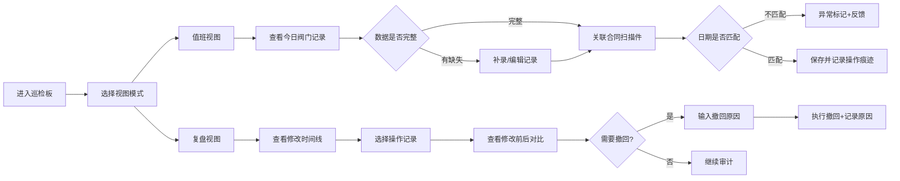

## 1. 产品概述

能源锅炉余热巡检板是面向储能站监控专员的实用型巡检工具，解决锅炉余热阀门记录与合同扫描件日期不同步、数据混乱的管理痛点。

- 核心目标：提供值班室可用的操作工具，而非仅用于截图汇报的展示页
- 目标用户：储能站监控专员（值班员）、主管（复盘审计）
- 核心价值：规范化余热阀门记录管理，实现数据可追溯、操作可审计

## 2. 核心功能

### 2.1 用户角色

| 角色 | 登录方式 | 核心权限 |
|------|----------|----------|
| 值班员 | 角色切换 | 处理当天记录、新增/编辑阀门记录、关联合同扫描件、筛选查询、导出数据 |
| 主管 | 角色切换 | 查看修改痕迹、撤回操作、查看完整审计日志、所有值班员权限 |

### 2.2 功能模块

1. **双视图切换**：值班视图（日常操作）、复盘视图（审计追溯）
2. **余热阀门记录管理**：列表展示、新增、编辑、删除、老何手工补录专用入口
3. **合同扫描件管理**：上传关联、日期匹配校验、缺失提醒
4. **修改痕迹审计**：操作历史记录、修改前后对比、撤回原因记录
5. **数据可视化**：联动图表（筛选后自动刷新）、阀门状态分布
6. **数据导出/导入**：Excel导出、文件读回校验
7. **异常状态反馈**：四种异常场景的差异化提示

### 2.3 页面详情

| 页面名称 | 模块名称 | 功能描述 |
|----------|----------|----------|
| 值班视图 | 顶部导航栏 | 双视图切换、角色切换、日期筛选、搜索框 |
| 值班视图 | 数据概览卡片 | 今日记录数、待匹配合同数、异常记录数、补录记录数 |
| 值班视图 | 阀门记录表格 | 分页展示、行内编辑、批量操作、状态标识 |
| 值班视图 | 合同扫描件面板 | 待关联文件列表、拖拽上传、日期校验 |
| 值班视图 | 联动图表区域 | 阀门开度趋势、温度分布柱状图 |
| 值班视图 | 老何补录入口 | 专用按钮、补录表单、差异对比预览 |
| 复盘视图 | 时间线审计面板 | 操作时间线、修改人、操作类型 |
| 复盘视图 | 修改对比面板 | 修改前后字段对比、高亮差异 |
| 复盘视图 | 撤回操作面板 | 撤回原因输入、历史撤回记录 |
| 复盘视图 | 异常状态汇总 | 四种异常场景的统计和快速定位 |

## 3. 核心流程

## 4. 用户界面设计

### 4.1 设计风格

- **主色调**：工业蓝 `#1e3a5f`（代表专业、可靠）
- **辅助色**：警示橙 `#f59e0b`（异常提醒）、成功绿 `#10b981`（正常）、危险红 `#ef4444`（严重异常）
- **按钮风格**：方形微圆角（3px）、工业质感、hover 时有细微阴影
- **字体**：标题使用 `Noto Sans SC Bold`，正文使用 `Noto Sans SC Regular`，等宽数据使用 `JetBrains Mono`
- **布局风格**：模块化卡片布局，信息密度适中，适合长时间值班监控
- **图标风格**：线性图标（lucide-react），工业仪表盘风格

### 4.2 页面设计概述

| 页面名称 | 模块名称 | UI 元素 |
|----------|----------|----------|
| 值班视图 | 导航栏 | 深色背景、白色文字、视图切换标签高亮、搜索框带放大镜图标 |
| 值班视图 | 概览卡片 | 四张卡片并排、大数字展示、趋势箭头、渐变背景 |
| 值班视图 | 数据表格 | 斑马纹、悬停高亮、异常行红边、状态标签圆角 |
| 值班视图 | 图表区域 | 卡片阴影、图例可点击、数据点悬停提示 |
| 值班视图 | 补录入口 | 橙色渐变按钮、脉冲动画提示 |
| 复盘视图 | 时间线 | 左侧垂直线、时间节点圆点、操作卡片悬浮 |
| 复盘视图 | 对比面板 | 左右分栏、删除线+高亮标记差异、背景色区分 |
| 复盘视图 | 异常汇总 | 四种异常图标差异化、点击跳转定位 |

### 4.3 响应式设计

- 桌面端优先（1280px+），适配 1920px 监控大屏
- 中等屏幕（1024px-1279px）：卡片自动换行，表格水平滚动
- 不强制移动端适配，以桌面值班场景为主

### 4.4 异常状态反馈设计

1. **全是坏行**：表格顶部红色横幅警告，每行左侧红色感叹号图标，底部显示"数据严重异常，请联系管理员"
2. **只有空表**：表格中央显示"暂无数据"插画，提示"点击右上角新增第一条记录"，引导按钮
3. **筛选后图表未更新**：图表右上角黄色警告标识，悬停提示"数据已筛选，点击刷新图表"，提供手动刷新按钮
4. **撤回原因覆盖旧理由**：输入框旁显示历史原因折叠面板，保存时二次确认"将覆盖历史撤回原因，是否继续？"
