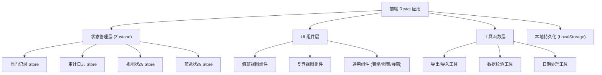
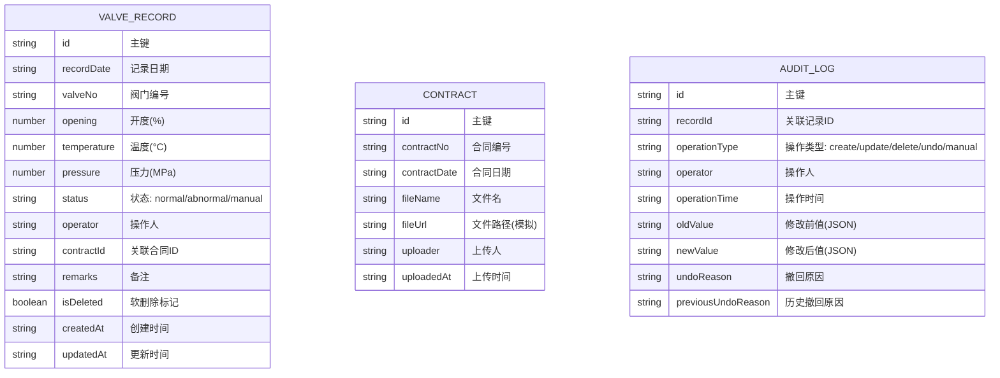

## 1. 架构设计



## 2. 技术栈说明

- **前端框架**：React@18 + TypeScript + Vite
- **初始化工具**：vite-init
- **状态管理**：Zustand（轻量、高性能，适合复杂表单和联动状态）
- **样式方案**：TailwindCSS@3（原子化 CSS，快速构建工业风 UI）
- **图表库**：Recharts（React 生态，支持联动交互）
- **图标库**：lucide-react（线性图标，工业风格）
- **后端**：无后端，使用 LocalStorage + Mock 数据模拟持久化
- **数据持久化**：LocalStorage 存储阀门记录、审计日志、合同信息

## 3. 路由定义

| 路由 | 用途 |
|------|------|
| `/` | 首页，默认显示值班视图 |
| `/duty` | 值班视图（完整路径，可直接访问） |
| `/review` | 复盘视图（完整路径，可直接访问） |

## 4. 数据模型

### 4.1 数据模型定义



### 4.2 TypeScript 类型定义

```typescript
// 阀门记录类型
interface ValveRecord {
  id: string;
  recordDate: string;
  valveNo: string;
  opening: number;
  temperature: number;
  pressure: number;
  status: 'normal' | 'abnormal' | 'manual';
  operator: string;
  contractId?: string;
  remarks?: string;
  isDeleted: boolean;
  createdAt: string;
  updatedAt: string;
}

// 合同扫描件类型
interface Contract {
  id: string;
  contractNo: string;
  contractDate: string;
  fileName: string;
  fileUrl: string;
  uploader: string;
  uploadedAt: string;
}

// 审计日志类型
interface AuditLog {
  id: string;
  recordId: string;
  operationType: 'create' | 'update' | 'delete' | 'undo' | 'manual';
  operator: string;
  operationTime: string;
  oldValue: Record<string, any> | null;
  newValue: Record<string, any> | null;
  undoReason?: string;
  previousUndoReason?: string;
}

// 视图状态
type ViewMode = 'duty' | 'review';

// 筛选条件
interface FilterParams {
  dateRange?: [string, string];
  status?: ValveRecord['status'][];
  valveNo?: string;
  operator?: string;
}

// 异常状态类型
type AnomalyType = 'all_bad_rows' | 'empty_table' | 'chart_not_sync' | 'undo_reason_override';
```

### 4.3 Mock 数据

初始化时预置以下数据：
1. 15 条阀门记录（包含正常、异常、手工补录三种状态）
2. 8 条合同扫描件记录（部分与阀门记录日期不匹配）
3. 1 条老何手工补录的专用记录（用于对比测试）
4. 20 条审计日志记录（包含各种操作类型）

## 5. 状态管理 Store 设计

### 5.1 ValveStore（阀门记录管理）
- `records: ValveRecord[]` - 阀门记录列表
- `filteredRecords: ValveRecord[]` - 筛选后的记录
- `addRecord(record: Omit<ValveRecord, 'id' | 'createdAt' | 'updatedAt'>)` - 新增记录
- `updateRecord(id: string, updates: Partial<ValveRecord>)` - 更新记录
- `deleteRecord(id: string, reason: string)` - 删除记录（软删）
- `addManualRecord(record: Partial<ValveRecord>)` - 老何手工补录专用
- `applyFilters(filters: FilterParams)` - 应用筛选条件

### 5.2 AuditStore（审计日志管理）
- `logs: AuditLog[]` - 审计日志列表
- `addLog(log: Omit<AuditLog, 'id' | 'operationTime'>)` - 新增日志
- `getLogsByRecordId(recordId: string)` - 获取单条记录的操作历史
- `undoOperation(logId: string, reason: string)` - 撤回操作

### 5.3 ViewStore（视图状态管理）
- `currentView: ViewMode` - 当前视图模式
- `currentRole: 'operator' | 'supervisor'` - 当前角色
- `anomalyState: AnomalyType | null` - 当前异常状态
- `chartSyncState: 'synced' | 'pending' | 'outdated'` - 图表同步状态
- `toggleView()` - 切换视图
- `setRole(role: 'operator' | 'supervisor')` - 切换角色
- `setAnomalyState(state: AnomalyType | null)` - 设置异常状态
- `setChartSyncState(state: 'synced' | 'pending' | 'outdated')` - 设置图表同步状态

## 6. 核心组件划分

| 组件路径 | 组件名称 | 职责 |
|----------|----------|------|
| `src/pages/DutyView.tsx` | 值班视图页 | 日常操作主界面，整合表格、图表、补录入口 |
| `src/pages/ReviewView.tsx` | 复盘视图页 | 审计主界面，整合时间线、对比面板 |
| `src/components/ValveTable.tsx` | 阀门记录表格 | 数据展示、行内编辑、异常状态渲染 |
| `src/components/ContractPanel.tsx` | 合同面板 | 合同上传、关联、日期校验 |
| `src/components/TrendChart.tsx` | 趋势图表 | 阀门开度、温度趋势，支持联动筛选 |
| `src/components/AuditTimeline.tsx` | 审计时间线 | 操作历史时间线展示 |
| `src/components/DiffViewer.tsx` | 修改对比器 | 修改前后字段差异对比 |
| `src/components/ManualRecordModal.tsx` | 手工补录弹窗 | 老何补录专用表单、差异预览 |
| `src/components/AnomalyFeedback.tsx` | 异常反馈组件 | 四种异常场景的差异化提示 |
| `src/components/StatCards.tsx` | 统计卡片组 | 数据概览四张卡片 |
| `src/components/Header.tsx` | 顶部导航 | 视图切换、角色切换、筛选搜索 |

## 7. 关键技术实现点

1. **双视图状态同步**：使用 Zustand 单一数据源，切换视图时保持筛选条件和数据状态
2. **联动图表**：筛选条件变化时更新 `filteredRecords`，图表组件订阅该数据自动重绘
3. **审计日志自动记录**：在 ValveStore 的每个操作方法中自动调用 AuditStore.addLog
4. **撤回操作实现**：保存操作前后快照，撤回时根据 oldValue 恢复数据，并记录撤回原因
5. **数据导出/导入**：使用 `xlsx` 库处理 Excel，导入时做数据格式校验和冲突检测
6. **LocalStorage 持久化**：Store 初始化时从 LocalStorage 加载数据，变更时自动保存
7. **异常状态检测**：
   - 全是坏行：检查 `filteredRecords.every(r => r.status === 'abnormal')`
   - 只有空表：检查 `filteredRecords.length === 0`
   - 图表不联动：对比筛选时间戳和图表渲染时间戳
   - 撤回原因覆盖：检查该记录是否已有 `undoReason`
