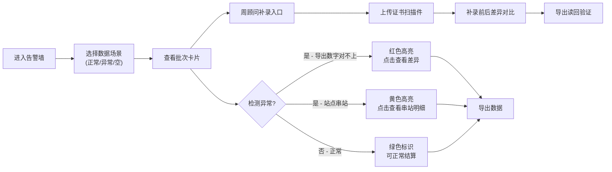

## 1. 产品概述

能源绿证批次告警墙是面向售电公司结算员的绿证批次监控系统，解决创智园 A 座等项目绿证结算中出现的数据不一致、站点串站、权限泄露等实际业务痛点。系统内置完整样例数据，无需导入外部文件即可验证正常、异常和空数据场景。

## 2. 核心功能

### 2.1 用户角色
| 角色 | 注册方式 | 核心权限 |
|------|---------|---------|
| 结算员 | 系统内置 | 查看告警墙、导出数据、触发异常场景、手工补录证书 |
| 周顾问 | 系统内置 | 手工补录证书扫描件、查看补录前后差异 |

### 2.2 功能模块
1. **告警墙首页**：批次卡片总览、统计数字、告警状态标识
2. **批次详情**：绿证明细、导出数字对比、串站检测
3. **手工补录**：周顾问补录证书扫描件、补录前后差异对比
4. **场景切换**：正常数据/异常数据/空数据一键切换

### 2.3 页面详情
| 页面名称 | 模块名称 | 功能描述 |
|---------|---------|---------|
| 告警墙首页 | 统计概览 | 显示批次总数、异常数、待处理数、已结算数 |
| 告警墙首页 | 批次卡片网格 | 展示各批次状态、站点名称、证书数量、金额 |
| 告警墙首页 | 异常标记 | 导出数字对不上标记为红色感叹号，串站标记为黄色警告 |
| 批次详情 | 数据对比区 | 左侧卡片数字 vs 右侧导出数字，高亮差异 |
| 批次详情 | 串站检测区 | 同名站点列表、归属关系、冲突标识 |
| 手工补录 | 证书上传区 | 周顾问上传扫描件、填写补录说明 |
| 手工补录 | 差异对比区 | 补录前后数据并排对比、导出读回验证 |
| 场景切换 | 数据切换按钮 | 一键切换正常/异常/空数据集 |

## 3. 核心业务流程

## 4. 用户界面设计

### 4.1 设计风格
- 主色调：工业深灰 (#1a1a2e) + 能源绿 (#16a34a)，突出能源行业属性
- 告警色：异常红 (#dc2626)、警告黄 (#eab308)、正常绿 (#22c55e)
- 卡片风格：深色毛玻璃效果，边框发光，悬浮时轻微上浮
- 字体：标题用 Space Grotesk，正文用 JetBrains Mono，数字等宽对齐
- 布局：Dashboard 网格布局，顶部统计条 + 主体卡片网格 + 右侧详情面板

### 4.2 页面设计概要
| 页面名称 | 模块名称 | UI 元素 |
|---------|---------|---------|
| 告警墙首页 | 顶部导航 | 项目名称、场景切换下拉、用户头像 |
| 告警墙首页 | 统计条 | 4 个统计卡片，数字滚动动画，状态色边框 |
| 告警墙首页 | 卡片网格 | 3 列响应式网格，卡片含站点名、批次号、状态角标、数据区 |
| 告警墙首页 | 异常卡片 | 红色边框发光，数字区显示"导出: 128 / 卡片: 132"差异 |
| 告警墙首页 | 串站卡片 | 黄色边框，站点名旁显示"⚠ 同名 2 站" |
| 批次详情 | 对比面板 | 左右分栏，红/绿背景标注差异数字 |
| 批次详情 | 串站列表 | 表格展示同名站点的归属项目、证书数、操作员 |
| 手工补录 | 上传区 | 拖拽上传框，扫描件预览，补录说明文本框 |
| 手工补录 | 差异区 | 三列对比：补录前 / 补录后 / 导出读回 |

### 4.3 响应式设计
- 桌面端：1440px 以上 3 列卡片，1024-1440px 2 列，1024px 以下 1 列
- 侧边详情面板在移动端改为底部抽屉
- 触摸设备优化按钮点击区域（≥44px）

### 4.4 动效设计
- 页面加载：卡片依次淡入上浮（stagger 100ms）
- 数字变化：滚动计数动画（counter-up）
- 告警闪烁：异常卡片边框脉冲动画（2s 循环）
- 悬停效果：卡片上浮 4px，阴影加深
- 场景切换：整体交叉淡入淡出（500ms）
